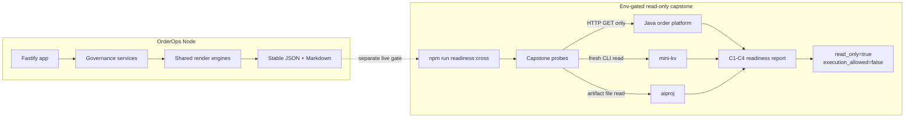

# OrderOps Node

[](https://github.com/wul012/nodeproj/actions/workflows/node-evidence.yml)
[](d/2205/evidence/maintainability-hotspots-v2205-summary.json)
[](d/2190/evidence/node-track-closeout-v2190-summary.json)
[](docs/plans/source-size-remediation-baseline.json)

OrderOps Node is an order-operations governance platform built with Fastify and TypeScript. It turns operational state into byte-stable JSON and Markdown evidence that can be reviewed, archived, and reproduced. Mechanical ratchets keep coverage, code size, renderer migration, archive growth, and known naming debt from silently regressing. It also owns the env-gated live capstone that reads the other three projects without granting itself write or execution authority.

OrderOps Node 是一个面向订单运维治理的 Fastify + TypeScript 平台：它把运行状态转换为可复核、可归档、可重复生成的 JSON 与 Markdown 证据，用机械化门禁防止覆盖率、源码体积、渲染器迁移、归档规模和命名债务倒退，并负责以只读方式联合检查 Java、mini-kv 与 aiproj，而不取得写入或执行权限。

**Maturity: single-project validation + verified read-only cross-project integration (env-gated, single machine, no execution authority).**

The Node production-excellence track completed N0-N5 and received its v2190 E1-E10 external closeout PASS. The corrected v2192 four-project C1-C4 capstone received an external program-end PASS after an independent live rerun.

## Engineering Highlights

| Surface | Committed result / gate | Command | Committed evidence |
|---|---:|---|---|
| Test suite | 1,726 / 1,726 tests passing | `npx vitest run` | [v2205 full-suite summary](d/2205/evidence/maintainability-hotspots-v2205-summary.json) |
| V8 coverage | floors S/B/F/L = 94/86/97/94; closeout actual = 95.92/87.59/98.64/95.88 | `npm run test:coverage` | [E3 coverage gate](docs/plans/node-track-final-evidence.md#e1-e10-evidence-matrix) |
| ESLint | 0 errors / 0 warnings; enforced maximum 0 | `npm run lint` | [v2203 warning-zero evidence](d/2203/evidence/lint-zero-v2203-summary.json) |
| Maintainability ratchet | 89 near-limit files / 121 long functions / 238 complex functions / 2 runtime cycles; exact debt may only shrink | `npm run maintainability:census` | [v2205 hotspot evidence](d/2205/evidence/maintainability-hotspots-v2205-summary.json) |
| Renderer census | 245 total / 242 standardized / 3 AST-valid waivers / 0 non-waived | `npm run renderer:census` | [committed census result](d/2184/evidence/renderer-consolidation-n1-closeout-v2184-summary.json) and [waiver manifest](docs/plans/renderer-consolidation-waivers.json) |
| Source-size ceiling | 0 source files over 800 lines | `npm run source:size:census` | [shrink-only baseline](docs/plans/source-size-remediation-baseline.json) |
| Elegance ratchet | 4,537 known name violations, shrink-only | `npm run elegance:census` | [committed baseline](docs/plans/elegance-baseline.json) and [v2201 result](d/2201/evidence/readiness-markdown-engine-v2201-summary.json) |

The badge rounds the committed 95.92% statement coverage measurement to 95.9%; the table preserves the complete statements/branches/functions/lines result and its enforced floors.

## Architecture



The normal Fastify path serves operational views and evidence reports. The capstone is a separate, explicit regression surface: it starts a packaged Java process for GET-only probes, invokes a fresh mini-kv CLI process with read-only commands, validates one committed aiproj artifact file, writes one aggregate JSON/Markdown report, and cleans up the processes it owns.

## Quickstart

Node.js 22 or later is required.

```powershell
npm ci
npm run typecheck
npx vitest run
```

The local dashboard starts with upstream access closed by default:

```powershell
$env:UPSTREAM_PROBES_ENABLED = "false"
$env:UPSTREAM_ACTIONS_ENABLED = "false"
npm run dev
```

Open `http://127.0.0.1:4100`. Configuration examples live in [`.env.example`](.env.example) and [`.env.production.example`](.env.production.example).

### Reproduce The Mechanical Censuses

```powershell
npm run archive:retention:census
npm run elegance:census
npm run renderer:census
npm run source:size:census
```

Each command exits non-zero when its committed budget or shrink-only baseline is violated.

### Run The Live Read-Only Capstone

Build the Java jar and mini-kv CLI first, then pin all three upstream commits explicitly:

```powershell
$env:INTEGRATION_LIVE = "1"
$env:JAVA_CAPSTONE_JAR = "D:\path\to\advanced-order-platform.jar"
$env:JAVA_CAPSTONE_COMMIT = "<java-commit>"
$env:MINIKV_CLI_PATH = "D:\path\to\minikv_cli.exe"
$env:MINIKV_CAPSTONE_COMMIT = "<mini-kv-commit>"
$env:AIPROJ_ROOT = "D:\aiproj"
$env:AIPROJ_CAPSTONE_COMMIT = "<aiproj-commit>"
npm run readiness:cross
```

The command writes `cross-project-readiness.json` and `cross-project-readiness.md` under `.tmp/cross-project-readiness` unless `CROSS_READINESS_OUTPUT_DIR` is set. A live run is accepted only when C1-C4 pass, all upstream commits are pinned, `read_only=true`, `execution_allowed=false`, and every process started by Node is stopped.

## Evidence Map

| Question | Start here |
|---|---|
| What has the Node track mechanically proved? | [E1-E10 final evidence](docs/plans/node-track-final-evidence.md) |
| Who independently accepted the four-project capstone? | [PROGRAM-END VERDICT](docs/plans/production-excellence-final-acceptance.md#program-end-verdict--claude-external-review-2026-07-11-capstone-c1c4-pass) |
| What did the accepted live run actually report? | [v2192 readiness report](d/2192/evidence/cross-project-readiness/cross-project-readiness.md) and [machine JSON](d/2192/evidence/cross-project-readiness/cross-project-readiness.json) |
| Which renderer exceptions remain, and why? | [renderer waiver manifest](docs/plans/renderer-consolidation-waivers.json) and [review notes](docs/plans/renderer-consolidation-waivers.md) |
| Which security-scan exceptions remain? | [narrow security waivers](docs/security-scan-waivers.json) |
| What is explicitly outside the current authority? | [production boundaries](docs/PRODUCTION_BOUNDARIES.md) |
| Where should a maintainer enter the repository? | [START_HERE.md](START_HERE.md) |

## Boundaries

This repository is not authorized for production execution. It is a read-only rehearsal and governance control plane, not a production deployment or an operator approval system.

- `UPSTREAM_PROBES_ENABLED=false` is the normal default; live reads require a separately reviewed window.
- `UPSTREAM_ACTIONS_ENABLED=false` is the normal default; this README does not authorize enabling upstream writes.
- The capstone uses Java HTTP GETs, mini-kv read-only CLI commands, and an aiproj artifact-file read. It does not execute Java writes, mini-kv mutations or restore/compact/load operations, aiproj training or promotion, deployment, rollback, schema migration, or production secret access.
- Default CI intentionally does not start sibling runtimes. `INTEGRATION_LIVE=1 npm run readiness:cross` is an explicit regression at Java final track close and after changes to the capstone contract surface.
- Stage 2 remains blocked until the Java track passes its final review. Completing this README maintenance version does not start Stage 2 or change the authorized maturity label.

For the exhaustive route catalog and internal implementation, follow the Fastify registrations under [`src/routes/`](src/routes/) and the maintained orientation in [START_HERE.md](START_HERE.md).
