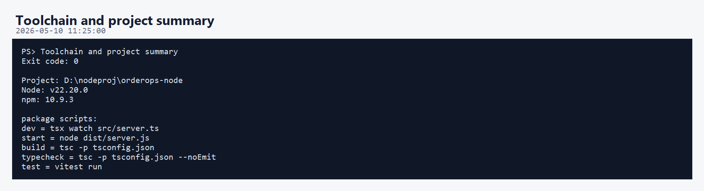
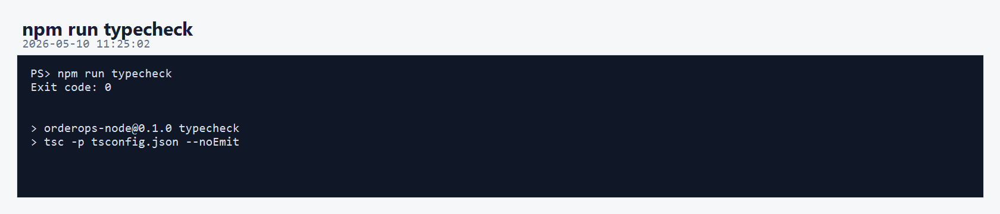
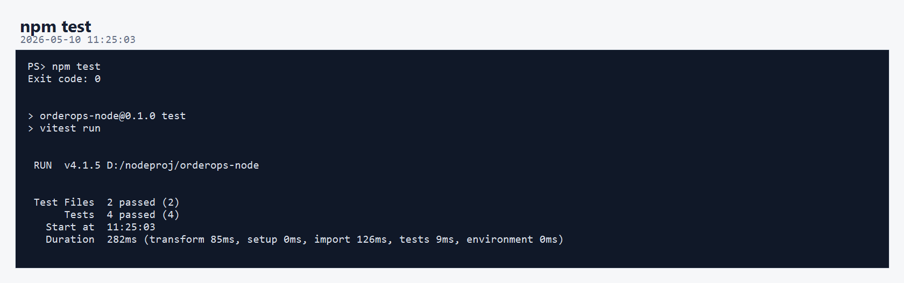
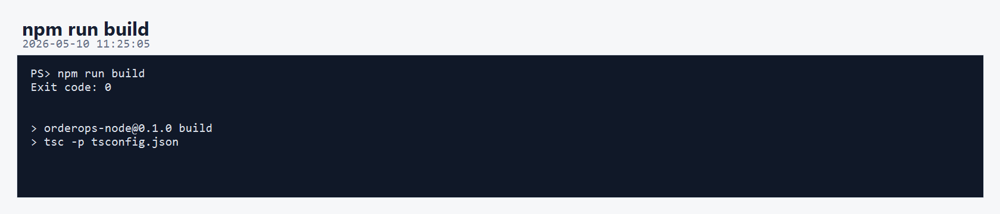
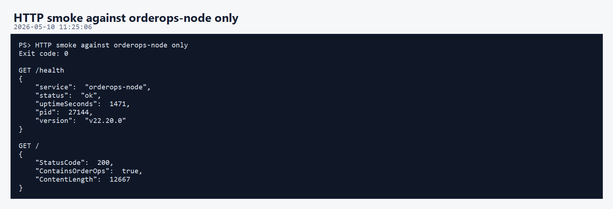
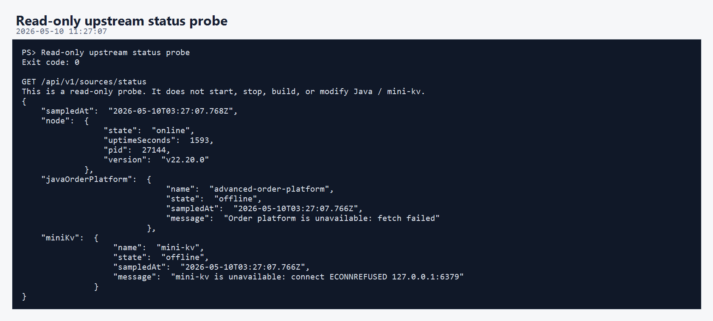
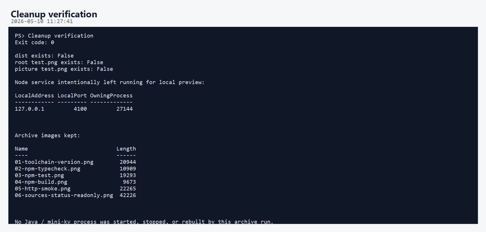

# OrderOps Node 第一版开发调试运行归档说明

本轮归档对应 `orderops-node` 第一版可运行雏形。

这一版验证范围只覆盖 Node 项目自身：

- Node / npm 工具链检查
- `package.json` 脚本确认
- TypeScript 类型检查
- Vitest 单元测试
- TypeScript 构建
- Node 自身 HTTP smoke test
- Dashboard HTML 返回验证
- 上游状态接口只读探测
- 验证后清理临时构建产物

本轮没有启动、停止、重启、构建或修改以下两个项目：

```text
D:\javaproj\advanced-order-platform
D:\C\mini-kv
```

其中 `/api/v1/sources/status` 只做只读探测。它不会改 Java 或 mini-kv 的文件，也不会控制它们的进程。

## 核心执行流程

```text
检查 node / npm 版本和 package scripts
 -> npm run typecheck
 -> npm test
 -> npm run build
 -> 调用 orderops-node /health
 -> 调用 orderops-node /
 -> 调用 orderops-node /api/v1/sources/status
 -> 删除 dist 构建产物和调试 test.png
 -> 确认 Node 服务继续运行在 4100
```

## 01-toolchain-version.png



- 项目路径：`D:\nodeproj\orderops-node`
- Node 版本：`v22.20.0`
- npm 版本：`10.9.3`
- 确认的脚本包括：

```text
dev = tsx watch src/server.ts
start = node dist/server.js
build = tsc -p tsconfig.json
typecheck = tsc -p tsconfig.json --noEmit
test = vitest run
```

意义：确认第一版 Node 项目的基础工具链和 npm 脚本都已经就绪。

## 02-npm-typecheck.png



- 命令：`npm run typecheck`
- 结果：`Exit code: 0`
- 实际执行：

```text
tsc -p tsconfig.json --noEmit
```

意义：TypeScript 严格类型检查通过，说明当前 `src/` 下的入口、client、route、service、UI 生成代码都能被编译器正确理解。

## 03-npm-test.png



- 命令：`npm test`
- 结果：`Exit code: 0`
- 测试框架：Vitest
- 当前测试结果：

```text
Test Files  2 passed (2)
Tests       4 passed (4)
```

当前测试覆盖：

- `loadConfig` 的默认配置。
- `loadConfig` 对端口、URL 末尾斜杠、采样间隔的处理。
- `validateRawGatewayCommand` 允许安全 mini-kv 命令。
- `validateRawGatewayCommand` 拒绝 `SAVE` 这类文件相关命令和多行输入。

意义：第一版的配置入口和 mini-kv raw command 安全边界已经有基础测试保护。

## 04-npm-build.png



- 命令：`npm run build`
- 结果：`Exit code: 0`
- 实际执行：

```text
tsc -p tsconfig.json
```

意义：项目可以正常编译到 `dist/`，说明不只是开发模式可跑，也具备生产启动脚本 `npm start` 所需的构建能力。

本轮验证后，`dist/` 已按清理规则删除。第一版归档只保留验证图片和说明文档。

## 05-http-smoke.png



本轮 HTTP smoke 只访问 Node 自己：

```text
GET http://127.0.0.1:4100/health
GET http://127.0.0.1:4100/
```

`/health` 返回：

```json
{
  "service": "orderops-node",
  "status": "ok",
  "version": "v22.20.0"
}
```

首页 `/` 验证：

```text
StatusCode = 200
ContainsOrderOps = true
```

意义：Fastify 服务本身在线，Dashboard HTML 能正常返回，第一版控制台入口可访问。

## 06-sources-status-readonly.png



- 命令：`GET /api/v1/sources/status`
- 性质：只读探测
- 本轮没有启动、停止、构建或修改 Java / mini-kv。

当前默认探测目标是：

```text
Java order platform: http://localhost:8080
mini-kv: 127.0.0.1:6379
```

本次返回显示：

```text
node.state = online
javaOrderPlatform.state = offline
miniKv.state = offline
```

这不表示 Node 第一版失败。

含义是：Node 控制台自身正常，但当前默认地址没有连接到正在运行的 Java / mini-kv 服务。后续如果你希望联调，只需要让对应服务监听默认端口，或通过环境变量修改：

```text
ORDER_PLATFORM_URL
MINIKV_HOST
MINIKV_PORT
```

## 07-cleanup.png



本轮清理内容：

- 删除 `D:\nodeproj\orderops-node\dist`
- 删除早期生成图片脚本时留下的调试文件：

```text
D:\nodeproj\orderops-node\a\1\test.png
D:\nodeproj\orderops-node\a\1\图片\test.png
```

本轮保留内容：

- `a/1/图片/01-toolchain-version.png`
- `a/1/图片/02-npm-typecheck.png`
- `a/1/图片/03-npm-test.png`
- `a/1/图片/04-npm-build.png`
- `a/1/图片/05-http-smoke.png`
- `a/1/图片/06-sources-status-readonly.png`
- `a/1/图片/07-cleanup.png`
- `a/1/解释/说明.md`

Node 服务继续保留运行，方便继续预览：

```text
http://127.0.0.1:4100
```

## 当前结论

第一版已经达到“Node 控制台雏形可运行”的状态：

```text
能类型检查
能跑单元测试
能构建
能提供 /health
能返回 Dashboard
能通过 /api/v1/sources/status 做只读状态聚合
```

这一版的边界是清楚的：

```text
Java 项目
 -> 保留订单一致性、库存、Outbox 等核心业务

mini-kv 项目
 -> 保留 C++ KV、TCP 协议、持久化和性能实验

orderops-node
 -> 负责控制台、网关、状态聚合和后续可观测性入口
```

## 清理记录

- 本轮生成过 `dist/`，已删除。
- 本轮调试 PNG 生成逻辑时产生过 `test.png`，已删除。
- 未删除源码、测试、依赖、归档图片或说明文档。
- 未启动、停止、重启、构建或修改 Java / mini-kv 项目。
- Node 预览服务仍保留运行在 `127.0.0.1:4100`，用于后续查看页面。
