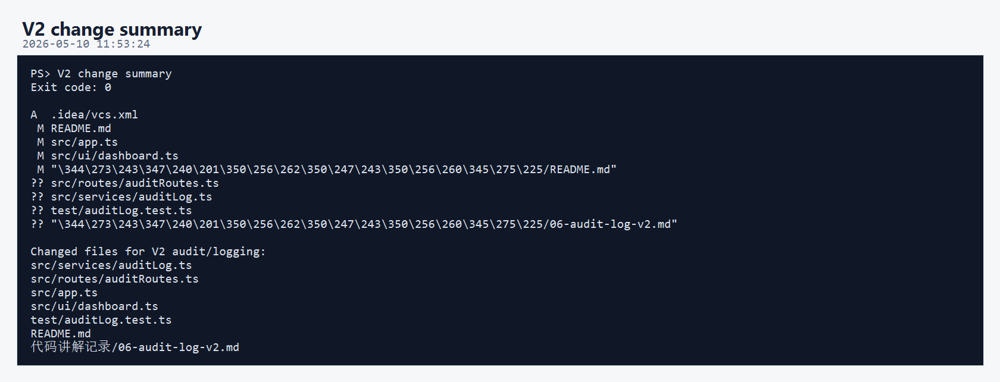
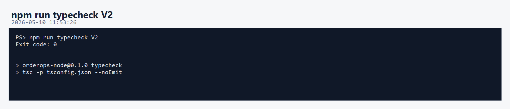
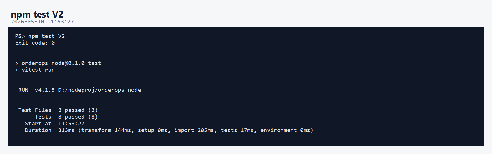
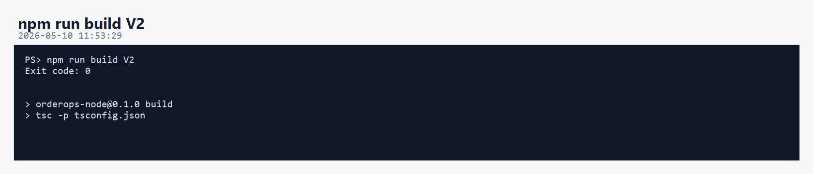
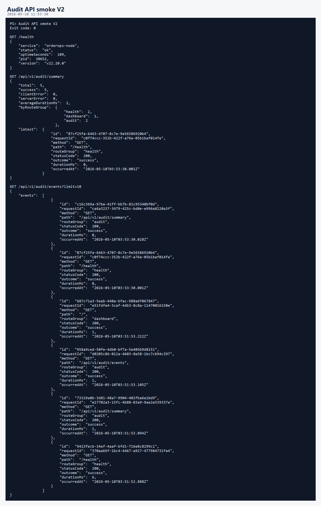
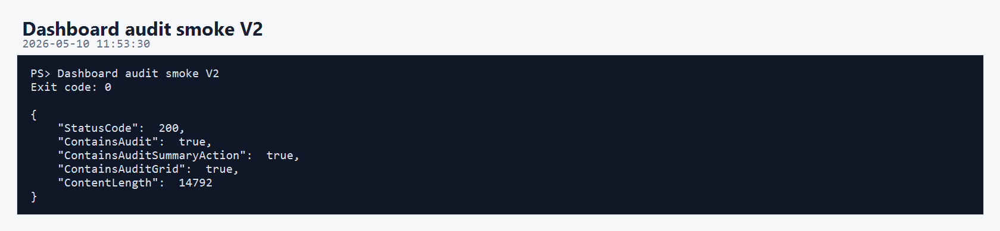
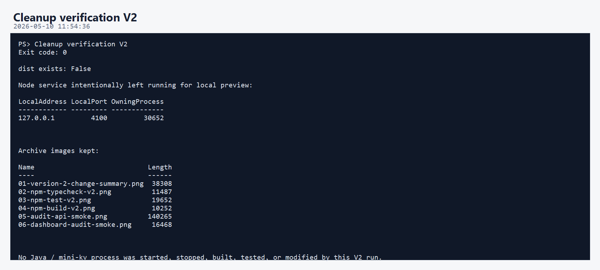

# OrderOps Node 第二版开发调试运行归档说明

本轮归档对应 `orderops-node` 第二版。

第二版新增主题：

```text
内存审计日志 + 请求观测 + Dashboard 审计面板
```

这一版仍然只验证 Node 项目自身，没有启动、停止、重启、构建或修改：

```text
D:\javaproj\advanced-order-platform
D:\C\mini-kv
```

本轮运行调试没有调用 `/api/v1/sources/status`，避免对 Java / mini-kv 做非必要探测。

## 核心执行流程

```text
实现 AuditLog 和 audit routes
 -> Dashboard 增加审计摘要和事件按钮
 -> 新增 auditLog 单元测试
 -> npm run typecheck
 -> npm test
 -> npm run build
 -> 重启 Node 自己的 4100 预览服务
 -> 调用 /health、/api/v1/audit/summary、/api/v1/audit/events
 -> 验证 Dashboard 包含 Audit 区域
 -> 删除 dist 构建产物
```

## 01-version-2-change-summary.png



本图记录第二版主要改动文件。

核心新增：

```text
src/services/auditLog.ts
src/routes/auditRoutes.ts
test/auditLog.test.ts
代码讲解记录/06-audit-log-v2.md
```

核心修改：

```text
src/app.ts
src/ui/dashboard.ts
README.md
代码讲解记录/README.md
```

意义：第二版开始让 Node 控制台具备自己的请求观测能力。

## 02-npm-typecheck-v2.png



- 命令：`npm run typecheck`
- 结果：`Exit code: 0`
- 实际执行：

```text
tsc -p tsconfig.json --noEmit
```

意义：第二版新增的 `AuditLog`、审计路由、Fastify hook、Dashboard 字符串都通过 TypeScript 严格检查。

## 03-npm-test-v2.png



- 命令：`npm test`
- 结果：`Exit code: 0`
- 当前测试结果：

```text
Test Files  3 passed (3)
Tests       8 passed (8)
```

第二版新增测试覆盖：

- 审计事件写入。
- `success / client_error / server_error` 统计。
- 平均耗时计算。
- route group 聚合。
- 审计日志容量截断。
- URL 分组规则。

## 04-npm-build-v2.png



- 命令：`npm run build`
- 结果：`Exit code: 0`
- 实际执行：

```text
tsc -p tsconfig.json
```

意义：第二版可以正常编译到 `dist/`。

本轮结束前已按清理规则删除 `dist/`。

## 05-audit-api-smoke.png



本轮 smoke 只访问 Node 自己：

```text
GET /health
GET /api/v1/audit/summary
GET /api/v1/audit/events?limit=10
```

验证结果说明：

- `/health` 返回 `status: ok`。
- `/api/v1/audit/summary` 返回总请求数、成功数、错误数、平均耗时、route group 聚合和最新事件。
- `/api/v1/audit/events` 返回最近请求事件列表。

关键点：这些接口只读取 Node 内存里的审计日志，不访问 Java 或 mini-kv。

## 06-dashboard-audit-smoke.png



本图验证 Dashboard HTML 已包含第二版审计 UI：

```text
ContainsAudit = true
ContainsAuditSummaryAction = true
ContainsAuditGrid = true
```

说明首页已经包含：

- Audit 指标卡片。
- Summary 按钮。
- Recent Events 按钮。
- 前端 `auditSummary` 行为分支。

## 07-cleanup-v2.png



本轮清理内容：

- 删除 `D:\nodeproj\orderops-node\dist`

本轮保留内容：

- 第二版源码改动。
- 第二版测试文件。
- 第二版代码讲解文档。
- `a/2/图片/` 下归档图片。
- `a/2/解释/说明.md`。

Node 预览服务继续保留运行：

```text
http://127.0.0.1:4100
```

## 当前结论

第二版已经达到“Node 自身请求可观测”的状态：

```text
每个 Node HTTP 请求会生成审计事件
可以查询最近事件
可以查询摘要统计
Dashboard 可以展示审计数据
测试覆盖审计核心逻辑
```

这一版继续保持项目边界：

```text
Java 高并发订单项目
 -> 不被启动、不被停止、不被构建、不被修改

mini-kv
 -> 不被启动、不被停止、不被构建、不被修改

orderops-node
 -> 独立完成 V2 开发、运行、调试和归档
```

## 清理记录

- 本轮生成过 `dist/`，已删除。
- 没有保留临时脚本。
- 没有删除源码、测试、依赖、归档图片或说明文档。
- 没有操作 Java / mini-kv 的进程、构建目录或源码。
- Node 预览服务仍保留运行在 `127.0.0.1:4100`。
