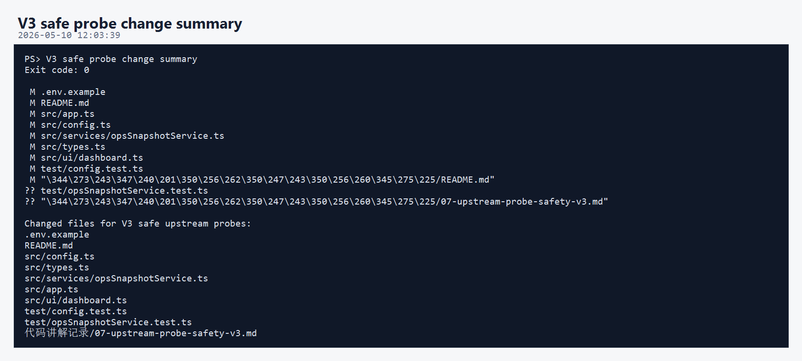
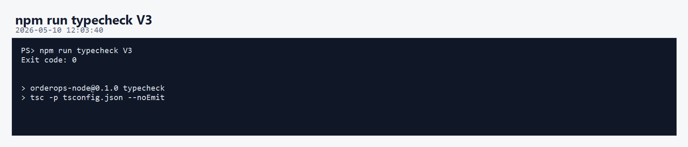
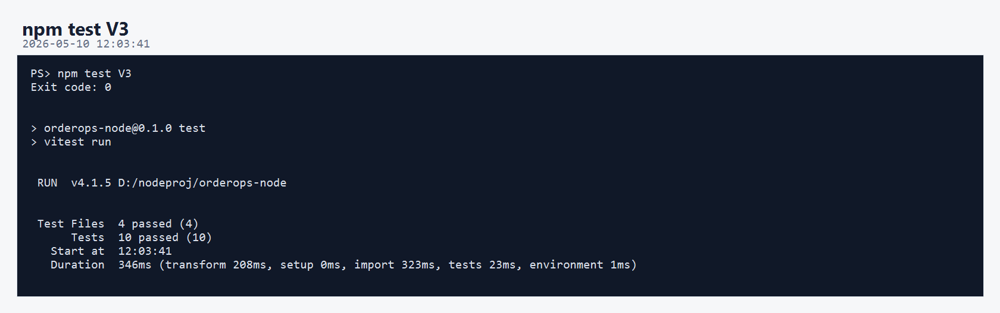
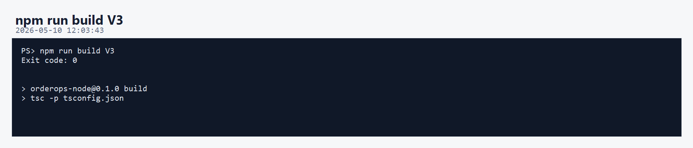
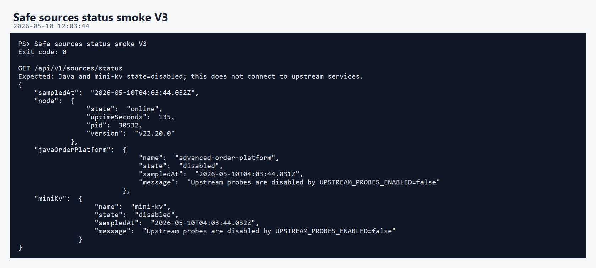
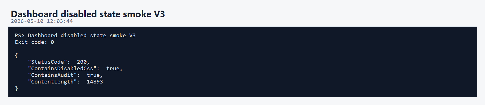
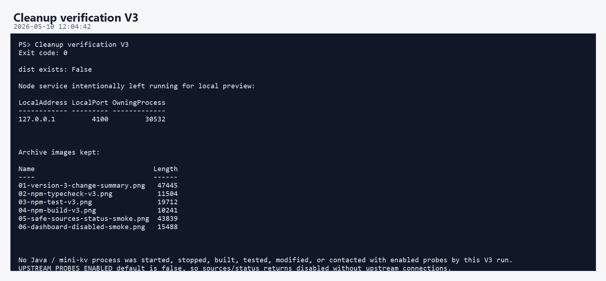

# OrderOps Node 第三版开发调试运行归档说明

本轮归档对应 `orderops-node` 第三版。

第三版新增主题：

```text
上游探测安全开关
```

核心变化是默认关闭自动上游探测：

```text
UPSTREAM_PROBES_ENABLED=false
```

这样 Dashboard、SSE 和 `/api/v1/sources/status` 不会自动连接 Java 高并发订单项目或 mini-kv。需要真实联调时，再显式设置为 `true`。

## 核心执行流程

```text
新增 upstreamProbesEnabled 配置
 -> SourceState 增加 disabled
 -> OpsSnapshotService 在开关关闭时短路返回 disabled
 -> Dashboard 增加 disabled 状态样式
 -> 新增配置和状态采样测试
 -> npm run typecheck
 -> npm test
 -> npm run build
 -> 重启 Node 自己的 4100 预览服务
 -> 调用 /api/v1/sources/status 验证 disabled
 -> 删除 dist 构建产物
```

本轮没有启动、停止、构建、测试或修改：

```text
D:\javaproj\advanced-order-platform
D:\C\mini-kv
```

## 01-version-3-change-summary.png



本图记录第三版主要改动文件。

核心修改：

```text
.env.example
README.md
src/config.ts
src/types.ts
src/services/opsSnapshotService.ts
src/app.ts
src/ui/dashboard.ts
test/config.test.ts
test/opsSnapshotService.test.ts
代码讲解记录/07-upstream-probe-safety-v3.md
```

意义：V3 把“不打扰上游开发调试”变成项目配置层能力。

## 02-npm-typecheck-v3.png



- 命令：`npm run typecheck`
- 结果：`Exit code: 0`
- 实际执行：

```text
tsc -p tsconfig.json --noEmit
```

意义：新增的 `disabled` 状态、布尔配置解析和 `OpsSnapshotService` 构造参数都通过 TypeScript 严格检查。

## 03-npm-test-v3.png



- 命令：`npm test`
- 结果：`Exit code: 0`
- 当前测试结果：

```text
Test Files  4 passed (4)
Tests       10 passed (10)
```

第三版新增测试覆盖：

- `UPSTREAM_PROBES_ENABLED` 默认是 `false`。
- `true / 1 / yes / on` 能解析成启用。
- `false / 0 / no / off` 能解析成禁用。
- 探测禁用时，`OpsSnapshotService.sample()` 返回 Java 和 mini-kv 的 `disabled` 状态。

## 04-npm-build-v3.png



- 命令：`npm run build`
- 结果：`Exit code: 0`
- 实际执行：

```text
tsc -p tsconfig.json
```

意义：第三版仍能正常编译到 `dist/`。

本轮结束前已按清理规则删除 `dist/`。

## 05-safe-sources-status-smoke.png



本轮 smoke 调用：

```text
GET /api/v1/sources/status
```

预期结果：

```text
javaOrderPlatform.state = disabled
miniKv.state = disabled
```

返回信息说明：

```text
Upstream probes are disabled by UPSTREAM_PROBES_ENABLED=false
```

这次调用不会连接 Java 或 mini-kv，因为短路逻辑发生在 client 调用之前。

## 06-dashboard-disabled-smoke.png



本图验证 Dashboard 已包含 disabled 状态样式：

```text
ContainsDisabledCss = true
```

说明页面能正确显示第三版新增的 `disabled` 状态，而不是把未探测的服务误显示为 `offline`。

## 07-cleanup-v3.png



本轮清理内容：

- 删除 `D:\nodeproj\orderops-node\dist`

本轮保留内容：

- 第三版源码改动。
- 第三版测试文件。
- 第三版代码讲解文档。
- `a/3/图片/` 下归档图片。
- `a/3/解释/说明.md`。

Node 预览服务继续保留运行：

```text
http://127.0.0.1:4100
```

## 当前结论

第三版已经达到“安全旁路运行”的状态：

```text
Node 控制台可以继续运行
Dashboard 可以继续打开
SSE 可以继续刷新
/api/v1/sources/status 可以继续调用
但默认不会连接 Java / mini-kv
```

需要联调时，再显式打开：

```powershell
$env:UPSTREAM_PROBES_ENABLED = "true"
npm run dev
```

## 清理记录

- 本轮生成过 `dist/`，已删除。
- 没有保留临时脚本。
- 没有删除源码、测试、依赖、归档图片或说明文档。
- 没有操作 Java / mini-kv 的进程、构建目录或源码。
- Node 预览服务仍保留运行在 `127.0.0.1:4100`。
