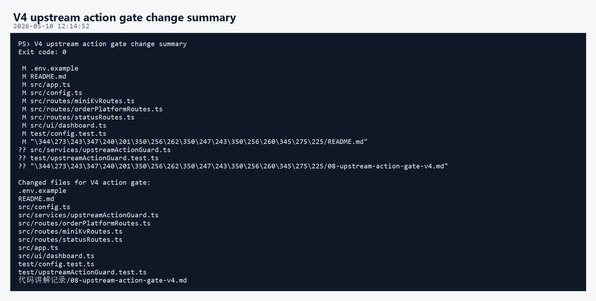
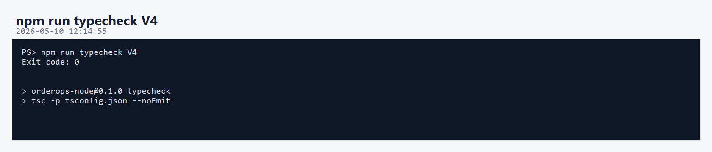
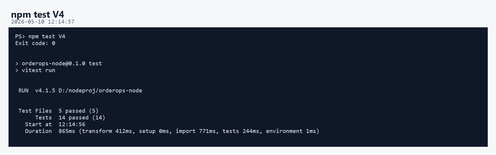
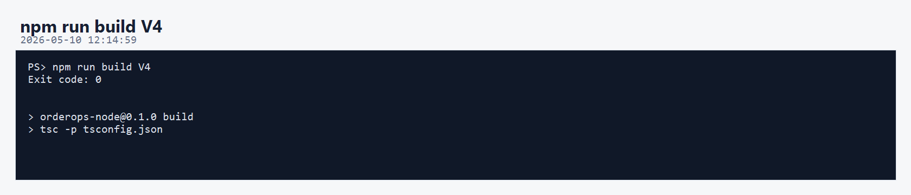
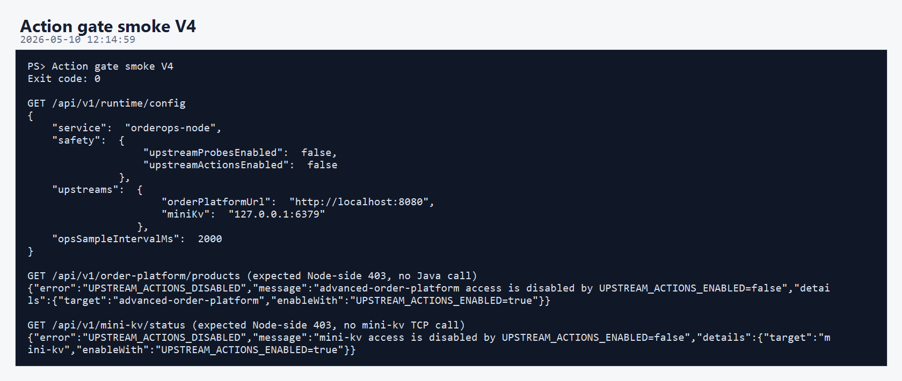
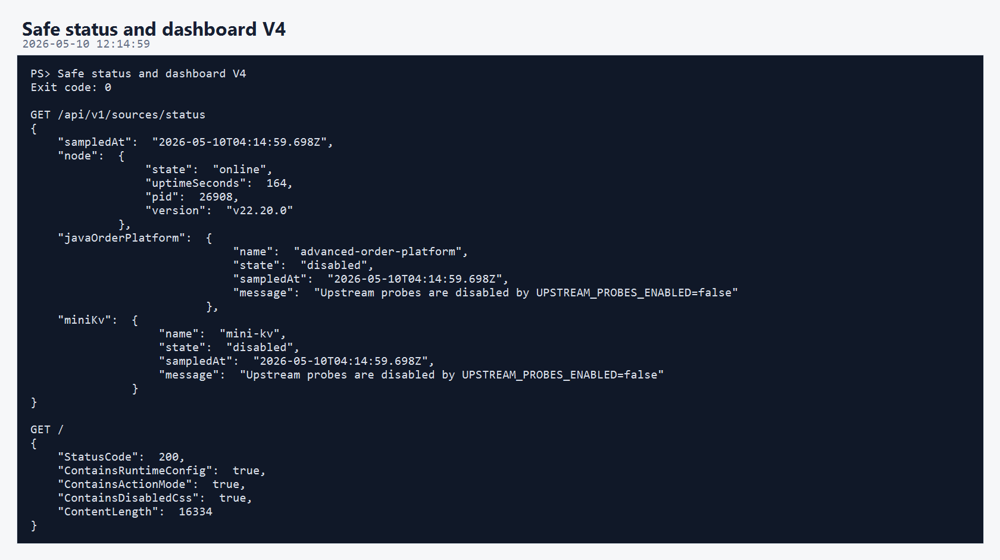
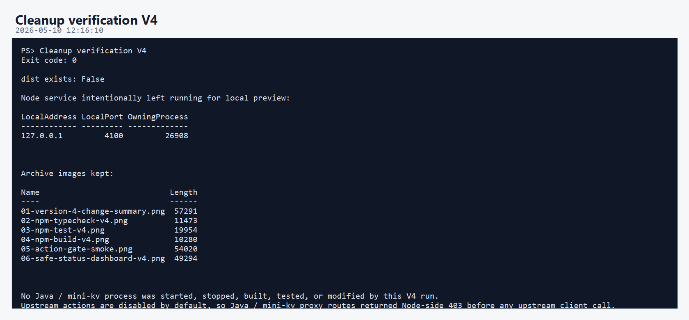

# OrderOps Node 第四版开发调试运行归档说明

本轮归档对应 `orderops-node` 第四版。

第四版新增主题：

```text
上游动作安全闸门
```

第三版已经让状态探测默认不连接 Java / mini-kv。第四版进一步保证：即使误点 Dashboard 里的 Java 或 mini-kv 操作按钮，Node 也会先在本地返回 403，不会触碰上游。

默认配置：

```text
UPSTREAM_PROBES_ENABLED=false
UPSTREAM_ACTIONS_ENABLED=false
```

## 核心执行流程

```text
新增 upstreamActionsEnabled 配置
 -> 新增 upstreamActionGuard
 -> Java 订单平台代理路由加 guard
 -> mini-kv 代理路由加 guard
 -> 新增 /api/v1/runtime/config
 -> Dashboard 展示 Probe mode / Action mode
 -> 新增动作闸门测试
 -> npm run typecheck
 -> npm test
 -> npm run build
 -> 重启 Node 自己的 4100 预览服务
 -> 验证代理路由返回 Node 侧 403
 -> 删除 dist 构建产物
```

本轮没有启动、停止、构建、测试或修改：

```text
D:\javaproj\advanced-order-platform
D:\C\mini-kv
```

## 01-version-4-change-summary.png



本图记录第四版主要改动文件。

核心新增：

```text
src/services/upstreamActionGuard.ts
test/upstreamActionGuard.test.ts
代码讲解记录/08-upstream-action-gate-v4.md
```

核心修改：

```text
.env.example
README.md
src/config.ts
src/routes/orderPlatformRoutes.ts
src/routes/miniKvRoutes.ts
src/routes/statusRoutes.ts
src/app.ts
src/ui/dashboard.ts
test/config.test.ts
```

意义：第四版把“不要误触上游服务”变成了明确的运行时安全闸门。

## 02-npm-typecheck-v4.png



- 命令：`npm run typecheck`
- 结果：`Exit code: 0`
- 实际执行：

```text
tsc -p tsconfig.json --noEmit
```

意义：新增的 action gate、runtime config、路由依赖注入和 Dashboard 字符串都通过 TypeScript 严格检查。

## 03-npm-test-v4.png



- 命令：`npm test`
- 结果：`Exit code: 0`
- 当前测试结果：

```text
Test Files  5 passed (5)
Tests       14 passed (14)
```

第四版新增测试覆盖：

- `UPSTREAM_ACTIONS_ENABLED` 默认是 `false`。
- `true / on` 能打开动作。
- `0 / not-a-bool` 保持关闭。
- `assertUpstreamActionsEnabled(false, ...)` 返回稳定 403。
- Fastify inject 验证 Java 和 mini-kv 代理路由默认被 Node 拦截。
- `/api/v1/runtime/config` 能返回当前 safety 配置。

## 04-npm-build-v4.png



- 命令：`npm run build`
- 结果：`Exit code: 0`
- 实际执行：

```text
tsc -p tsconfig.json
```

意义：第四版仍能正常编译到 `dist/`。

本轮结束前已按清理规则删除 `dist/`。

## 05-action-gate-smoke.png



本轮 smoke 调用：

```text
GET /api/v1/runtime/config
GET /api/v1/order-platform/products
GET /api/v1/mini-kv/status
```

预期结果：

```text
runtime config:
  upstreamProbesEnabled = false
  upstreamActionsEnabled = false

order-platform products:
  403 UPSTREAM_ACTIONS_DISABLED

mini-kv status:
  403 UPSTREAM_ACTIONS_DISABLED
```

关键点：这两个 403 是 Node 自己返回的，发生在调用 `OrderPlatformClient` 或 `MiniKvClient` 之前。

## 06-safe-status-dashboard-v4.png



本图验证：

- `/api/v1/sources/status` 仍返回 Java / mini-kv 的 `disabled` 状态。
- 首页 Dashboard 仍可访问。
- 页面包含 runtime config 行为。
- 页面包含 Action mode 显示。
- 页面包含 disabled 样式。

这说明第四版兼容第三版的“探测安全”，并增加了“动作安全”。

## 07-cleanup-v4.png



本轮清理内容：

- 删除 `D:\nodeproj\orderops-node\dist`

本轮保留内容：

- 第四版源码改动。
- 第四版测试文件。
- 第四版代码讲解文档。
- `a/4/图片/` 下归档图片。
- `a/4/解释/说明.md`。

Node 预览服务继续保留运行：

```text
http://127.0.0.1:4100
```

## 当前结论

第四版已经达到“双重安全运行”的状态：

```text
UPSTREAM_PROBES_ENABLED=false
 -> 不自动探测 Java / mini-kv

UPSTREAM_ACTIONS_ENABLED=false
 -> 不允许代理 API 触碰 Java / mini-kv
```

如果以后要真实联调，需要显式打开：

```powershell
$env:UPSTREAM_PROBES_ENABLED = "true"
$env:UPSTREAM_ACTIONS_ENABLED = "true"
npm run dev
```

在需要打开之前，应先确认 Java / mini-kv 当前开发调试状态。

## 清理记录

- 本轮生成过 `dist/`，已删除。
- 没有保留临时脚本。
- 没有删除源码、测试、依赖、归档图片或说明文档。
- 没有操作 Java / mini-kv 的进程、构建目录或源码。
- 没有启用上游动作，因此没有对 Java / mini-kv 发出代理调用。
- Node 预览服务仍保留运行在 `127.0.0.1:4100`。
