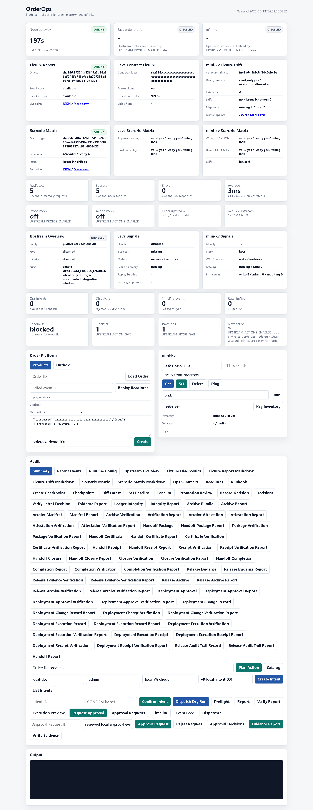

# Node v79：Dashboard scenario matrix panel

## 本版目标

v79 把 v78 已经生成的 `scenario matrix` 接到 Dashboard，只做只读展示，不进入真实执行。

本版新增页面能力：

- `Scenario Matrix` 汇总卡：展示 `matrixDigest`、`validScenarios / totalScenarios`、`issueCount`、drift 状态。
- `Java Scenario Matrix`：展示 `java-approved-replay-contract` 和 `java-blocked-replay-contract` 的 `valid / diagnosticReady / failingCheckCount`。
- `mini-kv Scenario Matrix`：展示 `mini-kv-write-checkjson` 和 `mini-kv-read-checkjson` 的 `valid / diagnosticReady / failingCheckCount`。
- Audit 区新增 `Scenario Matrix` 和 `Scenario Matrix Markdown` 两个只读按钮。

## 运行调试

使用安全环境变量启动 Node HTTP smoke：

```text
HOST=127.0.0.1
PORT=4179
UPSTREAM_PROBES_ENABLED=false
UPSTREAM_ACTIONS_ENABLED=false
```

验证结果：

```text
healthStatus=ok
dashboardStatus=200
matrixValid=true
totalScenarios=4
validScenarios=4
diagnosticReadyScenarios=4
issueCount=0
matrixDigest=sha256:6484012b007d19e26d03eed4159849bc333a3906602271f82937ac92a4808d32
```

## 截图



## 边界说明

本版只操作 Node 项目，没有启动、停止、构建、测试或修改 Java / mini-kv。Dashboard 面板只读取：

```text
/api/v1/upstream-contract-fixtures/scenario-matrix
/api/v1/upstream-contract-fixtures/scenario-matrix?format=markdown
```

它不会调用 Java replay POST，也不会执行 mini-kv `SET` / `DEL` / `EXPIRE`。
