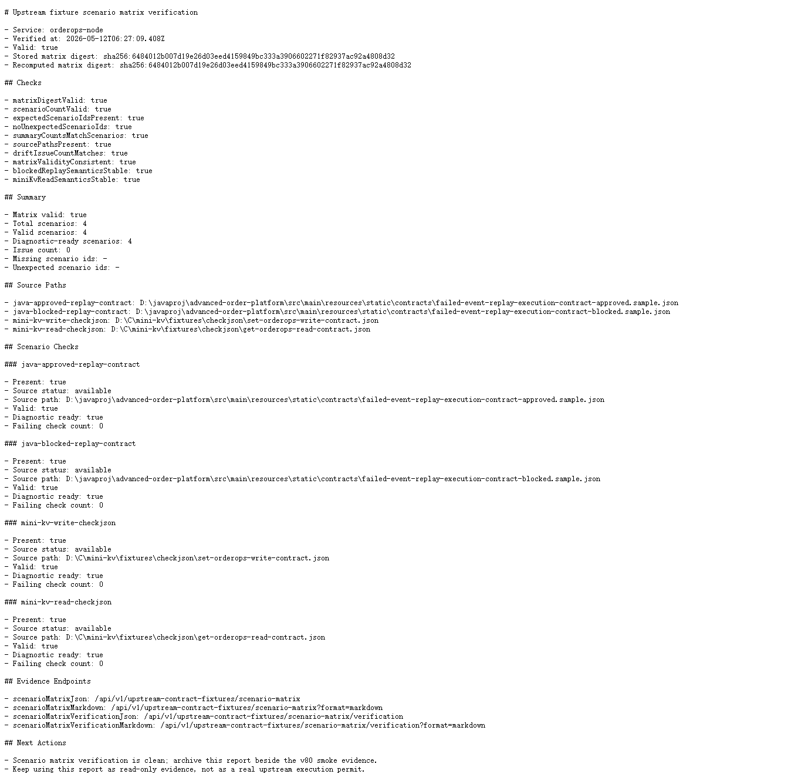

# Node v80：Scenario matrix verification report

## 本版目标

v80 在 v78/v79 的 `scenario matrix` 基础上新增 verification report。它用于复核矩阵证据是否稳定，不做真实执行，也不修复上游 fixture。

本版新增：

- `/api/v1/upstream-contract-fixtures/scenario-matrix/verification`
- `/api/v1/upstream-contract-fixtures/scenario-matrix/verification?format=markdown`
- `createUpstreamContractFixtureScenarioMatrixVerification()`
- Markdown verification report
- digest、场景覆盖、source path、drift issueCount、blocked/read 语义检查

## 运行调试

使用安全环境变量启动 Node HTTP smoke：

```text
HOST=127.0.0.1
PORT=4180
UPSTREAM_PROBES_ENABLED=false
UPSTREAM_ACTIONS_ENABLED=false
```

验证结果：

```text
healthStatus=ok
verificationValid=true
matrixDigestValid=true
scenarioCountValid=true
blockedReplaySemanticsStable=true
miniKvReadSemanticsStable=true
totalScenarios=4
issueCount=0
markdownStatus=200
```

## 截图



## 边界说明

本版只操作 Node 项目。verification 只读取已有 fixture 文件并复核已有 scenario matrix，不会：

- 调用 Java replay POST
- 执行 mini-kv `SET` / `DEL` / `EXPIRE`
- 修改 Java / mini-kv
- 把 verification valid 当成真实执行许可
