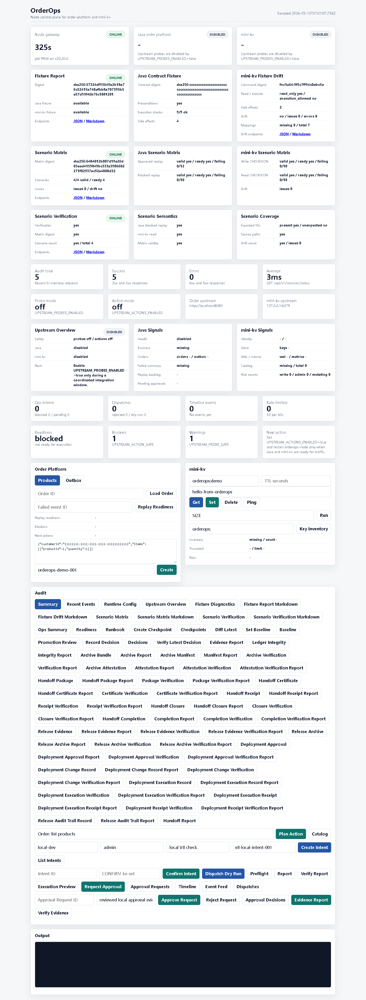

# Node v81：Dashboard scenario verification panel

## 本版目标

v81 把 v80 的 scenario matrix verification report 接到 Dashboard，只做只读展示。

本版新增页面能力：

- `Scenario Verification` 汇总卡：展示 verification valid、matrix digest 校验、scenario count 校验。
- `Scenario Semantics`：展示 Java blocked replay 与 mini-kv read CHECKJSON 语义是否稳定。
- `Scenario Coverage`：展示 expected IDs、source paths、drift issueCount 是否通过。
- Audit 区新增 `Scenario Verification` 和 `Scenario Verification Markdown` 两个只读按钮。

## 运行调试

使用安全环境变量启动 Node HTTP smoke：

```text
HOST=127.0.0.1
PORT=4181
UPSTREAM_PROBES_ENABLED=false
UPSTREAM_ACTIONS_ENABLED=false
```

验证结果：

```text
healthStatus=ok
dashboardStatus=200
hasScenarioVerificationPanel=true
hasScenarioVerificationAction=true
verificationValid=true
matrixDigestValid=true
scenarioCountValid=true
blockedReplaySemanticsStable=true
miniKvReadSemanticsStable=true
sourcePathsPresent=true
issueCount=0
```

## 截图



## 边界说明

本版只操作 Node 项目。Dashboard 面板只读取：

```text
/api/v1/upstream-contract-fixtures/scenario-matrix/verification
/api/v1/upstream-contract-fixtures/scenario-matrix/verification?format=markdown
```

它不会调用 Java replay POST，也不会执行 mini-kv `SET` / `DEL` / `EXPIRE`。
