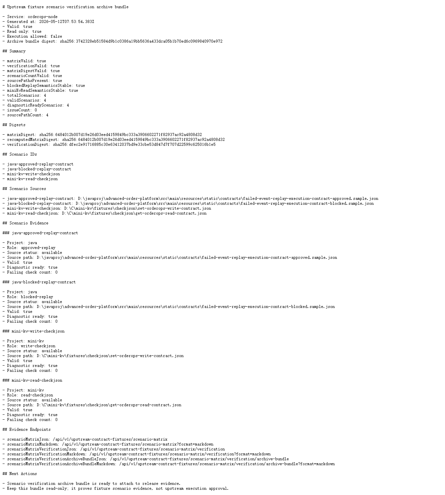

# Node v82：Scenario verification archive bundle

## 本版目标

v82 新增只读 archive bundle，把 scenario matrix、scenario verification、关键 endpoints、source path 和摘要信息固化成 release evidence bundle。

本版新增：

- `/api/v1/upstream-contract-fixtures/scenario-matrix/verification/archive-bundle`
- `/api/v1/upstream-contract-fixtures/scenario-matrix/verification/archive-bundle?format=markdown`
- `createUpstreamContractFixtureScenarioVerificationArchiveBundle()`
- archive bundle digest
- scenario matrix digest、verification digest、四个 scenario id、四个 source path、nextActions

## 运行调试

使用安全环境变量启动 Node HTTP smoke：

```text
HOST=127.0.0.1
PORT=4182
UPSTREAM_PROBES_ENABLED=false
UPSTREAM_ACTIONS_ENABLED=false
```

验证结果：

```text
healthStatus=ok
bundleValid=true
readOnly=true
executionAllowed=false
verificationValid=true
matrixDigestValid=true
totalScenarios=4
sourcePathCount=4
issueCount=0
markdownStatus=200
```

## 截图



## 边界说明

本版只操作 Node 项目。archive bundle 只是只读证据固化，不会：

- 替代 v77 fixture archive snapshot
- 写数据库
- 自动修复 fixture
- 调用 Java replay POST
- 执行 mini-kv `SET` / `DEL` / `EXPIRE`
- 修改 Java / mini-kv
