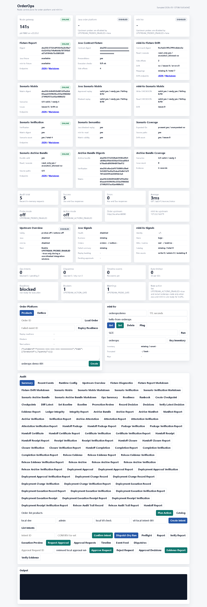

# Node v83：Dashboard scenario archive bundle panel

## 本版目标

v83 把 v82 的 scenario verification archive bundle 接到 Dashboard，只做只读展示。

本版新增页面能力：

- `Scenario Archive Bundle` 汇总卡：展示 bundle valid、readOnly / executionAllowed、sourcePathCount。
- `Archive Bundle Digests`：展示 archiveBundleDigest、verificationDigest、matrixDigest。
- `Archive Bundle Coverage`：展示 scenario 覆盖、issueCount、scenario evidence 数量。
- Audit 区新增 `Scenario Archive Bundle` 和 `Scenario Archive Bundle Markdown` 两个只读按钮。

## 运行调试

使用安全环境变量启动 Node HTTP smoke：

```text
HOST=127.0.0.1
PORT=4183
UPSTREAM_PROBES_ENABLED=false
UPSTREAM_ACTIONS_ENABLED=false
```

验证结果：

```text
healthStatus=ok
dashboardStatus=200
hasArchiveBundlePanel=true
hasArchiveBundleAction=true
bundleValid=true
readOnly=true
executionAllowed=false
archiveBundleDigestLength=64
sourcePathCount=4
totalScenarios=4
issueCount=0
```

## 截图



## 边界说明

本版只操作 Node 项目。Dashboard 面板只读取：

```text
/api/v1/upstream-contract-fixtures/scenario-matrix/verification/archive-bundle
/api/v1/upstream-contract-fixtures/scenario-matrix/verification/archive-bundle?format=markdown
```

它不会调用 Java replay POST，也不会执行 mini-kv `SET` / `DEL` / `EXPIRE`。
