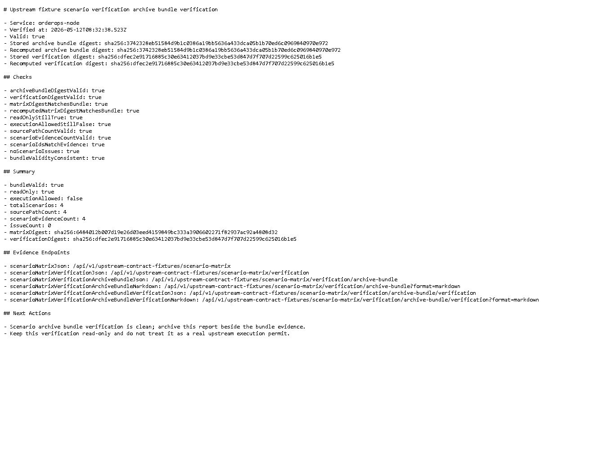

# Node v84：Scenario archive bundle verification report

## 本版目标

v84 给 v82 的 scenario verification archive bundle 新增 verification report，用来复核 archive bundle 自身是否可归档。

本版新增：

- `/api/v1/upstream-contract-fixtures/scenario-matrix/verification/archive-bundle/verification`
- `/api/v1/upstream-contract-fixtures/scenario-matrix/verification/archive-bundle/verification?format=markdown`
- `createUpstreamContractFixtureScenarioVerificationArchiveBundleVerification()`
- archiveBundleDigest 复算
- verificationDigest 复算
- readOnly / executionAllowed / source path / scenario evidence 数量检查

## 运行调试

使用安全环境变量启动 Node HTTP smoke：

```text
HOST=127.0.0.1
PORT=4184
UPSTREAM_PROBES_ENABLED=false
UPSTREAM_ACTIONS_ENABLED=false
```

验证结果：

```text
healthStatus=ok
verificationValid=true
archiveBundleDigestValid=true
verificationDigestValid=true
readOnlyStillTrue=true
executionAllowedStillFalse=true
sourcePathCountValid=true
scenarioEvidenceCountValid=true
totalScenarios=4
sourcePathCount=4
issueCount=0
markdownStatus=200
```

## 截图



## 边界说明

本版只操作 Node 项目。verification 只是只读复核，不会：

- 写数据库
- 自动修复 fixture
- 调用 Java replay POST
- 执行 mini-kv `SET` / `DEL` / `EXPIRE`
- 修改 Java / mini-kv
- 把 bundle verification valid 当成真实执行许可
