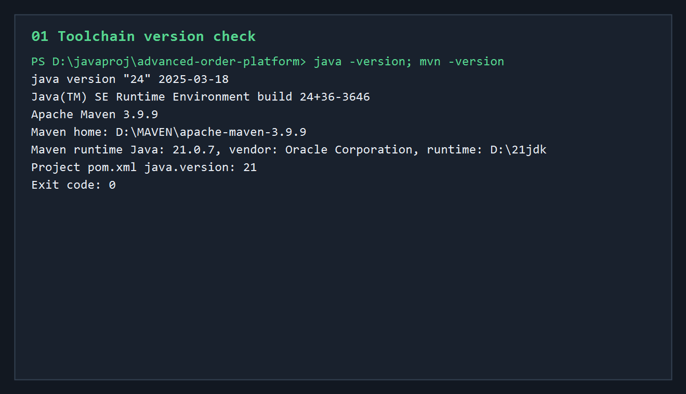
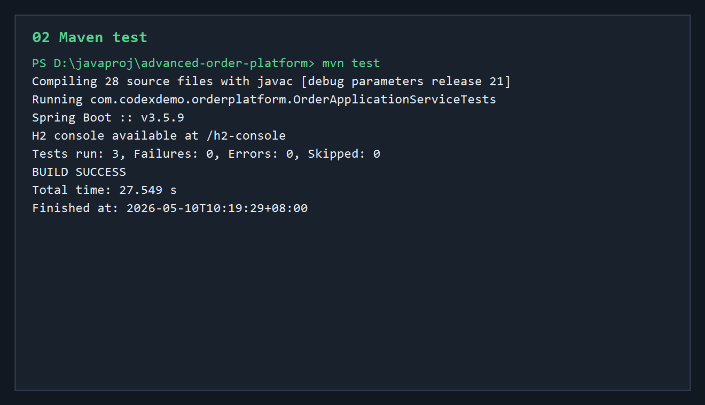
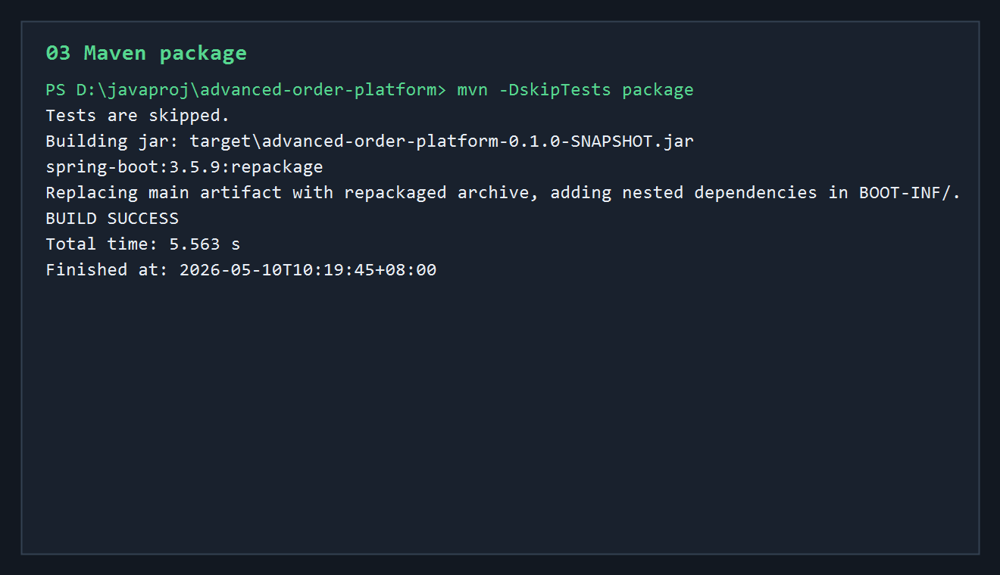
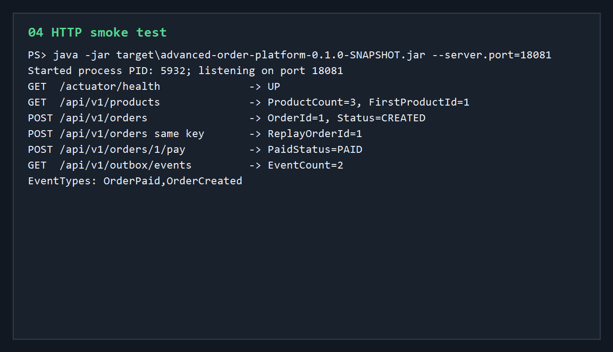
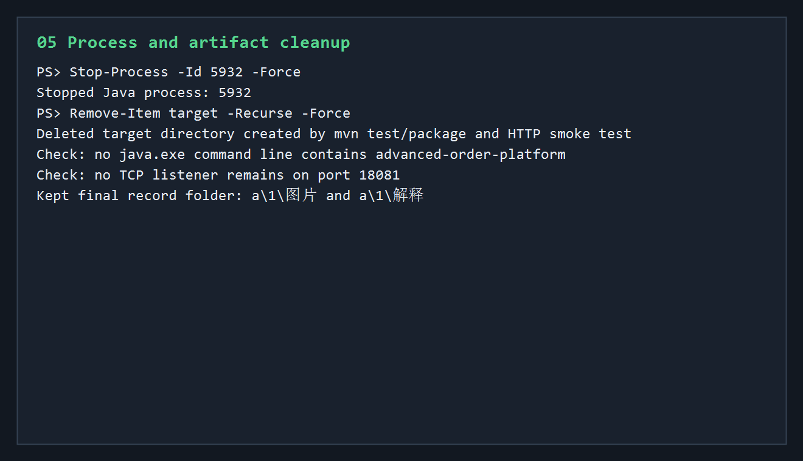

# 第一版开发调试运行归档说明

本轮归档对应 `advanced-order-platform` 第一版可运行雏形。

这一版验证范围包括：

- Java / Maven 工具链检查
- Maven 编译与单元测试
- Spring Boot 可执行 jar 打包
- 本地 HTTP smoke test
- 商品查询、创建订单、幂等重放、支付订单、Outbox 查询
- 验证后进程和构建产物清理

本轮关键输出已保存为 `a/1/图片/` 下 5 张 PNG 记录图。

## 核心执行流程

```text
检查 java / mvn 版本
 -> mvn test
 -> mvn -DskipTests package
 -> java -jar target/advanced-order-platform-0.1.0-SNAPSHOT.jar --server.port=18081
 -> 调用 Actuator health
 -> 查询商品列表
 -> 创建订单
 -> 使用相同 Idempotency-Key 重放下单
 -> 支付订单
 -> 查询 Outbox 事件
 -> 停止 Java 进程
 -> 删除 target 构建产物
```

## 01-toolchain-version.png



- 命令：`java -version; mvn -version`
- 结果：
  - 命令行 `java` 指向 JDK 24。
  - Maven 版本为 `Apache Maven 3.9.9`。
  - Maven 自身运行在 Java 21.0.7，路径为 `D:\21jdk`。
  - 项目 `pom.xml` 中的 `java.version` 是 21。
- 意义：确认项目可以用 Maven 按 Java 21 目标编译。虽然全局 `java` 是 JDK 24，但 Maven 编译日志显示使用 `release 21`，和项目配置一致。

## 02-maven-test.png



- 命令：`mvn test`
- 结果：构建成功，测试全部通过。
- 关键结果：

```text
Compiling 28 source files with javac [debug parameters release 21]
Running com.codexdemo.orderplatform.OrderApplicationServiceTests
Tests run: 3, Failures: 0, Errors: 0, Skipped: 0
BUILD SUCCESS
```

本轮测试覆盖：

- 下单后库存预占。
- 同一个 `Idempotency-Key` 重放时返回同一订单。
- 幂等重放不会重复扣库存。
- 支付后订单状态变为 `PAID`。
- 库存不足时抛出业务异常。

测试末尾出现 Mockito / ByteBuddy 动态 agent 警告，这是当前测试依赖在新版 JDK 上的运行提示，不是测试失败。

## 03-maven-package.png



- 命令：`mvn -DskipTests package`
- 结果：打包成功。
- 生成过的 jar：

```text
target\advanced-order-platform-0.1.0-SNAPSHOT.jar
```

关键输出：

```text
spring-boot:3.5.9:repackage
Replacing main artifact with repackaged archive
BUILD SUCCESS
```

意义：确认当前项目不仅能通过测试，也能被 Spring Boot Maven 插件打成可直接运行的 fat jar。

## 04-http-smoke.png



- 启动命令：

```powershell
java -jar target\advanced-order-platform-0.1.0-SNAPSHOT.jar --server.port=18081
```

- 本次启动进程：

```text
PID: 5932
Port: 18081
```

HTTP smoke test 结果：

```text
GET  /actuator/health              -> UP
GET  /api/v1/products              -> ProductCount=3, FirstProductId=1
POST /api/v1/orders                -> OrderId=1, Status=CREATED
POST /api/v1/orders same key       -> ReplayOrderId=1
POST /api/v1/orders/1/pay          -> PaidStatus=PAID
GET  /api/v1/outbox/events         -> EventCount=2
EventTypes: OrderPaid,OrderCreated
```

这一轮验证说明：

- 应用能正常启动。
- Actuator 健康检查可用。
- `DemoDataInitializer` 正常写入 3 个演示商品。
- 创建订单接口可用。
- 相同幂等键重复请求不会创建第二张订单。
- 支付接口能把订单推进到 `PAID`。
- Outbox 表能记录 `OrderCreated` 和 `OrderPaid` 事件。

## 05-cleanup.png



验证结束后执行清理：

```text
Stop-Process -Id 5932 -Force
Remove-Item target -Recurse -Force
```

清理结果：

- 本轮 HTTP smoke test 启动的 Java 进程 `5932` 已停止。
- 本轮 `mvn test`、`mvn package`、jar 启动验证生成的 `target` 目录已删除。
- 检查后没有发现 `advanced-order-platform` 相关 Java 进程残留。
- 检查后端口 `18081` 没有监听残留。

## 当前结论

第一版已经达到“可编译、可测试、可打包、可启动、可通过 HTTP 完整走通核心订单链路”的状态。

当前稳定链路是：

```text
商品种子数据
 -> 查询商品
 -> 创建订单
 -> 库存预占
 -> 幂等重放
 -> 支付订单
 -> reserved 库存确认
 -> 写入 Outbox 事件
```

下一轮适合继续验证或开发：

- 订单取消和 reserved 库存释放。
- Redis 缓存和限流。
- Outbox 后台发布器。
- PostgreSQL profile + Docker Compose 真实数据库运行。
- Testcontainers 集成测试。

## 进程与清理

- 本轮启动的 Java 服务进程 `5932` 已停止。
- 本轮构建产生的 `target` 目录已删除。
- 没有保留临时脚本。
- 没有发现残留 `tmp`、`.tmp`、`.pytest_cache`、`__pycache__`、`playwright-report` 或 `test-output` 目录。
