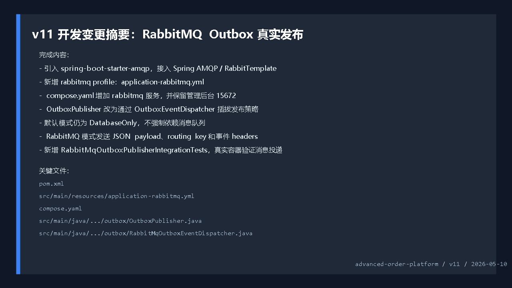
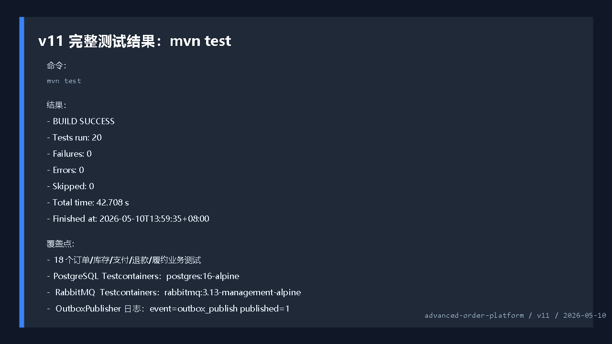
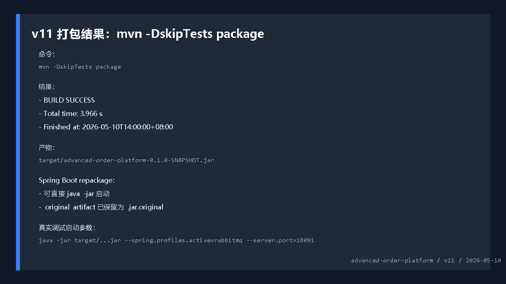
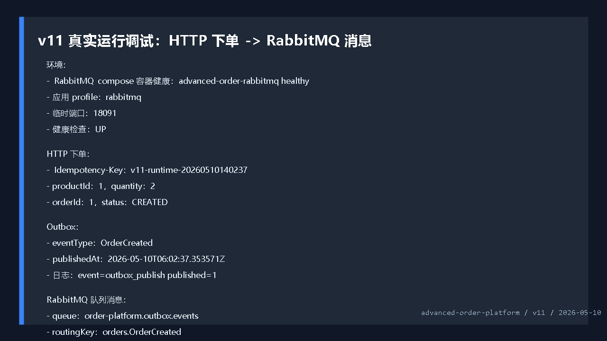
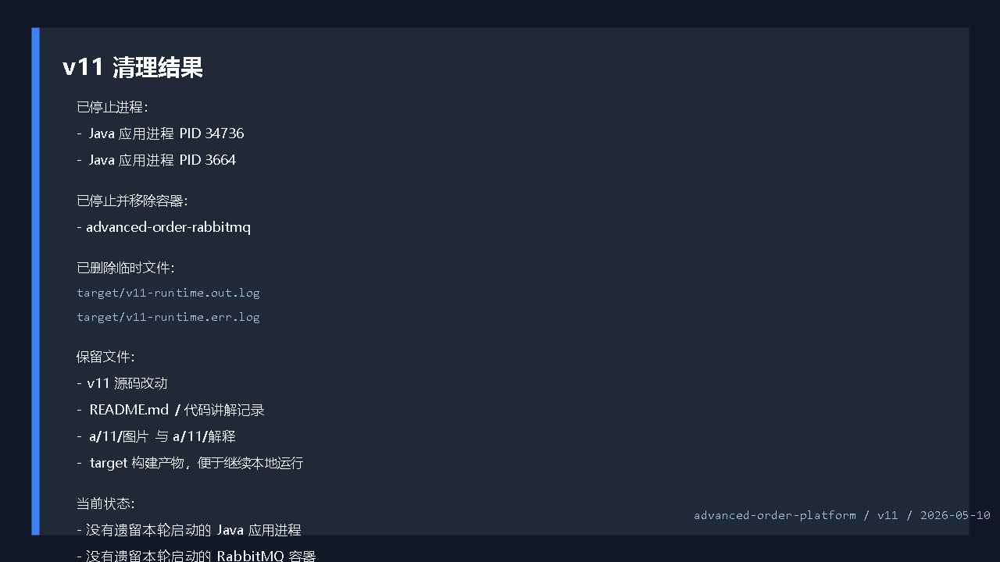

# 开发运行调试 v11：RabbitMQ Outbox 真实发布

## 本轮目标

第十一版的目标是把前面版本的 Outbox 发布器继续向真实工程场景推进：

```text
创建订单
 -> 写入 outbox_events
 -> OutboxPublisher 扫描待发布事件
 -> RabbitMqOutboxEventDispatcher 发送到 RabbitMQ
 -> 发送成功后标记 publishedAt
```

这版不是简单“加一个 RabbitMQ 依赖”，而是把发布动作抽象出来，让项目同时支持两种运行模式：

```text
默认模式
 -> 不依赖 RabbitMQ
 -> Outbox 事件只做数据库发布标记

rabbitmq profile
 -> 连接 RabbitMQ
 -> 声明 exchange / queue / binding
 -> 发送真实消息
 -> 再标记 publishedAt
```



## 代码改动概要

### 1. 引入 Spring AMQP

文件：`pom.xml`

```xml
<dependency>
    <groupId>org.springframework.boot</groupId>
    <artifactId>spring-boot-starter-amqp</artifactId>
</dependency>
```

这给项目带来 `RabbitTemplate`、RabbitMQ 连接工厂和 Spring Boot 自动配置能力。

### 2. 增加 RabbitMQ profile

文件：`src/main/resources/application-rabbitmq.yml`

```yaml
spring:
  rabbitmq:
    host: ${RABBITMQ_HOST:localhost}
    port: ${RABBITMQ_PORT:5672}
    username: ${RABBITMQ_USERNAME:order_app}
    password: ${RABBITMQ_PASSWORD:order_app}

outbox:
  rabbitmq:
    enabled: true
    exchange: ${OUTBOX_RABBITMQ_EXCHANGE:order-platform.outbox}
    queue: ${OUTBOX_RABBITMQ_QUEUE:order-platform.outbox.events}
    routing-key-prefix: ${OUTBOX_RABBITMQ_ROUTING_PREFIX:orders}
```

默认 `application.yml` 里保留：

```yaml
outbox:
  rabbitmq:
    enabled: false
```

所以平时运行项目不需要 RabbitMQ，只有主动启用 `rabbitmq` profile 才会连接消息队列。

### 3. 增加 RabbitMQ Compose 服务

文件：`compose.yaml`

```yaml
rabbitmq:
  image: rabbitmq:3.13-management-alpine
  container_name: advanced-order-rabbitmq
  environment:
    RABBITMQ_DEFAULT_USER: order_app
    RABBITMQ_DEFAULT_PASS: order_app
  ports:
    - "5672:5672"
    - "15672:15672"
```

运行命令：

```powershell
docker compose -f compose.yaml up -d rabbitmq
```

说明：项目目录里同时存在 `compose.yaml` 和 `docker-compose.yml`，为了避免 Docker 提示多个配置文件，本轮把文档命令统一写成 `-f compose.yaml`。

### 4. OutboxPublisher 改成插拔式发布

文件：`src/main/java/com/codexdemo/orderplatform/outbox/OutboxPublisher.java`

```java
private final OutboxEventDispatcher outboxEventDispatcher;

public OutboxPublisher(OutboxRepository outboxRepository, OutboxEventDispatcher outboxEventDispatcher) {
    this.outboxRepository = outboxRepository;
    this.outboxEventDispatcher = outboxEventDispatcher;
}
```

发布循环：

```java
for (OutboxEvent event : events) {
    outboxEventDispatcher.dispatch(event);
    if (event.markPublished(publishedAt)) {
        published++;
    }
}
```

注意顺序是先 `dispatch`，再 `markPublished`。

如果 RabbitMQ 发送失败，事务会回滚，事件不会被错误标记为已发布，下一轮扫描还能重试。

### 5. RabbitMQ 发布实现

文件：`src/main/java/com/codexdemo/orderplatform/outbox/RabbitMqOutboxEventDispatcher.java`

```java
rabbitTemplate.convertAndSend(
        properties.getExchange(),
        properties.routingKeyFor(event),
        event.getPayload(),
        message -> {
            message.getMessageProperties().setContentType("application/json");
            message.getMessageProperties().setMessageId(event.getId().toString());
            message.getMessageProperties().setHeader("eventId", event.getId().toString());
            message.getMessageProperties().setHeader("aggregateType", event.getAggregateType());
            message.getMessageProperties().setHeader("aggregateId", event.getAggregateId());
            message.getMessageProperties().setHeader("eventType", event.getEventType());
            message.getMessageProperties().setHeader("createdAt", event.getCreatedAt().toString());
            return message;
        }
);
```

这里发送的是 Outbox 表里的 JSON payload，同时把事件元信息放入 headers，便于后续消费者做幂等、路由和审计。

## 测试验证

完整测试命令：

```powershell
mvn test
```

结果：

```text
Tests run: 20
Failures: 0
Errors: 0
Skipped: 0
BUILD SUCCESS
Finished at: 2026-05-10T13:59:35+08:00
```

覆盖内容：

```text
OrderApplicationServiceTests
 -> 18 个业务测试

PostgresMigrationIntegrationTests
 -> Testcontainers 启动真实 PostgreSQL

RabbitMqOutboxPublisherIntegrationTests
 -> Testcontainers 启动真实 RabbitMQ
 -> 创建订单
 -> 发布 Outbox
 -> 从队列收到 orders.OrderCreated 消息
```



## 打包验证

打包命令：

```powershell
mvn -DskipTests package
```

结果：

```text
BUILD SUCCESS
Total time: 3.966 s
Finished at: 2026-05-10T14:00:00+08:00
```

产物：

```text
target/advanced-order-platform-0.1.0-SNAPSHOT.jar
```



## 真实运行调试

启动 RabbitMQ：

```powershell
docker compose -f compose.yaml up -d rabbitmq
```

RabbitMQ 健康检查：

```text
advanced-order-rabbitmq -> healthy
```

启动应用：

```powershell
java -jar target\advanced-order-platform-0.1.0-SNAPSHOT.jar `
  --spring.profiles.active=rabbitmq `
  --server.port=18091 `
  --outbox.publisher.scan-delay-ms=1000 `
  --order.expiration.enabled=false
```

应用启动结果：

```text
Tomcat started on port 18091
Started OrderPlatformApplication in 10.308 seconds
```

健康检查：

```text
GET http://localhost:18091/actuator/health
 -> UP
```

创建订单：

```text
Idempotency-Key: v11-runtime-20260510140237
productId: 1
quantity: 2
```

返回结果：

```json
{
  "orderId": 1,
  "status": "CREATED"
}
```

Outbox 结果：

```text
eventType: OrderCreated
publishedAt: 2026-05-10T06:02:37.353571Z
```

应用日志：

```text
event=outbox_publish published=1
```

RabbitMQ 队列取到的消息：

```json
{
  "routing_key": "orders.OrderCreated",
  "payload": "{\"orderId\":1,\"customerId\":\"11111111-1111-1111-1111-111111111111\",\"status\":\"CREATED\",\"totalAmount\":998.00}",
  "headers": {
    "aggregateId": "1",
    "aggregateType": "ORDER",
    "eventType": "OrderCreated"
  }
}
```

这证明 v11 的核心链路已经跑通：

```text
HTTP 下单成功
 -> 数据库 Outbox 事件生成
 -> 后台发布器扫描到事件
 -> RabbitMQ 收到真实消息
 -> OutboxEvent.publishedAt 被标记
```



## 清理结果

本轮调试启动过临时应用进程和 RabbitMQ 容器，结束前已清理：

```text
已停止 Java 应用进程：
 -> PID 34736
 -> PID 3664

已停止并移除 RabbitMQ 容器：
 -> advanced-order-rabbitmq

已删除临时运行日志：
 -> target/v11-runtime.out.log
 -> target/v11-runtime.err.log
```

保留内容：

```text
源码改动
README.md
代码讲解记录
a/11/图片
a/11/解释/说明.md
target 构建产物
```



## v11 结论

第十一版已经把项目推进到“有真实消息中间件验证”的阶段。

目前成熟度判断：

```text
业务练手成熟度：较高
工程化成熟度：继续提高
消息可靠性基础：已具备
生产级消息消费：还未完成
```

下一步最合适继续做：

```text
RabbitMQ 消费者样例
 -> 消费 OrderCreated
 -> 写一张通知表或积分表
 -> 做消费者幂等
 -> 增加失败重试和死信队列
```

这样项目就会从“能发布事件”继续升级到“能消费事件并驱动异步业务”。
