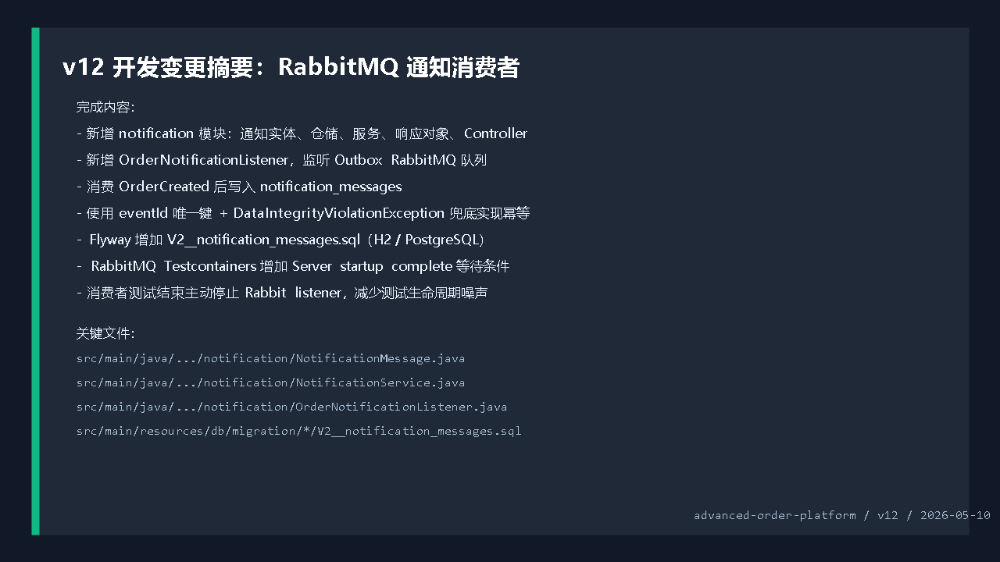
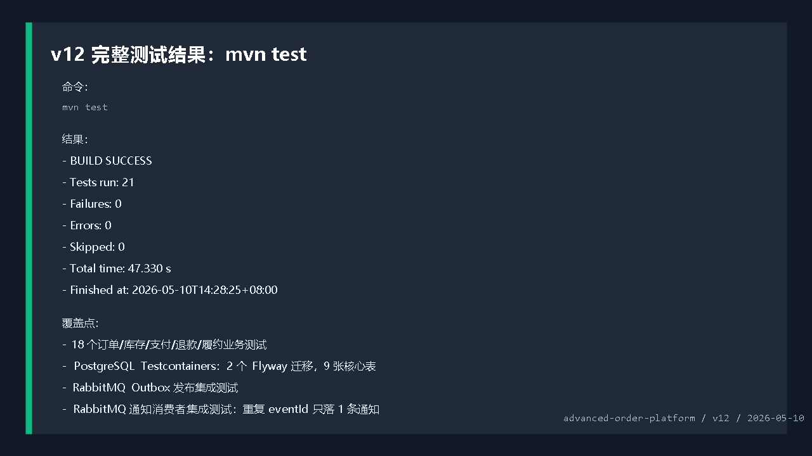
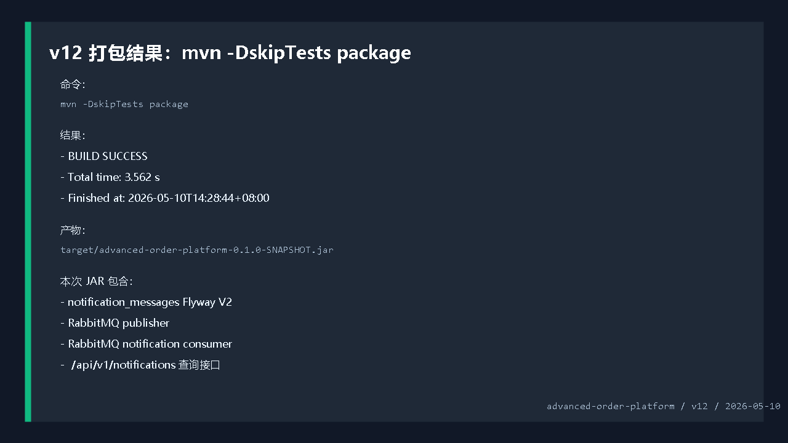
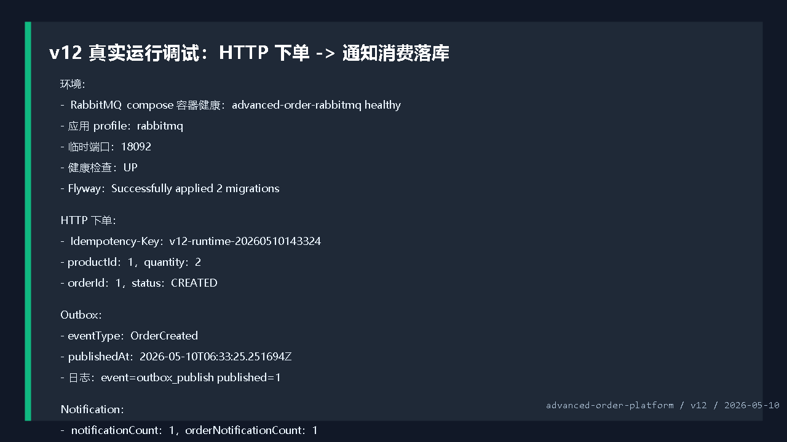
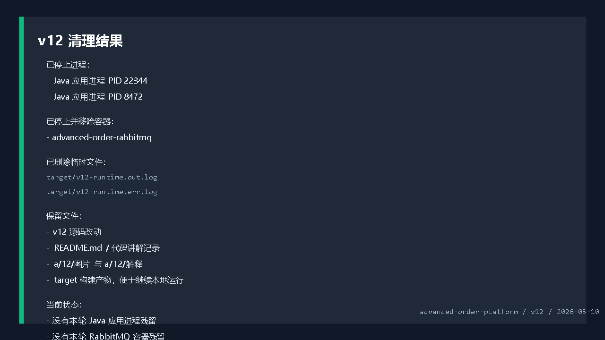

# 开发运行调试 v12：RabbitMQ 通知消费者和幂等落库

## 本轮目标

第十一版已经完成：

```text
OutboxEvent
 -> RabbitMQ exchange / queue
 -> publishedAt 标记
```

第十二版继续补下一段链路：

```text
RabbitMQ 队列消息
 -> OrderNotificationListener 消费
 -> NotificationService 幂等处理
 -> notification_messages 落库
 -> /api/v1/notifications 查询
```

也就是说，项目现在不只是“能发消息”，而是开始具备“消费消息驱动异步业务”的雏形。



## 代码改动概要

### 1. 新增 notification 模块

新增包：

```text
src/main/java/com/codexdemo/orderplatform/notification
```

主要文件：

```text
NotificationMessage.java
 -> 通知消息实体

NotificationMessageRepository.java
 -> 通知消息仓储

NotificationService.java
 -> 通知消息写入和幂等处理

OrderNotificationListener.java
 -> RabbitMQ 消费者

NotificationController.java
 -> 通知查询接口
```

### 2. 通知消息实体

文件：`src/main/java/com/codexdemo/orderplatform/notification/NotificationMessage.java`

```java
@Entity
@Table(
        name = "notification_messages",
        indexes = @Index(name = "idx_notification_messages_order_created", columnList = "order_id, created_at")
)
public class NotificationMessage {
```

核心字段：

```java
@Column(nullable = false, unique = true)
private UUID eventId;

@Column(nullable = false, length = 80)
private String eventType;

@Column(nullable = false)
private Long orderId;
```

`eventId` 对应 OutboxEvent 的 id，也是 RabbitMQ 消息里的 `eventId` header。

它被设置成唯一键，作用是保证同一个事件重复投递时只落一条通知。

### 3. 幂等写入服务

文件：`src/main/java/com/codexdemo/orderplatform/notification/NotificationService.java`

```java
@Transactional
public NotificationMessage recordOrderCreated(UUID eventId, Long orderId, String payload) {
    return notificationMessageRepository.findByEventId(eventId)
            .orElseGet(() -> saveOrderCreated(eventId, orderId, payload));
}
```

第一层幂等：先查 `eventId` 是否已经处理过。

第二层幂等：

```java
private NotificationMessage saveOrderCreated(UUID eventId, Long orderId, String payload) {
    try {
        return notificationMessageRepository.save(NotificationMessage.orderCreated(eventId, orderId, payload));
    } catch (DataIntegrityViolationException ex) {
        return notificationMessageRepository.findByEventId(eventId).orElseThrow(() -> ex);
    }
}
```

如果并发消费同一个消息，数据库唯一键会兜底防重复，捕获唯一键冲突后再回查已有通知。

### 4. RabbitMQ 消费者

文件：`src/main/java/com/codexdemo/orderplatform/notification/OrderNotificationListener.java`

```java
@Component
@ConditionalOnProperty(prefix = "notification.rabbitmq", name = "enabled", havingValue = "true")
public class OrderNotificationListener {
```

消费者默认不启用，只有 `notification.rabbitmq.enabled=true` 才会启动。

监听队列：

```java
@RabbitListener(queues = "${outbox.rabbitmq.queue}")
public void handle(Message message) {
```

读取消息头：

```java
String eventType = headerAsString(message, "eventType");
UUID eventId = UUID.fromString(headerAsString(message, "eventId"));
Long orderId = Long.valueOf(headerAsString(message, "aggregateId"));
String payload = new String(message.getBody(), StandardCharsets.UTF_8);
```

只处理订单创建事件：

```java
if (!"OrderCreated".equals(eventType)) {
    log.debug("event=notification_ignored eventType={}", eventType);
    return;
}
```

落库：

```java
NotificationMessage notification = notificationService.recordOrderCreated(eventId, orderId, payload);
```

日志：

```text
event=notification_recorded notificationId=1 eventId=... orderId=1
```

### 5. RabbitMQ 配置

文件：`src/main/java/com/codexdemo/orderplatform/outbox/RabbitMqOutboxConfiguration.java`

```java
@EnableRabbit
public class RabbitMqOutboxConfiguration {
```

`@EnableRabbit` 让 `@RabbitListener` 生效。

文件：`src/main/resources/application.yml`

```yaml
notification:
  rabbitmq:
    enabled: false
```

文件：`src/main/resources/application-rabbitmq.yml`

```yaml
notification:
  rabbitmq:
    enabled: ${NOTIFICATION_RABBITMQ_ENABLED:true}
```

启用 `rabbitmq` profile 后，通知消费者默认打开。

### 6. Flyway V2

新增迁移：

```text
src/main/resources/db/migration/h2/V2__notification_messages.sql
src/main/resources/db/migration/postgresql/V2__notification_messages.sql
```

核心 SQL：

```sql
create table notification_messages (
    id bigint generated by default as identity primary key,
    event_id uuid not null,
    event_type varchar(80) not null,
    order_id bigint not null,
    channel varchar(32) not null,
    status varchar(32) not null,
    recipient varchar(120) not null,
    subject varchar(160) not null,
    content varchar(500) not null,
    payload text not null,
    created_at timestamp(6) with time zone not null,
    constraint uk_notification_messages_event unique (event_id)
);
```

PostgreSQL 集成测试也同步更新为：

```text
appliedMigrations = 2
tableCount = 9
```

## 测试验证

完整测试命令：

```powershell
mvn test
```

结果：

```text
Tests run: 21
Failures: 0
Errors: 0
Skipped: 0
BUILD SUCCESS
Finished at: 2026-05-10T14:28:25+08:00
```

本轮测试覆盖：

```text
OrderApplicationServiceTests
 -> 18 个订单、库存、支付、退款、履约业务测试

PostgresMigrationIntegrationTests
 -> PostgreSQL 真实容器
 -> Flyway V1 + V2
 -> 9 张核心表

RabbitMqOutboxPublisherIntegrationTests
 -> RabbitMQ 真实发布

RabbitMqNotificationConsumerIntegrationTests
 -> RabbitMQ 真实消费
 -> OrderCreated 生成通知
 -> 重复 eventId 只保留一条通知
```



## 打包验证

打包命令：

```powershell
mvn -DskipTests package
```

结果：

```text
BUILD SUCCESS
Total time: 3.562 s
Finished at: 2026-05-10T14:28:44+08:00
```

产物：

```text
target/advanced-order-platform-0.1.0-SNAPSHOT.jar
```



## 真实运行调试

启动 RabbitMQ：

```powershell
docker compose -f compose.yaml up -d rabbitmq
```

RabbitMQ 容器状态：

```text
advanced-order-rabbitmq -> healthy
```

启动应用：

```powershell
java -jar target\advanced-order-platform-0.1.0-SNAPSHOT.jar `
  --spring.profiles.active=rabbitmq `
  --server.port=18092 `
  --outbox.publisher.scan-delay-ms=1000 `
  --order.expiration.enabled=false
```

应用启动结果：

```text
Successfully applied 2 migrations to schema "public", now at version v2
Tomcat started on port 18092
Created new connection: rabbitConnectionFactory
Started OrderPlatformApplication in 10.56 seconds
```

健康检查：

```text
GET http://localhost:18092/actuator/health
 -> UP
```

创建订单：

```text
Idempotency-Key: v12-runtime-20260510143324
productId: 1
quantity: 2
```

返回结果：

```json
{
  "orderId": 1,
  "status": "CREATED"
}
```

Outbox 结果：

```text
eventType: OrderCreated
publishedAt: 2026-05-10T06:33:25.251694Z
```

通知结果：

```text
notificationCount: 1
orderNotificationCount: 1
notificationEventType: OrderCreated
notificationStatus: READY
notificationRecipient: customer:1
notificationSubject: Order 1 created
notificationEventId: 11524bf3-0255-4595-91cf-46faa7beac5d
```

RabbitMQ 队列状态：

```text
messages: 0
consumers: 1
```

这表示队列里的 `OrderCreated` 消息已经被消费者拿走并成功落库。

应用日志：

```text
event=outbox_publish published=1
event=notification_recorded notificationId=1 eventId=11524bf3-0255-4595-91cf-46faa7beac5d orderId=1
```



## 清理结果

本轮调试启动过临时应用进程和 RabbitMQ 容器，结束前已处理：

```text
已停止 Java 应用进程：
 -> PID 22344
 -> PID 8472

已停止并移除 RabbitMQ 容器：
 -> advanced-order-rabbitmq
```

临时日志：

```text
target/v12-runtime.out.log
target/v12-runtime.err.log
```

这些日志只用于本轮真实调试，已经在最终收尾前删除。

保留内容：

```text
v12 源码改动
README.md
代码讲解记录
a/12/图片
a/12/解释/说明.md
target 构建产物
```



## v12 结论

第十二版已经让项目具备了完整的异步事件闭环：

```text
订单业务写库
 -> Outbox 记录事件
 -> RabbitMQ 发布事件
 -> RabbitMQ 消费事件
 -> 通知消息幂等落库
 -> HTTP 查询通知
```

当前成熟度：

```text
业务练手成熟度：较高
中间件练习价值：明显提升
消息可靠性基础：发布和消费都已具备
生产级消费者能力：还需补重试、死信队列、失败事件表和告警
```

下一版建议继续做消费者失败治理：

```text
RabbitMQ retry + DLQ
 -> 消费失败重试
 -> 超过次数进入死信队列
 -> failed_event_messages 表记录失败原因
 -> 提供失败消息查询和重放接口
```
