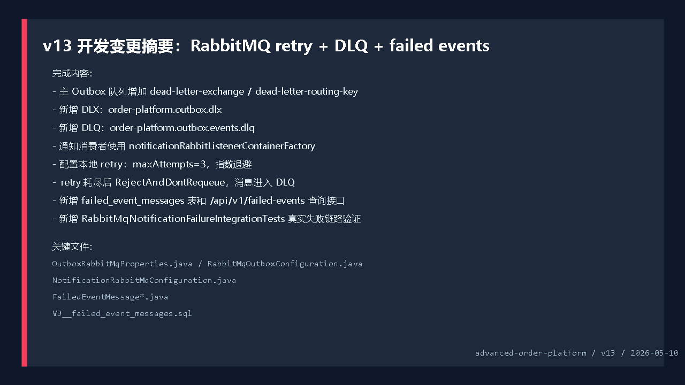
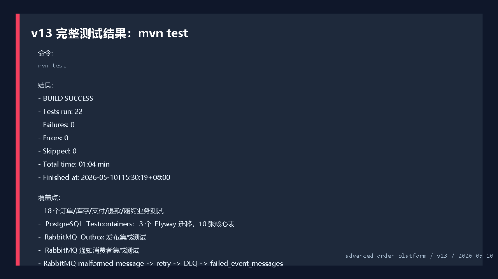
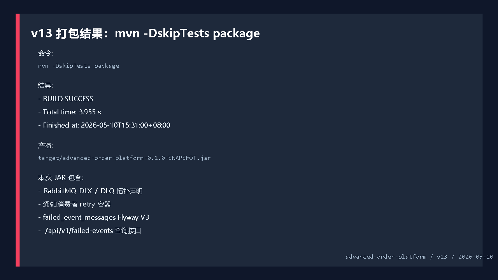
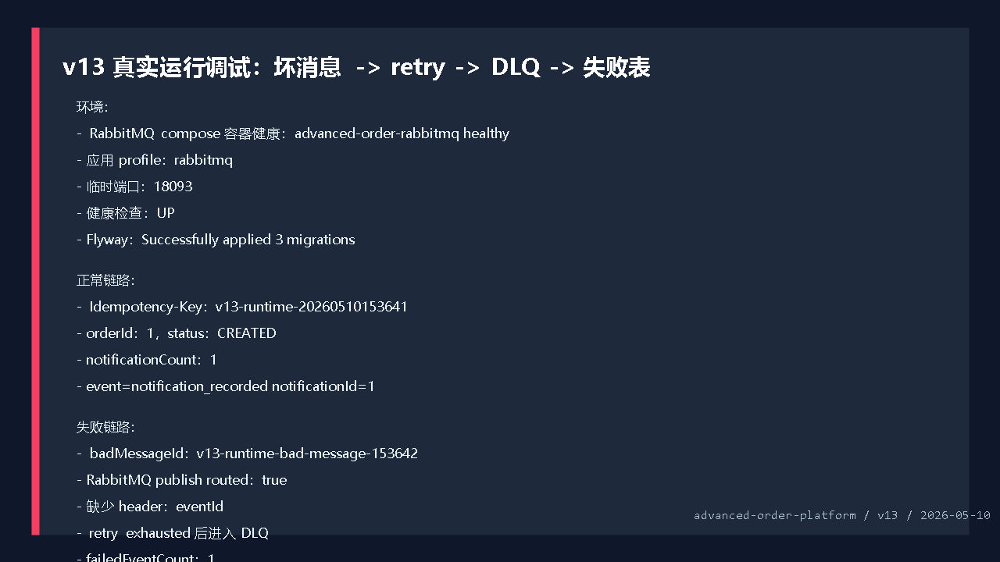
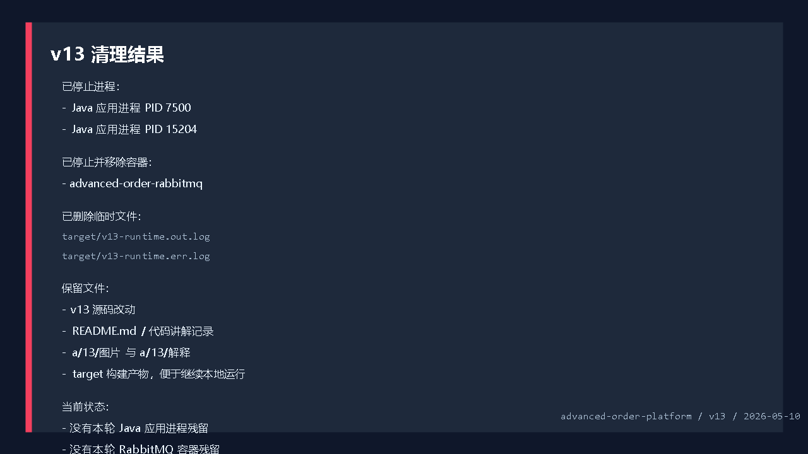

# 开发运行调试 v13：RabbitMQ retry、DLQ 和失败事件表

## 本轮目标

第十二版已经完成：

```text
OrderCreated 消息
 -> RabbitMQ 消费者
 -> notification_messages
```

第十三版继续补消费者失败治理：

```text
消费者处理失败
 -> 本地 retry 3 次
 -> retry 耗尽后 reject 且不 requeue
 -> RabbitMQ 投递到 DLQ
 -> FailedEventMessageListener 消费 DLQ
 -> failed_event_messages 落库
 -> /api/v1/failed-events 查询
```

这一版的重点不是增加一个新业务动作，而是让异步消费链路具备“失败可见、失败可查、后续可重放”的基础。



## 代码改动概要

### 1. Outbox RabbitMQ 增加 DLX / DLQ 配置

文件：`src/main/java/com/codexdemo/orderplatform/outbox/OutboxRabbitMqProperties.java`

```java
private String deadLetterExchange = "order-platform.outbox.dlx";

private String deadLetterQueue = "order-platform.outbox.events.dlq";

private String deadLetterRoutingKey = "orders.dead-letter";
```

对应配置：

```yaml
outbox:
  rabbitmq:
    dead-letter-exchange: order-platform.outbox.dlx
    dead-letter-queue: order-platform.outbox.events.dlq
    dead-letter-routing-key: orders.dead-letter
```

### 2. 主队列绑定死信交换机

文件：`src/main/java/com/codexdemo/orderplatform/outbox/RabbitMqOutboxConfiguration.java`

```java
@Bean
Queue outboxQueue(OutboxRabbitMqProperties properties) {
    return QueueBuilder.durable(properties.getQueue())
            .deadLetterExchange(properties.getDeadLetterExchange())
            .deadLetterRoutingKey(properties.getDeadLetterRoutingKey())
            .build();
}
```

这表示主队列里的消息被拒绝且不重新入队时，会进入配置好的 DLX。

声明 DLX：

```java
@Bean
DirectExchange outboxDeadLetterExchange(OutboxRabbitMqProperties properties) {
    return new DirectExchange(properties.getDeadLetterExchange(), true, false);
}
```

声明 DLQ：

```java
@Bean
Queue outboxDeadLetterQueue(OutboxRabbitMqProperties properties) {
    return QueueBuilder.durable(properties.getDeadLetterQueue()).build();
}
```

绑定 DLQ：

```java
@Bean
Binding outboxDeadLetterBinding(
        @Qualifier("outboxDeadLetterQueue") Queue outboxDeadLetterQueue,
        DirectExchange outboxDeadLetterExchange,
        OutboxRabbitMqProperties properties
) {
    return BindingBuilder
            .bind(outboxDeadLetterQueue)
            .to(outboxDeadLetterExchange)
            .with(properties.getDeadLetterRoutingKey());
}
```

### 3. 通知消费者 retry 配置

文件：`src/main/java/com/codexdemo/orderplatform/notification/NotificationRabbitMqProperties.java`

```java
private int maxAttempts = 3;
private long initialIntervalMs = 200;
private double multiplier = 2.0;
private long maxIntervalMs = 1000;
```

文件：`src/main/java/com/codexdemo/orderplatform/notification/NotificationRabbitMqConfiguration.java`

```java
factory.setDefaultRequeueRejected(false);
factory.setAdviceChain(RetryInterceptorBuilder
        .stateless()
        .maxAttempts(retry.getMaxAttempts())
        .backOffOptions(
                retry.getInitialIntervalMs(),
                retry.getMultiplier(),
                retry.getMaxIntervalMs()
        )
        .recoverer(new RejectAndDontRequeueRecoverer())
        .build());
```

这段配置的含义：

```text
maxAttempts=3
 -> 同一条消息最多处理 3 次

RejectAndDontRequeueRecoverer
 -> 重试耗尽后拒绝消息

defaultRequeueRejected=false
 -> 不把失败消息重新塞回主队列

主队列配置了 DLX
 -> 被拒绝的消息进入 DLQ
```

### 4. OrderNotificationListener 使用 retry 容器

文件：`src/main/java/com/codexdemo/orderplatform/notification/OrderNotificationListener.java`

```java
@RabbitListener(
        queues = "${outbox.rabbitmq.queue}",
        containerFactory = "notificationRabbitListenerContainerFactory"
)
public void handle(Message message) {
```

如果消息缺少必要 header：

```java
private String headerAsString(Message message, String name) {
    Object value = message.getMessageProperties().getHeaders().get(name);
    if (value == null) {
        throw new IllegalArgumentException("missing message header: " + name);
    }
    return value.toString();
}
```

就会触发 retry 和 DLQ 流程。

### 5. 失败事件消息表

文件：`src/main/java/com/codexdemo/orderplatform/notification/FailedEventMessage.java`

```java
@Entity
@Table(
        name = "failed_event_messages",
        indexes = @Index(name = "idx_failed_event_messages_failed_at", columnList = "failed_at")
)
public class FailedEventMessage {
```

核心字段：

```java
private String messageId;
private String eventId;
private String eventType;
private String aggregateType;
private String aggregateId;
private String sourceQueue;
private String deadLetterQueue;
private String failureReason;
private String payload;
private Instant failedAt;
```

`messageId` 是唯一键，避免同一条 DLQ 消息重复落库。

### 6. DLQ 监听器

文件：`src/main/java/com/codexdemo/orderplatform/notification/FailedEventMessageListener.java`

```java
@RabbitListener(queues = "${outbox.rabbitmq.dead-letter-queue}")
public void handle(Message message) {
    FailedEventMessage failedMessage = failedEventMessageService.record(
            message,
            outboxRabbitMqProperties.getDeadLetterQueue()
    );
```

这个监听器不做业务补偿，只做失败消息沉淀。

日志：

```text
event=failed_event_recorded failedEventId=1 messageId=... eventType=OrderCreated reason=rejected
```

### 7. 失败消息落库服务

文件：`src/main/java/com/codexdemo/orderplatform/notification/FailedEventMessageService.java`

messageId 解析逻辑：

```java
private String resolveMessageId(Message message, String payload) {
    return firstNonBlank(
            message.getMessageProperties().getMessageId(),
            header(message, "eventId"),
            "sha256-" + sha256(payload + message.getMessageProperties().getHeaders())
    );
}
```

优先级：

```text
RabbitMQ messageId
 -> Outbox eventId
 -> payload + headers 的 sha256
```

保存失败消息：

```java
return failedEventMessageRepository.save(FailedEventMessage.record(
        messageId,
        header(message, "eventId"),
        header(message, "eventType"),
        header(message, "aggregateType"),
        header(message, "aggregateId"),
        header(message, "x-first-death-queue"),
        deadLetterQueue,
        truncate(firstNonBlank(header(message, "x-first-death-reason"), "dead-lettered"), 500),
        payload
));
```

RabbitMQ 的 `x-first-death-queue` 和 `x-first-death-reason` 会告诉我们：

```text
消息从哪个队列失败
为什么进入死信
```

### 8. 查询接口

文件：`src/main/java/com/codexdemo/orderplatform/notification/FailedEventMessageController.java`

```java
@RestController
@RequestMapping("/api/v1/failed-events")
public class FailedEventMessageController {
```

查询：

```powershell
Invoke-RestMethod http://localhost:8080/api/v1/failed-events
```

## Flyway V3

新增迁移：

```text
src/main/resources/db/migration/h2/V3__failed_event_messages.sql
src/main/resources/db/migration/postgresql/V3__failed_event_messages.sql
```

核心 SQL：

```sql
create table failed_event_messages (
    id bigint generated by default as identity primary key,
    message_id varchar(120) not null,
    event_id varchar(80),
    event_type varchar(80),
    aggregate_type varchar(64),
    aggregate_id varchar(64),
    source_queue varchar(160),
    dead_letter_queue varchar(160) not null,
    failure_reason varchar(500) not null,
    payload text not null,
    failed_at timestamp(6) with time zone not null,
    constraint uk_failed_event_messages_message unique (message_id)
);
```

PostgreSQL 集成测试更新为：

```text
appliedMigrations = 3
tableCount = 10
```

## 测试验证

完整测试命令：

```powershell
mvn test
```

结果：

```text
Tests run: 22
Failures: 0
Errors: 0
Skipped: 0
BUILD SUCCESS
Finished at: 2026-05-10T15:30:19+08:00
```

新增失败链路测试：

```text
RabbitMqNotificationFailureIntegrationTests
```

测试发送一条故意缺少 `eventId` 的消息：

```java
message.getMessageProperties().setMessageId(BAD_MESSAGE_ID);
message.getMessageProperties().setHeader("aggregateType", "ORDER");
message.getMessageProperties().setHeader("aggregateId", "404");
message.getMessageProperties().setHeader("eventType", "OrderCreated");
```

然后断言：

```java
assertThat(notificationMessageRepository.findAll()).isEmpty();
assertThat(failedMessage.getMessageId()).isEqualTo(BAD_MESSAGE_ID);
assertThat(failedMessage.getEventType()).isEqualTo("OrderCreated");
assertThat(failedMessage.getSourceQueue()).isEqualTo(OUTBOX_QUEUE);
assertThat(failedMessage.getDeadLetterQueue()).isEqualTo(DEAD_LETTER_QUEUE);
assertThat(failedMessage.getPayload()).contains("\"orderId\":404");
```

这证明坏消息没有落成正常通知，而是进入失败事件表。



## 打包验证

打包命令：

```powershell
mvn -DskipTests package
```

结果：

```text
BUILD SUCCESS
Total time: 3.955 s
Finished at: 2026-05-10T15:31:00+08:00
```

产物：

```text
target/advanced-order-platform-0.1.0-SNAPSHOT.jar
```



## 真实运行调试

启动 RabbitMQ：

```powershell
docker compose -f compose.yaml up -d rabbitmq
```

RabbitMQ 状态：

```text
advanced-order-rabbitmq -> healthy
```

启动应用：

```powershell
java -jar target\advanced-order-platform-0.1.0-SNAPSHOT.jar `
  --spring.profiles.active=rabbitmq `
  --server.port=18093 `
  --outbox.publisher.scan-delay-ms=1000 `
  --order.expiration.enabled=false `
  --notification.rabbitmq.retry.initial-interval-ms=100 `
  --notification.rabbitmq.retry.max-interval-ms=200
```

启动日志：

```text
Successfully applied 3 migrations to schema "public", now at version v3
Tomcat started on port 18093
Created new connection: rabbitConnectionFactory
Started OrderPlatformApplication in 9.814 seconds
```

健康检查：

```text
GET http://localhost:18093/actuator/health
 -> UP
```

### 正常链路

创建订单：

```text
Idempotency-Key: v13-runtime-20260510153641
orderId: 1
status: CREATED
```

通知结果：

```text
notificationCount: 1
event=notification_recorded notificationId=1
```

### 失败链路

通过 RabbitMQ Management API 发送坏消息：

```text
messageId: v13-runtime-bad-message-153642
routingKey: orders.OrderCreated
payload: {"orderId":404,"status":"CREATED"}
headers:
 -> aggregateType=ORDER
 -> aggregateId=404
 -> eventType=OrderCreated
 -> 故意缺少 eventId
```

RabbitMQ 发布结果：

```text
publishRouted: true
```

消费者日志：

```text
Retries exhausted for message
missing message header: eventId
event=failed_event_recorded failedEventId=1 messageId=v13-runtime-bad-message-153642 eventType=OrderCreated reason=rejected
```

失败表查询结果：

```text
failedEventCount: 1
failedMessageId: v13-runtime-bad-message-153642
failedEventType: OrderCreated
failedAggregateId: 404
failedReason: rejected
failedSourceQueue: order-platform.outbox.events
failedDeadLetterQueue: order-platform.outbox.events.dlq
```

队列状态：

```text
mainQueue messages=0 consumers=1
dlq messages=0 consumers=1
```

`DLQ messages=0` 是因为 DLQ 消息已经被 `FailedEventMessageListener` 消费并写入数据库。



## 清理结果

本轮真实调试启动过临时应用进程和 RabbitMQ 容器：

```text
已停止 Java 应用进程：
 -> PID 7500
 -> PID 15204

已停止并移除 RabbitMQ 容器：
 -> advanced-order-rabbitmq
```

临时日志：

```text
target/v13-runtime.out.log
target/v13-runtime.err.log
```

这些日志只用于本轮调试，已经在最终收尾前删除。

保留内容：

```text
v13 源码改动
README.md
代码讲解记录
a/13/图片
a/13/解释/说明.md
target 构建产物
```



## v13 结论

第十三版补齐了 RabbitMQ 消费失败治理的基础闭环：

```text
正常消息
 -> 成功消费
 -> notification_messages

异常消息
 -> retry
 -> DLQ
 -> failed_event_messages
 -> HTTP 查询
```

当前成熟度：

```text
业务练手成熟度：较高
消息发布可靠性：已具备
消息消费可靠性：具备 retry + DLQ + 失败表基础
生产级补偿能力：还需要失败消息重放接口和权限控制
```

下一版最合适继续做：

```text
失败事件重放
 -> 查询 failed_event_messages
 -> 选择一条失败记录
 -> 重新投递到 order-platform.outbox
 -> 更新失败记录状态或重放时间
```
