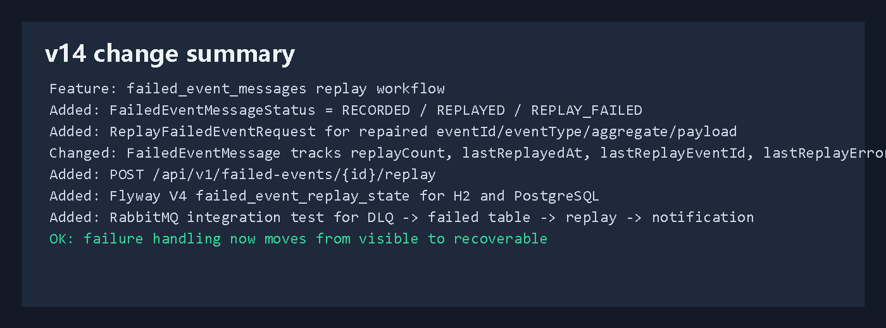
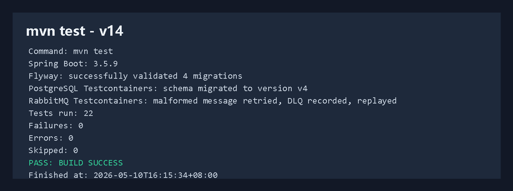
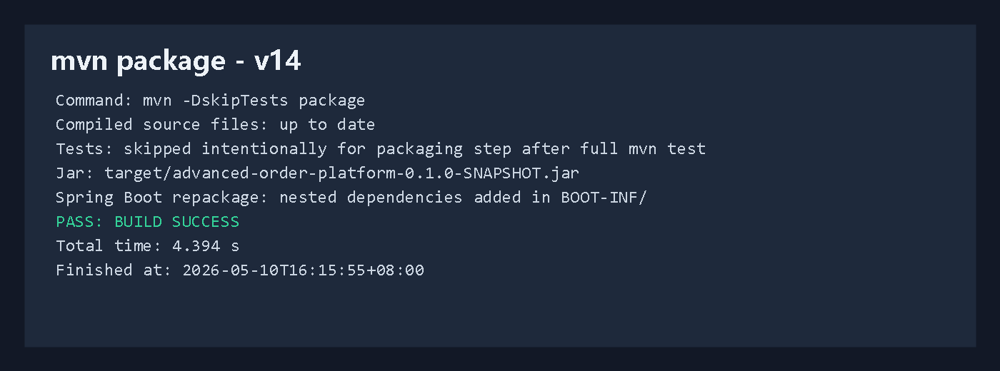
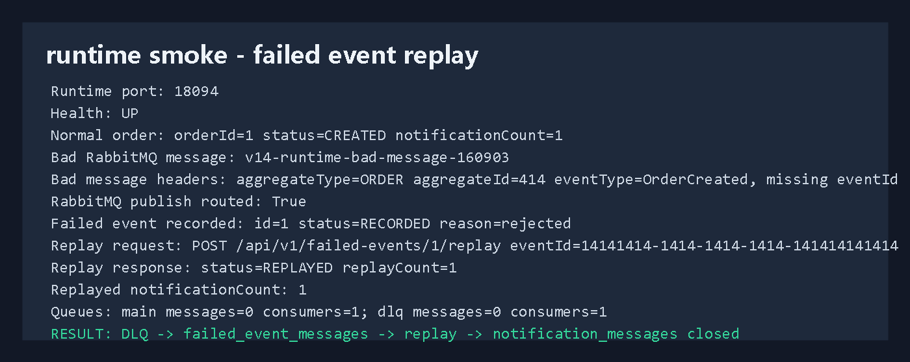
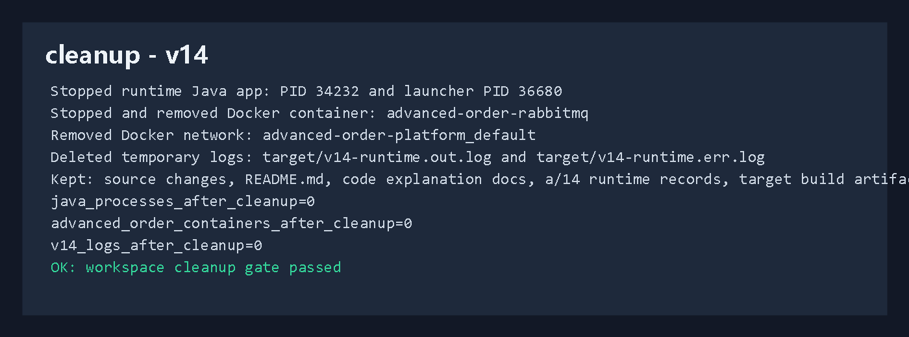

# 开发运行调试 v14：失败事件修复重放

## 本轮目标

v13 已经完成：

```text
消费失败
 -> retry
 -> DLQ
 -> failed_event_messages
 -> /api/v1/failed-events 查询
```

v14 继续补完整失败事件治理闭环：

```text
failed_event_messages 中的失败记录
 -> 人工或后台工具补齐 eventId / eventType / aggregateType / aggregateId / payload
 -> POST /api/v1/failed-events/{id}/replay
 -> 重新投递到 RabbitMQ 业务 exchange
 -> OrderNotificationListener 重新消费
 -> notification_messages 落库
 -> failed_event_messages 更新为 REPLAYED
```



## 代码改动概要

### 1. 失败事件状态

文件：`src/main/java/com/codexdemo/orderplatform/notification/FailedEventMessageStatus.java`

```java
public enum FailedEventMessageStatus {
    RECORDED,
    REPLAYED,
    REPLAY_FAILED
}
```

含义：

```text
RECORDED
 -> 失败消息已经从 DLQ 记录到表里，还没有重放

REPLAYED
 -> 已经成功重新投递到业务 exchange

REPLAY_FAILED
 -> 重放投递失败，错误写入 lastReplayError
```

### 2. 失败消息表增加重放字段

文件：`src/main/java/com/codexdemo/orderplatform/notification/FailedEventMessage.java`

```java
@Enumerated(EnumType.STRING)
@Column(nullable = false, length = 32)
private FailedEventMessageStatus status;

@Column(name = "replay_count", nullable = false)
private int replayCount;

@Column(name = "last_replayed_at")
private Instant lastReplayedAt;

@Column(name = "last_replay_event_id", length = 80)
private String lastReplayEventId;

@Column(name = "last_replay_error", length = 500)
private String lastReplayError;
```

新记录默认状态：

```java
this.status = FailedEventMessageStatus.RECORDED;
this.replayCount = 0;
```

重放成功后：

```java
public void markReplayed(String replayEventId, Instant replayedAt) {
    this.status = FailedEventMessageStatus.REPLAYED;
    this.replayCount++;
    this.lastReplayEventId = replayEventId;
    this.lastReplayedAt = replayedAt;
    this.lastReplayError = null;
}
```

### 3. 重放请求体

文件：`src/main/java/com/codexdemo/orderplatform/notification/ReplayFailedEventRequest.java`

```java
public record ReplayFailedEventRequest(
        String eventId,
        String eventType,
        String aggregateType,
        String aggregateId,
        String payload
) {
}
```

这个请求体允许只补缺失字段。比如本轮调试的坏消息缺少 `eventId`，重放时只传：

```json
{
  "eventId": "14141414-1414-1414-1414-141414141414"
}
```

### 4. 重放接口

文件：`src/main/java/com/codexdemo/orderplatform/notification/FailedEventMessageController.java`

```java
@PostMapping("/{id}/replay")
public FailedEventMessageResponse replayFailedMessage(
        @PathVariable Long id,
        @RequestBody(required = false) ReplayFailedEventRequest request
) {
    return failedEventMessageService.replay(id, request);
}
```

调用示例：

```powershell
$body = @{
  eventId = "14141414-1414-1414-1414-141414141414"
} | ConvertTo-Json

Invoke-RestMethod `
  -Method Post `
  -Uri http://localhost:8080/api/v1/failed-events/1/replay `
  -ContentType "application/json" `
  -Body $body
```

### 5. 重放服务

文件：`src/main/java/com/codexdemo/orderplatform/notification/FailedEventMessageService.java`

先查失败记录：

```java
FailedEventMessage failedMessage = failedEventMessageRepository.findById(id)
        .orElseThrow(() -> new ResponseStatusException(HttpStatus.NOT_FOUND, "failed event message not found"));
```

如果已经重放成功，就直接返回，避免重复投递：

```java
if (failedMessage.getStatus() == FailedEventMessageStatus.REPLAYED) {
    return FailedEventMessageResponse.from(failedMessage);
}
```

合并请求体修复值和原始失败记录值：

```java
String eventId = resolveReplayEventId(failedMessage, request);
String eventType = requiredReplayField("eventType", firstNonBlank(requestEventType(request), failedMessage.getEventType()));
String aggregateType = requiredReplayField(
        "aggregateType",
        firstNonBlank(requestAggregateType(request), failedMessage.getAggregateType())
);
String aggregateId = requiredReplayField(
        "aggregateId",
        firstNonBlank(requestAggregateId(request), failedMessage.getAggregateId())
);
String payload = requiredReplayField("payload", firstNonBlank(requestPayload(request), failedMessage.getPayload()));
```

重新投递 RabbitMQ：

```java
rabbitTemplate.convertAndSend(
        outboxRabbitMqProperties.getExchange(),
        outboxRabbitMqProperties.routingKeyForEventType(eventType),
        payload,
        message -> {
            message.getMessageProperties().setContentType("application/json");
            message.getMessageProperties().setMessageId(eventId);
            message.getMessageProperties().setHeader("eventId", eventId);
            message.getMessageProperties().setHeader("aggregateType", aggregateType);
            message.getMessageProperties().setHeader("aggregateId", aggregateId);
            message.getMessageProperties().setHeader("eventType", eventType);
            message.getMessageProperties().setHeader("replayedFromFailedEventId", failedMessage.getId());
            message.getMessageProperties().setHeader("replayedFromMessageId", failedMessage.getMessageId());
            return message;
        }
);
```

### 6. routing key 复用

文件：`src/main/java/com/codexdemo/orderplatform/outbox/OutboxRabbitMqProperties.java`

```java
public String routingKeyFor(OutboxEvent event) {
    return routingKeyForEventType(event.getEventType());
}

public String routingKeyForEventType(String eventType) {
    return routingKeyPrefix + "." + eventType;
}
```

重放逻辑不自己拼 routing key，而是复用 Outbox 规则，避免正常发布和重放发布走出两套行为。

## Flyway V4

新增迁移：

```text
src/main/resources/db/migration/h2/V4__failed_event_replay_state.sql
src/main/resources/db/migration/postgresql/V4__failed_event_replay_state.sql
```

核心字段：

```sql
alter table failed_event_messages
    add column status varchar(32) not null default 'RECORDED';

alter table failed_event_messages
    add column replay_count integer not null default 0;

alter table failed_event_messages
    add column last_replayed_at timestamp(6) with time zone;

alter table failed_event_messages
    add column last_replay_event_id varchar(80);

alter table failed_event_messages
    add column last_replay_error varchar(500);
```

PostgreSQL 集成测试同步更新：

```java
assertThat(appliedMigrations).isEqualTo(4);
```

## 测试验证

完整测试命令：

```powershell
mvn test
```

结果：

```text
Tests run: 22
Failures: 0
Errors: 0
Skipped: 0
BUILD SUCCESS
Finished at: 2026-05-10T16:15:34+08:00
```

本轮重点测试：

```text
RabbitMqNotificationFailureIntegrationTests
```

它验证：

```text
坏消息缺少 eventId
 -> 消费者失败并重试
 -> 进入 DLQ
 -> failed_event_messages 记录 status=RECORDED
 -> 补 eventId 后 replay
 -> notification_messages 新增通知
 -> 失败记录返回 status=REPLAYED, replayCount=1
```



## 打包验证

命令：

```powershell
mvn -DskipTests package
```

结果：

```text
BUILD SUCCESS
Total time: 4.394 s
Finished at: 2026-05-10T16:15:55+08:00
```

产物：

```text
target/advanced-order-platform-0.1.0-SNAPSHOT.jar
```



## 真实运行调试

启动 RabbitMQ：

```powershell
docker compose -f compose.yaml up -d rabbitmq
```

启动应用：

```powershell
java -jar target\advanced-order-platform-0.1.0-SNAPSHOT.jar `
  --spring.profiles.active=rabbitmq `
  --server.port=18094 `
  --outbox.publisher.scan-delay-ms=1000 `
  --order.expiration.enabled=false `
  --notification.rabbitmq.retry.initial-interval-ms=100 `
  --notification.rabbitmq.retry.max-interval-ms=200
```

健康检查：

```text
GET http://localhost:18094/actuator/health
 -> UP
```

正常链路：

```text
orderId: 1
orderStatus: CREATED
normalNotificationCount: 1
```

失败链路：

```text
badMessageId: v14-runtime-bad-message-160903
payload: {"orderId":414,"status":"CREATED"}
headers:
 -> aggregateType=ORDER
 -> aggregateId=414
 -> eventType=OrderCreated
 -> 故意缺少 eventId
```

失败记录：

```text
failedEventId: 1
failedStatusBeforeReplay: RECORDED
failureReason: rejected
```

重放请求：

```text
POST /api/v1/failed-events/1/replay
eventId: 14141414-1414-1414-1414-141414141414
```

重放结果：

```text
replayStatus: REPLAYED
replayCount: 1
replayEventId: 14141414-1414-1414-1414-141414141414
replayedNotificationCount: 1
```

队列结果：

```text
mainQueueMessages: 0
mainQueueConsumers: 1
dlqMessages: 0
dlqConsumers: 1
```



## 清理结果

本轮真实调试启动过临时应用进程和 RabbitMQ 容器，最终已清理：

```text
已停止 Java 应用进程：
 -> PID 34232
 -> PID 36680

已停止并移除 Docker 容器：
 -> advanced-order-rabbitmq

已移除 Docker 网络：
 -> advanced-order-platform_default

已删除临时运行日志：
 -> target/v14-runtime.out.log
 -> target/v14-runtime.err.log
```

最终检查：

```text
java_processes_after_cleanup=0
advanced_order_containers_after_cleanup=0
v14_logs_after_cleanup=0
```

保留内容：

```text
v14 源码改动
README.md
代码讲解记录/18-version-14-failed-event-replay.md
a/14/图片
a/14/解释/说明.md
target 构建产物
```



## v14 结论

第十四版补齐了失败事件治理的关键一环：

```text
失败消息可查
 -> 失败消息可修
 -> 失败消息可重放
 -> 重放状态可追踪
```

现在项目在消息可靠性练习上已经具备比较完整的闭环：正常发布、正常消费、消费失败重试、DLQ、失败记录、失败查询、修复重放、重新消费。
