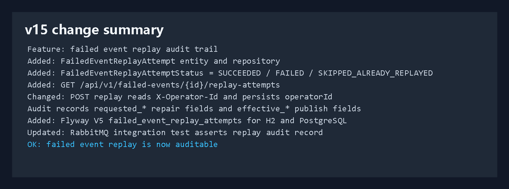
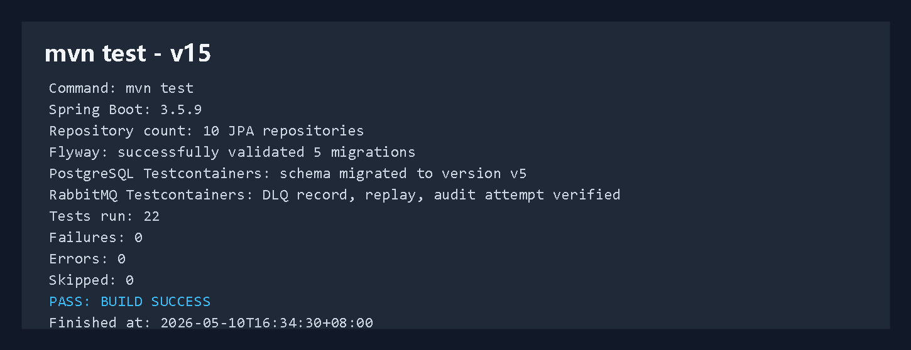
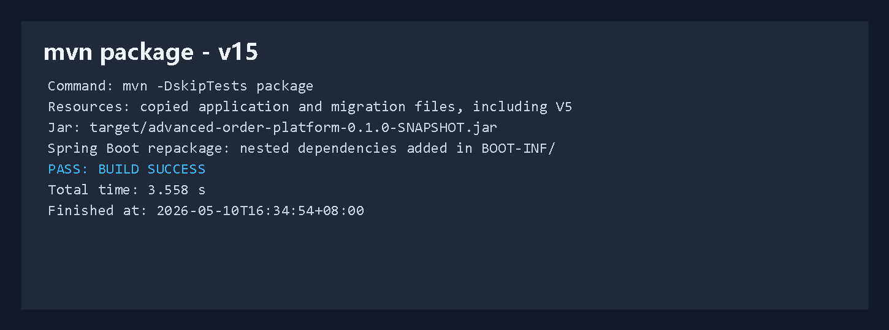
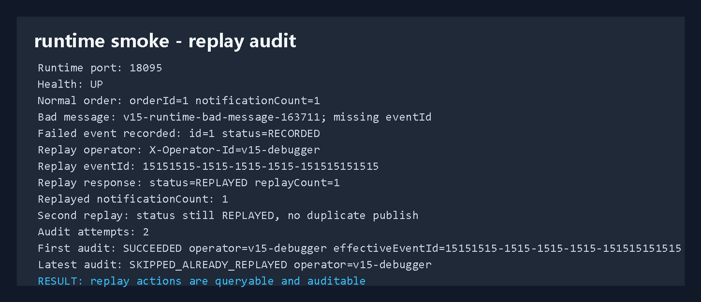
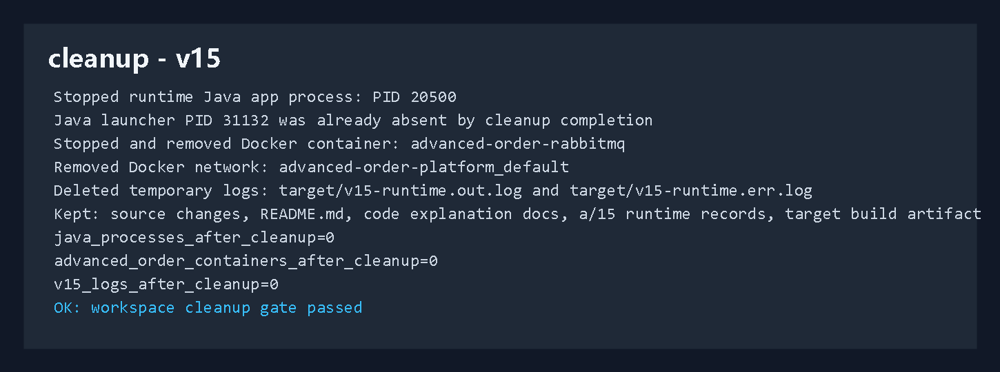

# 开发运行调试 v15：失败事件重放审计

## 本轮目标

v14 已经完成失败事件修复重放：

```text
failed_event_messages
 -> POST /api/v1/failed-events/{id}/replay
 -> RabbitMQ 重新投递
 -> notification_messages
 -> failed_event_messages.status = REPLAYED
```

v15 继续补生产化排查能力：记录每一次重放尝试。

```text
重放请求
 -> 读取 X-Operator-Id
 -> 记录 requested_* 修复字段
 -> 记录 effective_* 最终投递字段
 -> 记录 SUCCEEDED / FAILED / SKIPPED_ALREADY_REPLAYED
 -> /api/v1/failed-events/{id}/replay-attempts 查询
```



## 代码改动概要

### 1. 重放尝试状态

文件：`src/main/java/com/codexdemo/orderplatform/notification/FailedEventReplayAttemptStatus.java`

```java
public enum FailedEventReplayAttemptStatus {
    SUCCEEDED,
    FAILED,
    SKIPPED_ALREADY_REPLAYED
}
```

含义：

```text
SUCCEEDED
 -> 这次重放成功投递到 RabbitMQ

FAILED
 -> 这次重放投递 RabbitMQ 时失败

SKIPPED_ALREADY_REPLAYED
 -> 失败消息已经是 REPLAYED，系统不重复投递，但记录这次操作尝试
```

### 2. 重放审计实体

文件：`src/main/java/com/codexdemo/orderplatform/notification/FailedEventReplayAttempt.java`

实体表：

```java
@Entity
@Table(
        name = "failed_event_replay_attempts",
        indexes = @Index(
                name = "idx_failed_event_replay_attempts_message",
                columnList = "failed_event_message_id, attempted_at"
        )
)
public class FailedEventReplayAttempt {
```

关联失败消息：

```java
@ManyToOne(fetch = FetchType.LAZY, optional = false)
@JoinColumn(name = "failed_event_message_id", nullable = false)
private FailedEventMessage failedEventMessage;
```

记录操作者：

```java
@Column(name = "operator_id", nullable = false, length = 80)
private String operatorId;
```

记录请求修复字段：

```java
private String requestedEventId;
private String requestedEventType;
private String requestedAggregateType;
private String requestedAggregateId;
private String requestedPayload;
```

记录最终生效字段：

```java
private String effectiveEventId;
private String effectiveEventType;
private String effectiveAggregateType;
private String effectiveAggregateId;
private String effectivePayload;
```

这能区分：

```text
requested_*
 -> 操作者本次传入了什么修复值

effective_*
 -> 系统最终拿什么投递 RabbitMQ
```

### 3. 审计查询响应

文件：`src/main/java/com/codexdemo/orderplatform/notification/FailedEventReplayAttemptResponse.java`

```java
public record FailedEventReplayAttemptResponse(
        Long id,
        Long failedEventMessageId,
        String operatorId,
        String requestedEventId,
        String requestedEventType,
        String requestedAggregateType,
        String requestedAggregateId,
        String requestedPayload,
        String effectiveEventId,
        String effectiveEventType,
        String effectiveAggregateType,
        String effectiveAggregateId,
        String effectivePayload,
        FailedEventReplayAttemptStatus status,
        String errorMessage,
        Instant attemptedAt
) {
}
```

### 4. Controller 增加 operator 和审计查询

文件：`src/main/java/com/codexdemo/orderplatform/notification/FailedEventMessageController.java`

重放接口现在读取 `X-Operator-Id`：

```java
@PostMapping("/{id}/replay")
public FailedEventMessageResponse replayFailedMessage(
        @PathVariable Long id,
        @RequestHeader(value = "X-Operator-Id", required = false) String operatorId,
        @RequestBody(required = false) ReplayFailedEventRequest request
) {
    return failedEventMessageService.replay(id, request, operatorId);
}
```

新增审计查询：

```java
@GetMapping("/{id}/replay-attempts")
public List<FailedEventReplayAttemptResponse> listReplayAttempts(@PathVariable Long id) {
    return failedEventMessageService.listReplayAttempts(id);
}
```

调用示例：

```powershell
Invoke-RestMethod http://localhost:8080/api/v1/failed-events/1/replay-attempts
```

### 5. Service 写审计

文件：`src/main/java/com/codexdemo/orderplatform/notification/FailedEventMessageService.java`

注入审计仓储：

```java
private final FailedEventReplayAttemptRepository failedEventReplayAttemptRepository;
```

操作者兜底：

```java
private String normalizeOperatorId(String operatorId) {
    String normalized = firstNonBlank(operatorId, "anonymous");
    return truncate(normalized.strip(), 80);
}
```

重放成功时：

```java
publishReplay(failedMessage, eventId, eventType, aggregateType, aggregateId, payload);
failedMessage.markReplayed(eventId, replayedAt);
saveReplayAttempt(
        failedMessage,
        request,
        normalizedOperatorId,
        eventId,
        eventType,
        aggregateType,
        aggregateId,
        payload,
        FailedEventReplayAttemptStatus.SUCCEEDED,
        null,
        replayedAt
);
```

重复重放时：

```java
if (failedMessage.getStatus() == FailedEventMessageStatus.REPLAYED) {
    saveReplayAttempt(
            failedMessage,
            request,
            normalizedOperatorId,
            eventId,
            eventType,
            aggregateType,
            aggregateId,
            payload,
            FailedEventReplayAttemptStatus.SKIPPED_ALREADY_REPLAYED,
            null,
            replayedAt
    );
    return FailedEventMessageResponse.from(failedMessage);
}
```

## Flyway V5

新增迁移：

```text
src/main/resources/db/migration/h2/V5__failed_event_replay_attempts.sql
src/main/resources/db/migration/postgresql/V5__failed_event_replay_attempts.sql
```

核心 SQL：

```sql
create table failed_event_replay_attempts (
    id bigint generated by default as identity primary key,
    failed_event_message_id bigint not null,
    operator_id varchar(80) not null,
    requested_event_id varchar(80),
    requested_event_type varchar(80),
    requested_aggregate_type varchar(64),
    requested_aggregate_id varchar(64),
    requested_payload text,
    effective_event_id varchar(80),
    effective_event_type varchar(80),
    effective_aggregate_type varchar(64),
    effective_aggregate_id varchar(64),
    effective_payload text,
    status varchar(32) not null,
    error_message varchar(500),
    attempted_at timestamp(6) with time zone not null,
    constraint fk_failed_event_replay_attempts_message
        foreign key (failed_event_message_id) references failed_event_messages (id)
);
```

PostgreSQL 集成测试同步验证：

```text
appliedMigrations = 5
tableCount = 11
```

## 测试验证

单测重点验证：

```text
RabbitMqNotificationFailureIntegrationTests
```

测试链路：

```text
坏消息缺少 eventId
 -> retry
 -> DLQ
 -> failed_event_messages
 -> replay(eventId, operatorId=qa-operator)
 -> notification_messages
 -> failed_event_replay_attempts
```

审计断言：

```java
assertThat(replayAttempt.getOperatorId()).isEqualTo("qa-operator");
assertThat(replayAttempt.getRequestedEventId()).isEqualTo(REPLAY_EVENT_ID);
assertThat(replayAttempt.getEffectiveEventId()).isEqualTo(REPLAY_EVENT_ID);
assertThat(replayAttempt.getEffectiveEventType()).isEqualTo("OrderCreated");
assertThat(replayAttempt.getEffectiveAggregateId()).isEqualTo("404");
assertThat(replayAttempt.getStatus()).isEqualTo(FailedEventReplayAttemptStatus.SUCCEEDED);
```

完整测试命令：

```powershell
mvn test
```

结果：

```text
Tests run: 22
Failures: 0
Errors: 0
Skipped: 0
BUILD SUCCESS
Finished at: 2026-05-10T16:34:30+08:00
```



## 打包验证

命令：

```powershell
mvn -DskipTests package
```

结果：

```text
BUILD SUCCESS
Total time: 3.558 s
Finished at: 2026-05-10T16:34:54+08:00
```

产物：

```text
target/advanced-order-platform-0.1.0-SNAPSHOT.jar
```



## 真实运行调试

启动 RabbitMQ：

```powershell
docker compose -f compose.yaml up -d rabbitmq
```

启动应用：

```powershell
java -jar target\advanced-order-platform-0.1.0-SNAPSHOT.jar `
  --spring.profiles.active=rabbitmq `
  --server.port=18095 `
  --outbox.publisher.scan-delay-ms=1000 `
  --order.expiration.enabled=false `
  --notification.rabbitmq.retry.initial-interval-ms=100 `
  --notification.rabbitmq.retry.max-interval-ms=200
```

健康检查：

```text
GET http://localhost:18095/actuator/health
 -> UP
```

正常订单链路：

```text
createdOrderId: 1
normalNotificationCount: 1
```

坏消息：

```text
badMessageId: v15-runtime-bad-message-163711
payload: {"orderId":515,"status":"CREATED"}
headers:
 -> aggregateType=ORDER
 -> aggregateId=515
 -> eventType=OrderCreated
 -> 故意缺少 eventId
```

重放：

```text
X-Operator-Id: v15-debugger
eventId: 15151515-1515-1515-1515-151515151515
replayStatus: REPLAYED
replayCount: 1
replayedNotificationCount: 1
```

二次重放：

```text
secondReplayStatus: REPLAYED
auditAttemptCount: 2
latestAuditStatus: SKIPPED_ALREADY_REPLAYED
firstAuditStatus: SUCCEEDED
firstAuditOperator: v15-debugger
firstAuditEffectiveEventId: 15151515-1515-1515-1515-151515151515
```



## 清理结果

本轮真实调试启动过 Java 应用进程和 RabbitMQ 容器，最终已清理：

```text
已停止 Java 应用进程：
 -> PID 20500

Java 启动器：
 -> PID 31132 清理完成时已经不存在

已停止并移除 Docker 容器：
 -> advanced-order-rabbitmq

已移除 Docker 网络：
 -> advanced-order-platform_default

已删除临时运行日志：
 -> target/v15-runtime.out.log
 -> target/v15-runtime.err.log
```

最终检查：

```text
java_processes_after_cleanup=0
advanced_order_containers_after_cleanup=0
v15_logs_after_cleanup=0
```

保留内容：

```text
v15 源码改动
README.md
代码讲解记录/19-version-15-replay-audit.md
a/15/图片
a/15/解释/说明.md
target 构建产物
```



## v15 结论

第十五版把失败事件治理继续推进了一层：

```text
失败消息可查
 -> 失败消息可修复重放
 -> 重放操作可审计
```

当前异步消息治理链路已经具备：

```text
RabbitMQ 发布
RabbitMQ 消费
消费失败 retry
DLQ
失败消息落库
失败消息重放
重放审计查询
```

下一步适合继续补权限控制、重放审批或管理端页面。
