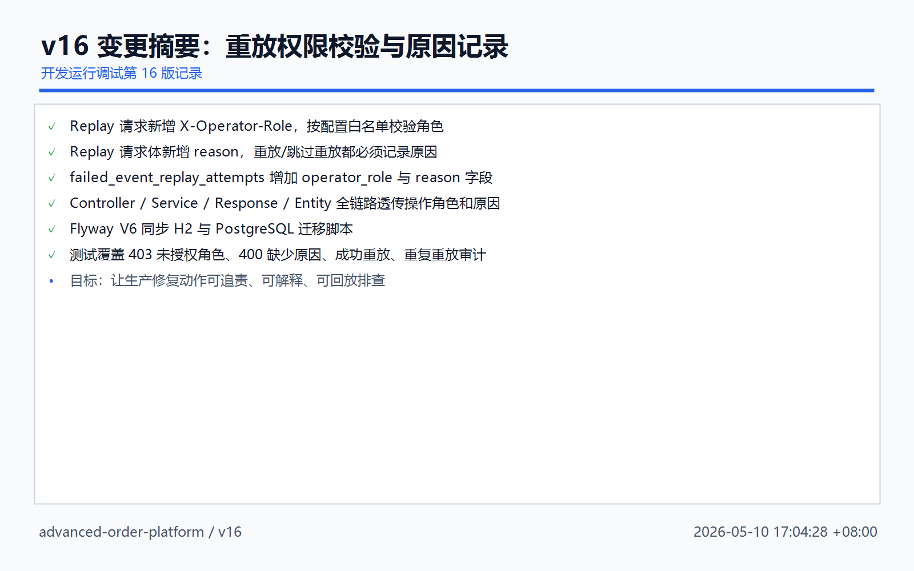
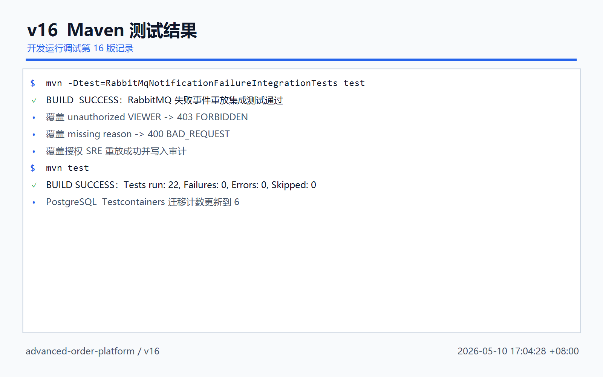
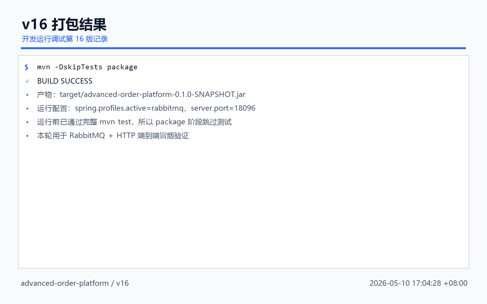
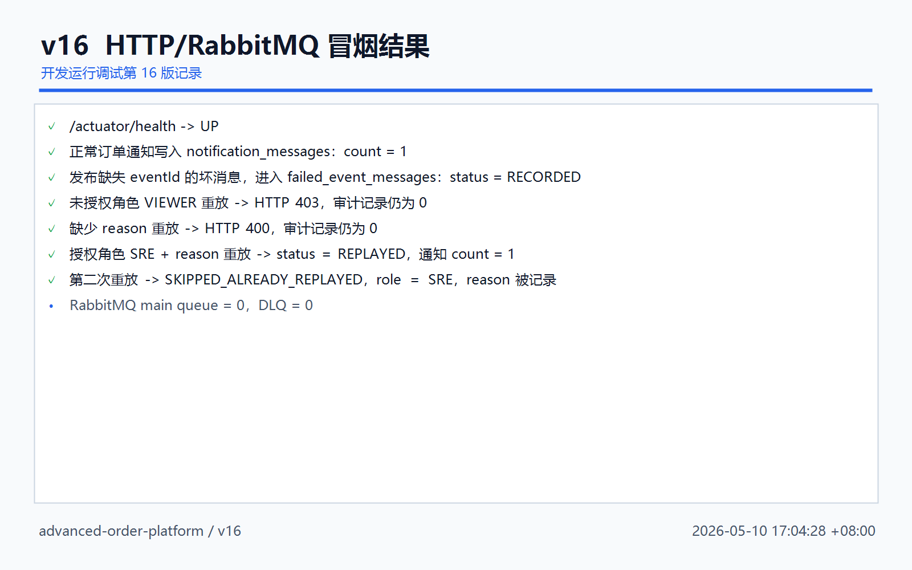
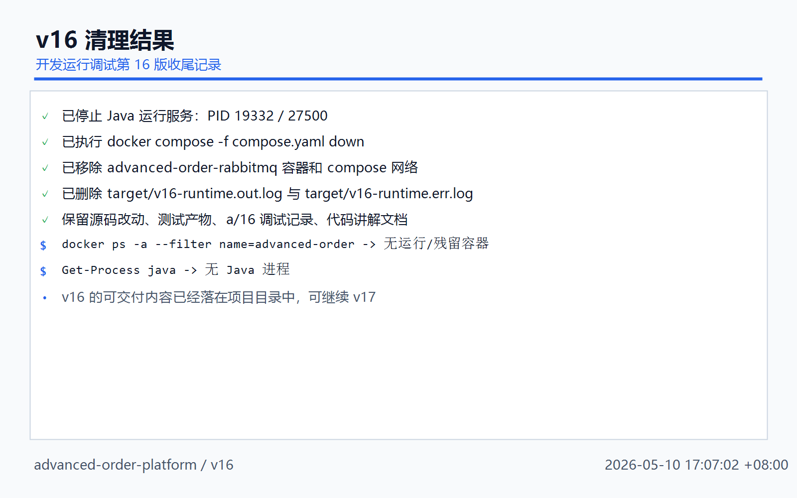

# 开发运行调试 v16：失败事件重放权限校验与原因记录

## 本轮目标

v15 已经做到“失败事件可以人工重放，并记录每次重放审计”。v16 继续把这个能力往生产可用推进：

```text
人工重放失败事件
 -> 必须带 X-Operator-Id
 -> 必须带 X-Operator-Role
 -> role 必须在白名单内
 -> 请求体必须写 reason
 -> 成功 / 失败 / 已重放跳过 都写入审计
```

核心价值：

```text
谁操作的
 -> operator_id

以什么角色操作的
 -> operator_role

为什么要重放
 -> reason

最终重放结果是什么
 -> SUCCEEDED / FAILED / SKIPPED_ALREADY_REPLAYED
```



## 关键代码引用

### 1. 重放请求增加 reason

文件：`src/main/java/com/codexdemo/orderplatform/notification/ReplayFailedEventRequest.java`

```java
public record ReplayFailedEventRequest(
        String eventId,
        String eventType,
        String aggregateType,
        String aggregateId,
        String payload,
        String reason
) {
}
```

解释：

```text
eventId/eventType/aggregateType/aggregateId/payload
 -> 仍然表示本次人工修复要覆盖哪些事件字段

reason
 -> 本次为什么要重放，必须填写
```

### 2. 新增重放权限配置

文件：`src/main/java/com/codexdemo/orderplatform/notification/FailedEventReplayProperties.java`

```java
@Component
@ConfigurationProperties(prefix = "failed-event.replay")
public class FailedEventReplayProperties {
    private List<String> allowedRoles = new ArrayList<>(List.of("ORDER_SUPPORT", "SRE", "SYSTEM"));
    private String systemRole = "SYSTEM";

    public boolean isAllowedRole(String role) {
        String normalizedRole = normalize(role);
        return normalizedRole != null
                && allowedRoles.stream()
                .map(this::normalize)
                .anyMatch(normalizedRole::equals);
    }
}
```

解释：

```text
allowedRoles
 -> 哪些角色允许重放失败事件

systemRole
 -> 代码内部系统调用时使用的默认角色

normalize
 -> 把角色统一 trim + uppercase，避免 sre / SRE / Sre 因大小写不同失败
```

配置文件：`src/main/resources/application.yml`

```yaml
failed-event:
  replay:
    allowed-roles:
      - ORDER_SUPPORT
      - SRE
      - SYSTEM
    system-role: SYSTEM
```

RabbitMQ 环境配置：`src/main/resources/application-rabbitmq.yml`

```yaml
failed-event:
  replay:
    allowed-roles: ${FAILED_EVENT_REPLAY_ALLOWED_ROLES:ORDER_SUPPORT,SRE,SYSTEM}
    system-role: ${FAILED_EVENT_REPLAY_SYSTEM_ROLE:SYSTEM}
```

### 3. Controller 读取操作人和角色

文件：`src/main/java/com/codexdemo/orderplatform/notification/FailedEventMessageController.java`

```java
@PostMapping("/{id}/replay")
public FailedEventMessageResponse replayFailedMessage(
        @PathVariable Long id,
        @RequestHeader(value = "X-Operator-Id", required = false) String operatorId,
        @RequestHeader(value = "X-Operator-Role", required = false) String operatorRole,
        @RequestBody(required = false) ReplayFailedEventRequest request
) {
    return failedEventMessageService.replay(id, request, operatorId, operatorRole);
}
```

解释：

```text
X-Operator-Id
 -> 谁在操作

X-Operator-Role
 -> 操作者以什么角色操作

request.reason
 -> 为什么要做这次修复重放
```

### 4. Service 做强校验

文件：`src/main/java/com/codexdemo/orderplatform/notification/FailedEventMessageService.java`

```java
String normalizedOperatorId = normalizeOperatorId(operatorId);
String normalizedOperatorRole = requireAllowedOperatorRole(operatorRole);
String reason = resolveReplayReason(request);
```

操作人必填：

```java
private String normalizeOperatorId(String operatorId) {
    if (!StringUtils.hasText(operatorId)) {
        throw new ResponseStatusException(HttpStatus.BAD_REQUEST, "X-Operator-Id header is required");
    }
    return truncate(operatorId.strip(), 80);
}
```

角色必须在白名单内：

```java
private String requireAllowedOperatorRole(String operatorRole) {
    if (!StringUtils.hasText(operatorRole)) {
        throw new ResponseStatusException(HttpStatus.FORBIDDEN, "X-Operator-Role header is required");
    }
    String normalizedRole = failedEventReplayProperties.normalize(operatorRole);
    if (!failedEventReplayProperties.isAllowedRole(normalizedRole)) {
        throw new ResponseStatusException(HttpStatus.FORBIDDEN, "Operator role is not allowed to replay failed events");
    }
    return truncate(normalizedRole, 80);
}
```

原因必填：

```java
private String resolveReplayReason(ReplayFailedEventRequest request) {
    if (request == null || !StringUtils.hasText(request.reason())) {
        throw new ResponseStatusException(HttpStatus.BAD_REQUEST, "Replay reason is required");
    }
    return truncate(request.reason().strip(), 500);
}
```

解释：

```text
403 FORBIDDEN
 -> 身份角色不允许做重放

400 BAD_REQUEST
 -> 请求信息不完整，例如没有 operatorId 或 reason
```

### 5. 审计表记录 role 和 reason

文件：`src/main/java/com/codexdemo/orderplatform/notification/FailedEventReplayAttempt.java`

```java
@Column(name = "operator_id", nullable = false, length = 80)
private String operatorId;

@Column(name = "operator_role", nullable = false, length = 80)
private String operatorRole;

@Column(nullable = false, length = 500)
private String reason;
```

审计写入：

```java
public static FailedEventReplayAttempt record(
        FailedEventMessage failedEventMessage,
        String operatorId,
        String operatorRole,
        String reason,
        ReplayFailedEventRequest request,
        String effectiveEventId,
        String effectiveEventType,
        String effectiveAggregateType,
        String effectiveAggregateId,
        String effectivePayload,
        FailedEventReplayAttemptStatus status,
        String errorMessage,
        Instant attemptedAt
) {
    return new FailedEventReplayAttempt(
            failedEventMessage,
            operatorId,
            operatorRole,
            reason,
            request == null ? null : request.eventId(),
            request == null ? null : request.eventType(),
            request == null ? null : request.aggregateType(),
            request == null ? null : request.aggregateId(),
            request == null ? null : request.payload(),
            effectiveEventId,
            effectiveEventType,
            effectiveAggregateType,
            effectiveAggregateId,
            effectivePayload,
            status,
            errorMessage,
            attemptedAt
    );
}
```

### 6. 审计响应也返回 role 和 reason

文件：`src/main/java/com/codexdemo/orderplatform/notification/FailedEventReplayAttemptResponse.java`

```java
public record FailedEventReplayAttemptResponse(
        Long id,
        Long failedEventMessageId,
        String operatorId,
        String operatorRole,
        String reason,
        String requestedEventId,
        String requestedEventType,
        String requestedAggregateType,
        String requestedAggregateId,
        String requestedPayload,
        String effectiveEventId,
        String effectiveEventType,
        String effectiveAggregateType,
        String effectiveAggregateId,
        String effectivePayload,
        FailedEventReplayAttemptStatus status,
        String errorMessage,
        Instant attemptedAt
) {
}
```

这样前端或运维平台查询：

```text
GET /api/v1/failed-events/{id}/replay-attempts
```

就能看到：

```text
operatorId
operatorRole
reason
status
effective_*
requested_*
```

## Flyway V6

H2：

```text
src/main/resources/db/migration/h2/V6__failed_event_replay_authorization.sql
```

PostgreSQL：

```text
src/main/resources/db/migration/postgresql/V6__failed_event_replay_authorization.sql
```

核心 SQL：

```sql
alter table failed_event_replay_attempts
    add column operator_role varchar(80) not null default 'UNKNOWN';

alter table failed_event_replay_attempts
    add column reason varchar(500) not null default 'not recorded before v16';
```

说明：

```text
default 'UNKNOWN'
default 'not recorded before v16'
```

是为了兼容已有 v15 审计数据。旧数据没有这两个字段，迁移时用默认值补齐，避免非空列导致迁移失败。

## 测试结果

本轮执行：

```powershell
mvn -Dtest=RabbitMqNotificationFailureIntegrationTests test
mvn test
```

结果：

```text
RabbitMqNotificationFailureIntegrationTests
 -> BUILD SUCCESS

mvn test
 -> Tests run: 22, Failures: 0, Errors: 0, Skipped: 0
```

测试覆盖点：

```text
VIEWER 调 replay
 -> 403 FORBIDDEN
 -> 不写审计

允许角色但缺 reason
 -> 400 BAD_REQUEST
 -> 不写审计

SRE + reason 调 replay
 -> REPLAYED
 -> 写 SUCCEEDED 审计

第二次 replay
 -> 不重复投递
 -> 写 SKIPPED_ALREADY_REPLAYED 审计
```



## 打包结果

本轮执行：

```powershell
mvn -DskipTests package
```

结果：

```text
BUILD SUCCESS
```

产物：

```text
target/advanced-order-platform-0.1.0-SNAPSHOT.jar
```



## 运行调试结果

运行环境：

```powershell
docker compose -f compose.yaml up -d rabbitmq

java -jar target\advanced-order-platform-0.1.0-SNAPSHOT.jar `
  --spring.profiles.active=rabbitmq `
  --server.port=18096 `
  --outbox.publisher.scan-delay-ms=1000 `
  --order.expiration.enabled=false `
  --notification.rabbitmq.retry.initial-interval-ms=100 `
  --notification.rabbitmq.retry.max-interval-ms=200
```

HTTP / RabbitMQ 冒烟结果：

```text
health                     : UP
createdOrderId             : 1
normalNotificationCount    : 1
failedEventId              : 1
failedStatusBeforeReplay   : RECORDED
unauthorizedRoleStatus     : 403
missingReasonStatus        : 400
auditCountBeforeAuthorized : 0
replayStatus               : REPLAYED
replayCount                : 1
replayedNotificationCount  : 1
secondReplayStatus         : REPLAYED
auditAttemptCount          : 2
latestAuditStatus          : SKIPPED_ALREADY_REPLAYED
latestAuditRole            : SRE
latestAuditReason          : confirm repeated replay is skipped
firstAuditStatus           : SUCCEEDED
firstAuditRole             : SRE
firstAuditReason           : repair missing eventId in v16 smoke test
mainQueueMessages          : 0
dlqMessages                : 0
```



## 清理结果

本轮启动的运行调试进程已经收尾：

```text
Java 运行服务
 -> 已停止

RabbitMQ compose 容器
 -> 已 docker compose down

target/v16-runtime.out.log
target/v16-runtime.err.log
 -> 已删除
```

保留内容：

```text
源码改动
测试产物
a/16 运行调试记录
代码讲解记录
```



## 本轮结论

v16 后，失败事件重放从“能修复”推进到“可控、可追责”：

```text
没有身份
 -> 不能重放

角色不在白名单
 -> 不能重放

没有原因
 -> 不能重放

成功重放或重复重放
 -> 都有审计记录
```

下一步建议：

```text
v17
 -> 给失败事件重放增加更接近后台管理的查询能力
 -> 支持按 status / eventType / aggregateId / 时间范围筛选 failed_event_messages
 -> 支持按 operatorRole / status / attemptedAt 查询 replay attempts
```
