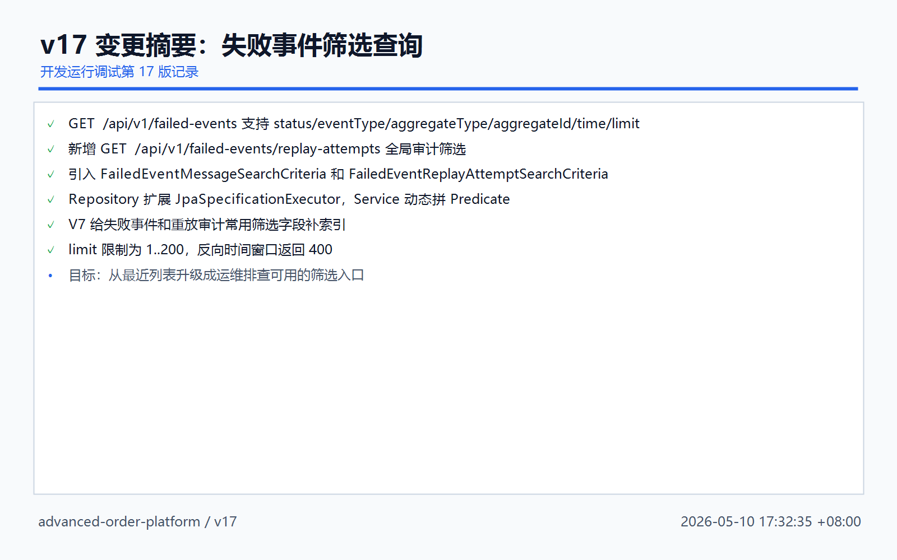
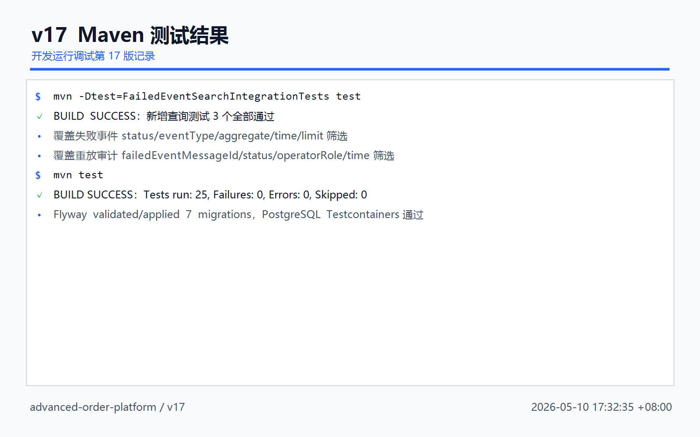
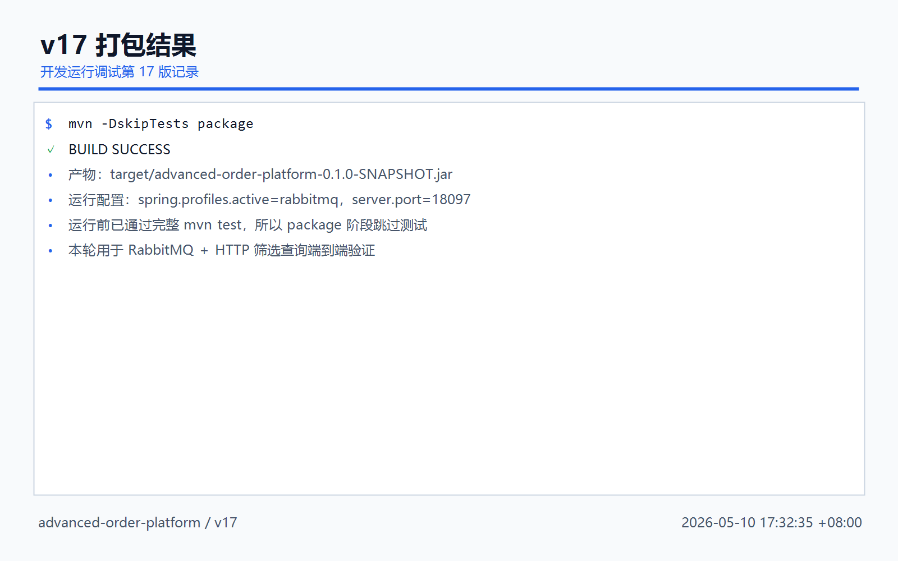
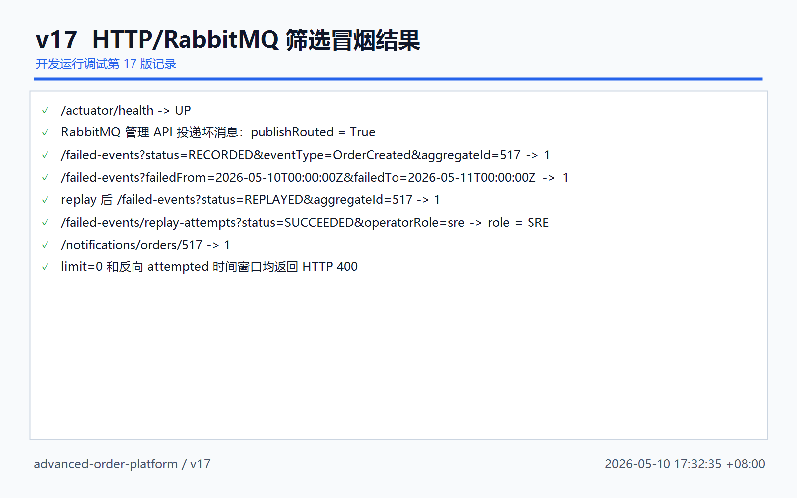
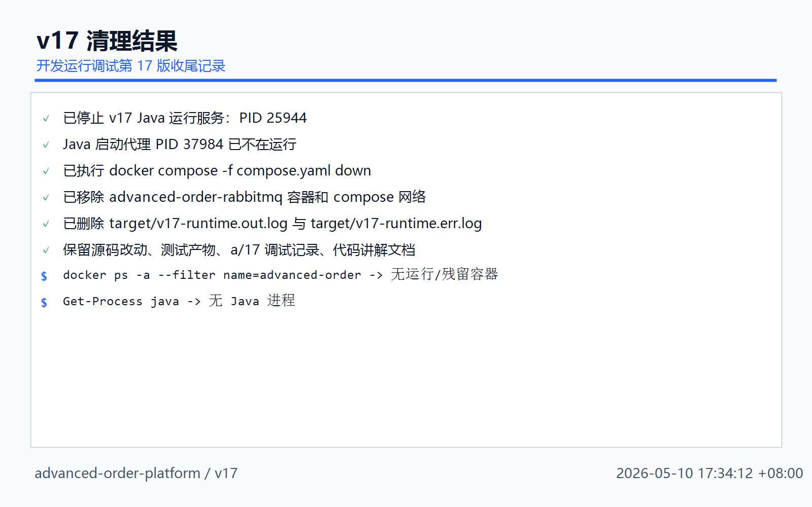

# 开发运行调试 v17：失败事件与重放审计筛选查询

## 本轮目标

v16 已经做到失败事件重放可控、可审计：

```text
X-Operator-Id
X-Operator-Role
reason
failed_event_replay_attempts
```

v17 继续补排查能力，让失败事件从“最近列表”升级成“可按条件筛选”：

```text
失败事件筛选
 -> status / eventType / aggregateType / aggregateId / failedFrom / failedTo / limit

重放审计筛选
 -> failedEventMessageId / status / operatorId / operatorRole / attemptedFrom / attemptedTo / limit
```



## 代码改动概要

### 1. 查询条件对象

文件：`src/main/java/com/codexdemo/orderplatform/notification/FailedEventMessageSearchCriteria.java`

```java
public record FailedEventMessageSearchCriteria(
        FailedEventMessageStatus status,
        String eventType,
        String aggregateType,
        String aggregateId,
        Instant failedFrom,
        Instant failedTo,
        Integer limit
) {
}
```

文件：`src/main/java/com/codexdemo/orderplatform/notification/FailedEventReplayAttemptSearchCriteria.java`

```java
public record FailedEventReplayAttemptSearchCriteria(
        Long failedEventMessageId,
        FailedEventReplayAttemptStatus status,
        String operatorId,
        String operatorRole,
        Instant attemptedFrom,
        Instant attemptedTo,
        Integer limit
) {
}
```

### 2. Controller 新增筛选参数

文件：`src/main/java/com/codexdemo/orderplatform/notification/FailedEventMessageController.java`

失败事件查询：

```java
@GetMapping
public List<FailedEventMessageResponse> searchFailedMessages(
        @RequestParam(required = false) FailedEventMessageStatus status,
        @RequestParam(required = false) String eventType,
        @RequestParam(required = false) String aggregateType,
        @RequestParam(required = false) String aggregateId,
        @RequestParam(required = false) @DateTimeFormat(iso = DateTimeFormat.ISO.DATE_TIME) Instant failedFrom,
        @RequestParam(required = false) @DateTimeFormat(iso = DateTimeFormat.ISO.DATE_TIME) Instant failedTo,
        @RequestParam(required = false) Integer limit
) {
    return failedEventMessageService.searchFailedMessages(new FailedEventMessageSearchCriteria(
            status,
            eventType,
            aggregateType,
            aggregateId,
            failedFrom,
            failedTo,
            limit
    ));
}
```

重放审计全局查询：

```java
@GetMapping("/replay-attempts")
public List<FailedEventReplayAttemptResponse> searchReplayAttempts(
        @RequestParam(required = false) Long failedEventMessageId,
        @RequestParam(required = false) FailedEventReplayAttemptStatus status,
        @RequestParam(required = false) String operatorId,
        @RequestParam(required = false) String operatorRole,
        @RequestParam(required = false) @DateTimeFormat(iso = DateTimeFormat.ISO.DATE_TIME) Instant attemptedFrom,
        @RequestParam(required = false) @DateTimeFormat(iso = DateTimeFormat.ISO.DATE_TIME) Instant attemptedTo,
        @RequestParam(required = false) Integer limit
) {
    return failedEventMessageService.searchReplayAttempts(new FailedEventReplayAttemptSearchCriteria(
            failedEventMessageId,
            status,
            operatorId,
            operatorRole,
            attemptedFrom,
            attemptedTo,
            limit
    ));
}
```

### 3. Repository 支持动态查询

文件：`src/main/java/com/codexdemo/orderplatform/notification/FailedEventMessageRepository.java`

```java
public interface FailedEventMessageRepository
        extends JpaRepository<FailedEventMessage, Long>, JpaSpecificationExecutor<FailedEventMessage> {
```

文件：`src/main/java/com/codexdemo/orderplatform/notification/FailedEventReplayAttemptRepository.java`

```java
public interface FailedEventReplayAttemptRepository
        extends JpaRepository<FailedEventReplayAttempt, Long>, JpaSpecificationExecutor<FailedEventReplayAttempt> {
```

`JpaSpecificationExecutor` 用来动态组合查询条件，避免新增很多 `findByXxxAndYyy` 方法。

### 4. Service 动态拼 Predicate

文件：`src/main/java/com/codexdemo/orderplatform/notification/FailedEventMessageService.java`

失败事件筛选入口：

```java
return failedEventMessageRepository
        .findAll(
                failedMessagesMatching(normalizedCriteria),
                PageRequest.of(0, limit, Sort.by(Sort.Direction.DESC, "failedAt", "id"))
        )
        .getContent()
        .stream()
        .map(FailedEventMessageResponse::from)
        .toList();
```

失败事件条件拼接：

```java
private Specification<FailedEventMessage> failedMessagesMatching(FailedEventMessageSearchCriteria criteria) {
    return (root, query, criteriaBuilder) -> {
        List<Predicate> predicates = new ArrayList<>();
        if (criteria.status() != null) {
            predicates.add(criteriaBuilder.equal(root.get("status"), criteria.status()));
        }
        addTextEquals(predicates, criteriaBuilder, root.get("eventType"), criteria.eventType());
        addTextEquals(predicates, criteriaBuilder, root.get("aggregateType"), criteria.aggregateType());
        addTextEquals(predicates, criteriaBuilder, root.get("aggregateId"), criteria.aggregateId());
        if (criteria.failedFrom() != null) {
            predicates.add(criteriaBuilder.greaterThanOrEqualTo(root.get("failedAt"), criteria.failedFrom()));
        }
        if (criteria.failedTo() != null) {
            predicates.add(criteriaBuilder.lessThanOrEqualTo(root.get("failedAt"), criteria.failedTo()));
        }
        return criteriaBuilder.and(predicates.toArray(Predicate[]::new));
    };
}
```

重放审计条件拼接：

```java
addTextEquals(predicates, criteriaBuilder, root.get("operatorId"), criteria.operatorId());
addTextEquals(
        predicates,
        criteriaBuilder,
        root.get("operatorRole"),
        failedEventReplayProperties.normalize(criteria.operatorRole())
);
```

这里 `operatorRole=sre` 会被规范成 `SRE`，和 v16 的角色校验规则一致。

### 5. limit 和时间范围校验

```java
private int normalizeSearchLimit(Integer limit) {
    if (limit == null) {
        return 50;
    }
    if (limit < 1 || limit > 200) {
        throw new ResponseStatusException(HttpStatus.BAD_REQUEST, "limit must be between 1 and 200");
    }
    return limit;
}
```

```java
private void validateTimeRange(Instant from, Instant to, String fromName, String toName) {
    if (from != null && to != null && from.isAfter(to)) {
        throw new ResponseStatusException(HttpStatus.BAD_REQUEST, fromName + " must be before or equal to " + toName);
    }
}
```

## Flyway V7

H2：

```text
src/main/resources/db/migration/h2/V7__failed_event_search_indexes.sql
```

PostgreSQL：

```text
src/main/resources/db/migration/postgresql/V7__failed_event_search_indexes.sql
```

核心索引：

```sql
create index idx_failed_event_messages_status_failed_at
    on failed_event_messages (status, failed_at);

create index idx_failed_event_messages_event_type_failed_at
    on failed_event_messages (event_type, failed_at);

create index idx_failed_event_messages_aggregate
    on failed_event_messages (aggregate_type, aggregate_id);

create index idx_failed_event_replay_attempts_status
    on failed_event_replay_attempts (status, attempted_at);

create index idx_failed_event_replay_attempts_operator_role
    on failed_event_replay_attempts (operator_role, attempted_at);

create index idx_failed_event_replay_attempts_operator_id
    on failed_event_replay_attempts (operator_id, attempted_at);
```

## 测试结果

本轮执行：

```powershell
mvn -Dtest=FailedEventSearchIntegrationTests test
mvn test
```

结果：

```text
FailedEventSearchIntegrationTests
 -> Tests run: 3, Failures: 0, Errors: 0, Skipped: 0

mvn test
 -> Tests run: 25, Failures: 0, Errors: 0, Skipped: 0
```



## 打包结果

本轮执行：

```powershell
mvn -DskipTests package
```

结果：

```text
BUILD SUCCESS
```

产物：

```text
target/advanced-order-platform-0.1.0-SNAPSHOT.jar
```



## 运行调试结果

运行环境：

```powershell
docker compose -f compose.yaml up -d rabbitmq

java -jar target\advanced-order-platform-0.1.0-SNAPSHOT.jar `
  --spring.profiles.active=rabbitmq `
  --server.port=18097 `
  --outbox.publisher.scan-delay-ms=1000 `
  --order.expiration.enabled=false `
  --notification.rabbitmq.retry.initial-interval-ms=100 `
  --notification.rabbitmq.retry.max-interval-ms=200
```

冒烟结果：

```text
health                    : UP
publishRouted             : True
failedEventId             : 1
failedStatusBeforeReplay  : RECORDED
failedSearchEventType     : OrderCreated
failedSearchAggregateId   : 517
timeWindowResultCount     : 1
replayStatus              : REPLAYED
replayCount               : 1
replayedFilteredCount     : 1
replayedFilteredStatus    : REPLAYED
auditFilteredCount        : 1
auditFilteredOperatorId   : v17-smoke-operator
auditFilteredOperatorRole : SRE
auditFilteredStatus       : SUCCEEDED
singleMessageAttemptCount : 1
notificationCount         : 1
invalidLimitStatus        : 400
invalidRangeStatus        : 400
```



## 清理结果

本轮启动的运行调试环境已经收尾：

```text
Java 运行服务
 -> 已停止 PID 25944

Java 启动代理
 -> PID 37984 已不在运行

RabbitMQ compose 容器
 -> 已 docker compose down

target/v17-runtime.out.log
target/v17-runtime.err.log
 -> 已删除
```

保留内容：

```text
源码改动
测试产物
a/17 运行调试记录
代码讲解记录
```



## 本轮结论

v17 后，失败事件排查链路变成：

```text
失败事件进入 DLQ
 -> failed_event_messages 落库
 -> 按 status/eventType/aggregateId/time 筛选定位
 -> 人工带 role/reason 重放
 -> 按 operatorRole/status/time 筛选审计
```

下一步建议：

```text
v18
 -> 给查询接口升级分页响应对象
 -> 支持 page/size/sort 白名单
 -> 为管理端页面准备稳定的分页元数据
```
