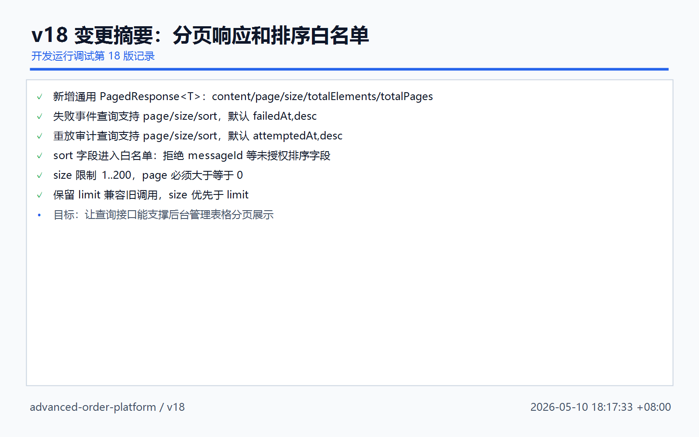
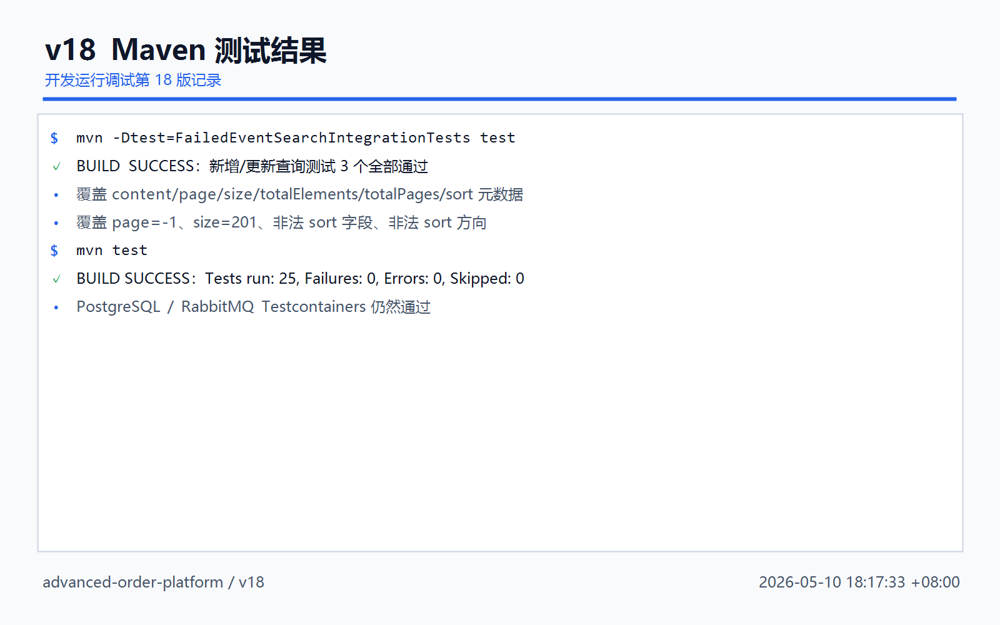
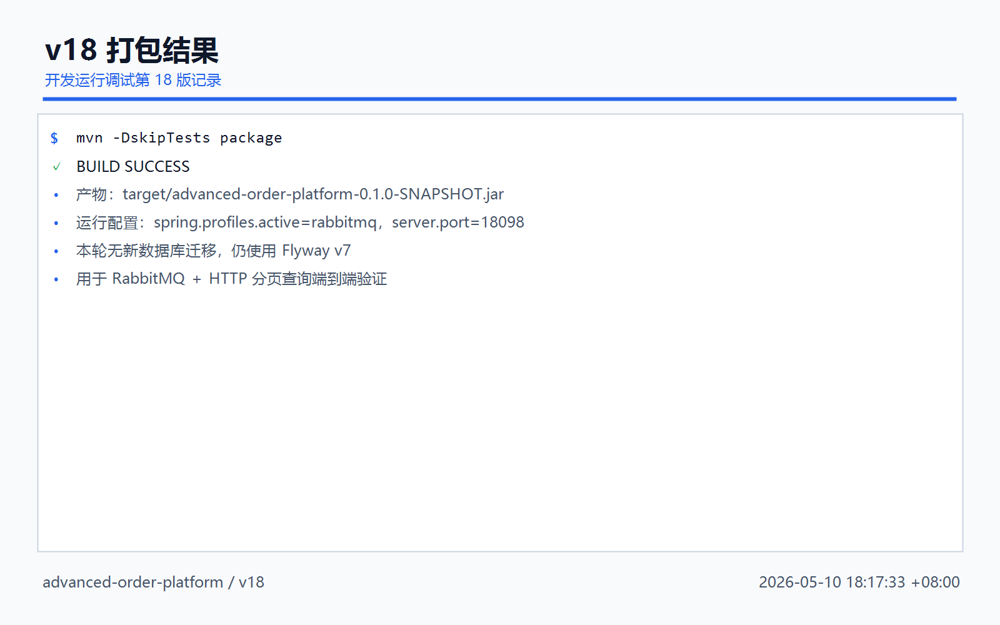
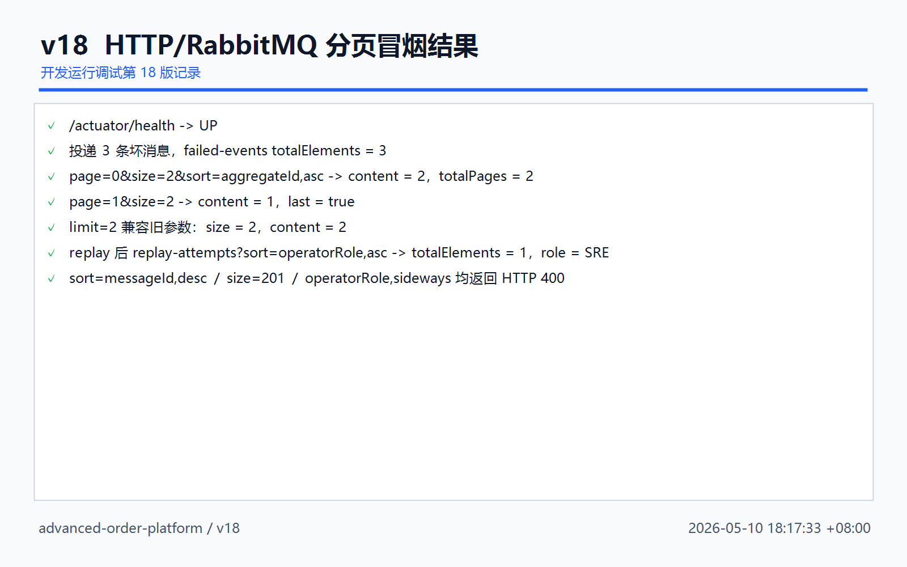
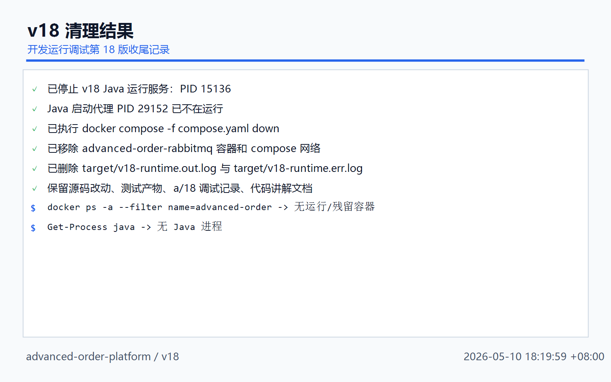

# 开发运行调试 v18：失败事件查询分页响应和排序白名单

## 本轮目标

v17 已经支持失败事件和重放审计多条件筛选。v18 继续把查询接口往管理端表格形态推进：

```text
page
 -> 第几页，从 0 开始

size
 -> 每页多少条，限制 1..200

sort
 -> 排序字段和方向，例如 failedAt,desc

totalElements / totalPages
 -> 前端分页控件需要的总数信息
```



## 代码改动概要

### 1. 通用分页响应对象

文件：`src/main/java/com/codexdemo/orderplatform/common/PagedResponse.java`

```java
public record PagedResponse<T>(
        List<T> content,
        int page,
        int size,
        long totalElements,
        int totalPages,
        boolean first,
        boolean last,
        boolean empty,
        String sort
) {
}
```

从 Spring Data `Page` 转成 API 响应：

```java
public static <S, T> PagedResponse<T> from(Page<S> page, Function<S, T> mapper, String sort) {
    return new PagedResponse<>(
            page.getContent().stream().map(mapper).toList(),
            page.getNumber(),
            page.getSize(),
            page.getTotalElements(),
            page.getTotalPages(),
            page.isFirst(),
            page.isLast(),
            page.isEmpty(),
            sort
    );
}
```

### 2. 查询条件增加 page / size / sort

文件：`src/main/java/com/codexdemo/orderplatform/notification/FailedEventMessageSearchCriteria.java`

```java
public record FailedEventMessageSearchCriteria(
        FailedEventMessageStatus status,
        String eventType,
        String aggregateType,
        String aggregateId,
        Instant failedFrom,
        Instant failedTo,
        Integer page,
        Integer size,
        String sort,
        Integer limit
) {
}
```

保留旧 `limit` 构造方式：

```java
public FailedEventMessageSearchCriteria(
        FailedEventMessageStatus status,
        String eventType,
        String aggregateType,
        String aggregateId,
        Instant failedFrom,
        Instant failedTo,
        Integer limit
) {
    this(status, eventType, aggregateType, aggregateId, failedFrom, failedTo, null, null, null, limit);
}
```

这样 v17 的调用仍然能跑：

```text
limit=20
 -> v18 中当成 size=20 使用
```

### 3. Controller 返回分页对象

文件：`src/main/java/com/codexdemo/orderplatform/notification/FailedEventMessageController.java`

失败事件分页查询：

```java
@GetMapping
public PagedResponse<FailedEventMessageResponse> searchFailedMessages(
        @RequestParam(required = false) FailedEventMessageStatus status,
        @RequestParam(required = false) String eventType,
        @RequestParam(required = false) String aggregateType,
        @RequestParam(required = false) String aggregateId,
        @RequestParam(required = false) @DateTimeFormat(iso = DateTimeFormat.ISO.DATE_TIME) Instant failedFrom,
        @RequestParam(required = false) @DateTimeFormat(iso = DateTimeFormat.ISO.DATE_TIME) Instant failedTo,
        @RequestParam(required = false) Integer page,
        @RequestParam(required = false) Integer size,
        @RequestParam(required = false) String sort,
        @RequestParam(required = false) Integer limit
) {
    return failedEventMessageService.searchFailedMessages(new FailedEventMessageSearchCriteria(
            status,
            eventType,
            aggregateType,
            aggregateId,
            failedFrom,
            failedTo,
            page,
            size,
            sort,
            limit
    ));
}
```

重放审计分页查询：

```java
@GetMapping("/replay-attempts")
public PagedResponse<FailedEventReplayAttemptResponse> searchReplayAttempts(
        @RequestParam(required = false) Long failedEventMessageId,
        @RequestParam(required = false) FailedEventReplayAttemptStatus status,
        @RequestParam(required = false) String operatorId,
        @RequestParam(required = false) String operatorRole,
        @RequestParam(required = false) @DateTimeFormat(iso = DateTimeFormat.ISO.DATE_TIME) Instant attemptedFrom,
        @RequestParam(required = false) @DateTimeFormat(iso = DateTimeFormat.ISO.DATE_TIME) Instant attemptedTo,
        @RequestParam(required = false) Integer page,
        @RequestParam(required = false) Integer size,
        @RequestParam(required = false) String sort,
        @RequestParam(required = false) Integer limit
) {
    return failedEventMessageService.searchReplayAttempts(new FailedEventReplayAttemptSearchCriteria(
            failedEventMessageId,
            status,
            operatorId,
            operatorRole,
            attemptedFrom,
            attemptedTo,
            page,
            size,
            sort,
            limit
    ));
}
```

### 4. Service 排序白名单

文件：`src/main/java/com/codexdemo/orderplatform/notification/FailedEventMessageService.java`

失败事件允许排序：

```java
private static final Map<String, String> FAILED_MESSAGE_SORT_FIELDS = Map.of(
        "id", "id",
        "failedAt", "failedAt",
        "status", "status",
        "eventType", "eventType",
        "aggregateId", "aggregateId",
        "replayCount", "replayCount"
);
```

重放审计允许排序：

```java
private static final Map<String, String> REPLAY_ATTEMPT_SORT_FIELDS = Map.of(
        "id", "id",
        "attemptedAt", "attemptedAt",
        "status", "status",
        "operatorId", "operatorId",
        "operatorRole", "operatorRole"
);
```

### 5. Service 构造 PageRequest

```java
private NormalizedPageRequest normalizePageRequest(
        Integer page,
        Integer size,
        Integer limit,
        String sort,
        Map<String, String> allowedSortFields,
        String defaultSort
) {
    int normalizedPage = normalizeSearchPage(page);
    int normalizedSize = normalizeSearchSize(size, limit);
    SortInstruction sortInstruction = normalizeSort(sort, allowedSortFields, defaultSort);
    return new NormalizedPageRequest(
            PageRequest.of(normalizedPage, normalizedSize, sortInstruction.sort()),
            sortInstruction.expression()
    );
}
```

页码校验：

```java
private int normalizeSearchPage(Integer page) {
    if (page == null) {
        return 0;
    }
    if (page < 0) {
        throw new ResponseStatusException(HttpStatus.BAD_REQUEST, "page must be greater than or equal to 0");
    }
    return page;
}
```

每页数量校验：

```java
private int normalizeSearchSize(Integer size, Integer limit) {
    Integer requestedSize = size == null ? limit : size;
    if (requestedSize == null) {
        return 50;
    }
    if (requestedSize < 1 || requestedSize > 200) {
        throw new ResponseStatusException(HttpStatus.BAD_REQUEST, "size must be between 1 and 200");
    }
    return requestedSize;
}
```

排序校验：

```java
private SortInstruction normalizeSort(
        String sort,
        Map<String, String> allowedSortFields,
        String defaultSort
) {
    String expression = StringUtils.hasText(sort) ? sort.strip() : defaultSort;
    String[] parts = expression.split(",");
    if (parts.length < 1 || parts.length > 2) {
        throw new ResponseStatusException(HttpStatus.BAD_REQUEST, "sort must use field,direction format");
    }
    String requestedField = parts[0].strip();
    String property = allowedSortFields.get(requestedField);
    if (property == null) {
        throw new ResponseStatusException(HttpStatus.BAD_REQUEST, "sort field is not allowed: " + requestedField);
    }
    Sort.Direction direction = Sort.Direction.DESC;
    if (parts.length == 2 && StringUtils.hasText(parts[1])) {
        try {
            direction = Sort.Direction.fromString(parts[1].strip());
        } catch (IllegalArgumentException ex) {
            throw new ResponseStatusException(HttpStatus.BAD_REQUEST, "sort direction must be asc or desc", ex);
        }
    }
    Sort sortOrder = Sort.by(direction, property);
    if (!"id".equals(property)) {
        sortOrder = sortOrder.and(Sort.by(Sort.Direction.DESC, "id"));
    }
    return new SortInstruction(sortOrder, requestedField + "," + direction.name().toLowerCase());
}
```

## 测试结果

本轮执行：

```powershell
mvn -Dtest=FailedEventSearchIntegrationTests test
mvn test
```

结果：

```text
FailedEventSearchIntegrationTests
 -> Tests run: 3, Failures: 0, Errors: 0, Skipped: 0

mvn test
 -> Tests run: 25, Failures: 0, Errors: 0, Skipped: 0
```



## 打包结果

本轮执行：

```powershell
mvn -DskipTests package
```

结果：

```text
BUILD SUCCESS
```

产物：

```text
target/advanced-order-platform-0.1.0-SNAPSHOT.jar
```



## 运行调试结果

运行环境：

```powershell
docker compose -f compose.yaml up -d rabbitmq

java -jar target\advanced-order-platform-0.1.0-SNAPSHOT.jar `
  --spring.profiles.active=rabbitmq `
  --server.port=18098 `
  --outbox.publisher.scan-delay-ms=1000 `
  --order.expiration.enabled=false `
  --notification.rabbitmq.retry.initial-interval-ms=100 `
  --notification.rabbitmq.retry.max-interval-ms=200
```

冒烟结果：

```text
health                   : UP
publishedMessages        : 3
recordedTotalElements    : 3
firstPageContentCount    : 2
firstPagePage            : 0
firstPageSize            : 2
firstPageTotalElements   : 3
firstPageTotalPages      : 2
firstPageSort            : aggregateId,asc
secondPageContentCount   : 1
secondPagePage           : 1
secondPageLast           : True
legacyLimitSize          : 2
legacyLimitContentCount  : 2
replayStatus             : REPLAYED
attemptTotalElements     : 1
attemptContentCount      : 1
attemptSort              : operatorRole,asc
attemptOperatorRole      : SRE
invalidSortStatus        : 400
invalidSizeStatus        : 400
invalidAttemptSortStatus : 400
```



## 清理结果

本轮启动的运行调试环境已经收尾：

```text
Java 运行服务
 -> 已停止 PID 15136

Java 启动代理
 -> PID 29152 已不在运行

RabbitMQ compose 容器
 -> 已 docker compose down

target/v18-runtime.out.log
target/v18-runtime.err.log
 -> 已删除
```

保留内容：

```text
源码改动
测试产物
a/18 运行调试记录
代码讲解记录
```



## 本轮结论

v18 后，失败事件排查接口已经具备后台管理表格的基本形态：

```text
筛选
 -> status / eventType / aggregateId / operatorRole / time

分页
 -> page / size / totalElements / totalPages

排序
 -> sort 白名单

兼容
 -> limit 仍可作为 size 使用
```

下一步建议：

```text
v19
 -> 增加失败事件管理端的导出或批量标记能力
 -> 例如批量标记 ignored / investigating / resolved
```
