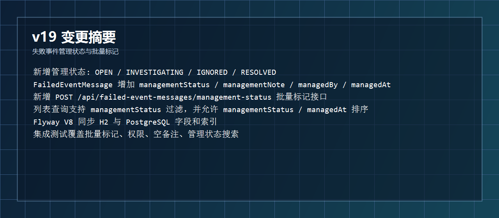
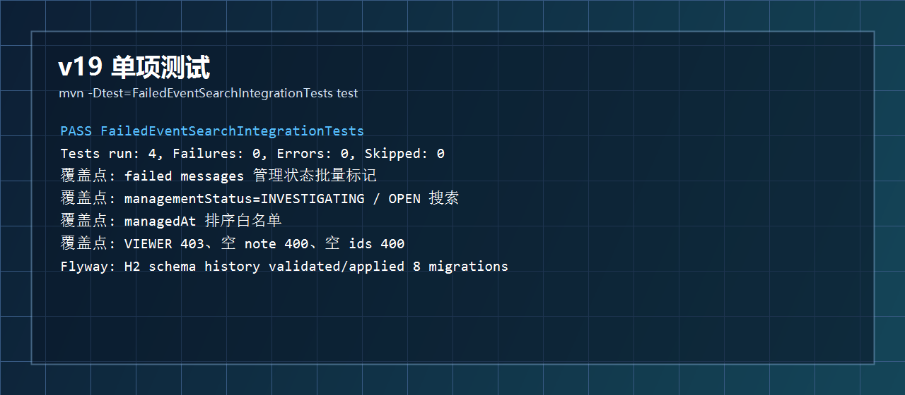
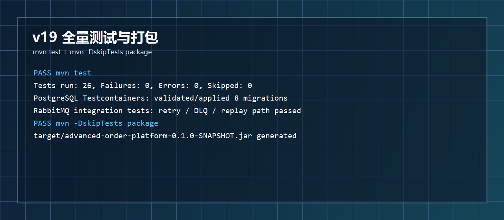
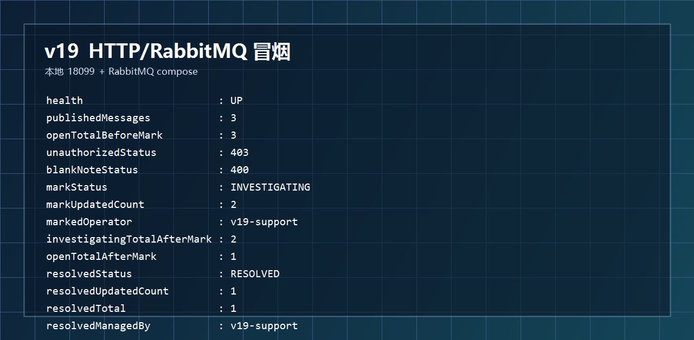
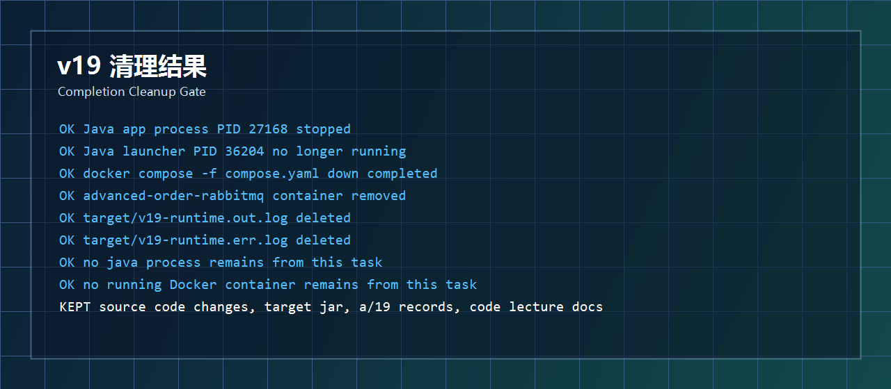

# 开发运行调试 v19：失败事件管理状态与批量标记

## 本轮目标

v18 已经把失败事件查询做成了更接近后台表格的形态：分页、排序、总数、筛选。v19 继续往“可运维”方向推进，让失败事件不只是能查，还能被人工标记处理进度。

```text
OPEN
 -> 新进入失败事件表，尚未处理

INVESTIGATING
 -> 运维或客服正在排查

IGNORED
 -> 确认无需处理

RESOLVED
 -> 已处理完成
```



## 代码改动概要

### 1. 管理状态枚举

文件：`src/main/java/com/codexdemo/orderplatform/notification/FailedEventManagementStatus.java`

```java
public enum FailedEventManagementStatus {
    OPEN,
    INVESTIGATING,
    IGNORED,
    RESOLVED
}
```

这个枚举和失败消息本身的 `FailedEventMessageStatus` 分开。前者表示“业务处理进度”，后者表示“消息重放状态”。

### 2. 失败事件实体增加管理字段

文件：`src/main/java/com/codexdemo/orderplatform/notification/FailedEventMessage.java`

```java
@Enumerated(EnumType.STRING)
@Column(name = "management_status", nullable = false, length = 32)
private FailedEventManagementStatus managementStatus;

@Column(name = "management_note", length = 500)
private String managementNote;

@Column(name = "managed_by", length = 80)
private String managedBy;

@Column(name = "managed_at")
private Instant managedAt;
```

新失败事件默认进入 `OPEN`：

```java
this.managementStatus = FailedEventManagementStatus.OPEN;
```

批量标记时统一走实体方法：

```java
public void markManagementStatus(
        FailedEventManagementStatus managementStatus,
        String managementNote,
        String managedBy,
        Instant managedAt
) {
    if (managementStatus == null) {
        throw new IllegalArgumentException("managementStatus must not be null");
    }
    if (!StringUtils.hasText(managedBy)) {
        throw new IllegalArgumentException("managedBy must not be blank");
    }
    if (managedAt == null) {
        throw new IllegalArgumentException("managedAt must not be null");
    }
    this.managementStatus = managementStatus;
    this.managementNote = managementNote;
    this.managedBy = managedBy.strip();
    this.managedAt = managedAt;
}
```

### 3. 批量标记请求与响应

文件：`src/main/java/com/codexdemo/orderplatform/notification/MarkFailedEventManagementRequest.java`

```java
public record MarkFailedEventManagementRequest(
        List<Long> ids,
        FailedEventManagementStatus status,
        String note
) {
}
```

文件：`src/main/java/com/codexdemo/orderplatform/notification/FailedEventManagementBatchResponse.java`

```java
public record FailedEventManagementBatchResponse(
        FailedEventManagementStatus status,
        int updatedCount,
        List<FailedEventMessageResponse> items
) {
}
```

### 4. Controller 暴露批量标记接口

文件：`src/main/java/com/codexdemo/orderplatform/notification/FailedEventMessageController.java`

```java
@PostMapping("/management-status")
public FailedEventManagementBatchResponse markManagementStatus(
        @RequestHeader(value = "X-Operator-Id", required = false) String operatorId,
        @RequestHeader(value = "X-Operator-Role", required = false) String operatorRole,
        @RequestBody MarkFailedEventManagementRequest request
) {
    return failedEventMessageService.markManagementStatus(request, operatorId, operatorRole);
}
```

查询接口也增加了 `managementStatus`：

```java
@RequestParam(required = false) FailedEventManagementStatus managementStatus
```

因此现在可以这样查：

```powershell
Invoke-RestMethod "http://localhost:18099/api/v1/failed-events?managementStatus=INVESTIGATING&page=0&size=20&sort=managementStatus,asc"
```

### 5. Service 负责权限、校验、查询和批量更新

文件：`src/main/java/com/codexdemo/orderplatform/notification/FailedEventMessageService.java`

排序白名单新增：

```java
"managementStatus", "managementStatus",
"managedAt", "managedAt"
```

查询条件新增：

```java
if (criteria.managementStatus() != null) {
    predicates.add(criteriaBuilder.equal(root.get("managementStatus"), criteria.managementStatus()));
}
```

批量标记主流程：

```java
@Transactional
public FailedEventManagementBatchResponse markManagementStatus(
        MarkFailedEventManagementRequest request,
        String operatorId,
        String operatorRole
) {
    if (request == null) {
        throw new ResponseStatusException(HttpStatus.BAD_REQUEST, "request body is required");
    }
    List<Long> ids = normalizeManagementIds(request.ids());
    FailedEventManagementStatus managementStatus = requireManagementStatus(request.status());
    String normalizedOperatorId = normalizeOperatorId(operatorId);
    FailedEventReplayOperatorRole normalizedOperatorRole = requireAllowedOperatorRole(operatorRole);
    String note = resolveManagementNote(request.note());
    Instant managedAt = clock.instant();

    List<FailedEventMessage> failedMessages = failedEventMessageRepository.findAllById(ids);
    if (failedMessages.size() != ids.size()) {
        throw new ResponseStatusException(HttpStatus.NOT_FOUND, "one or more failed event messages were not found");
    }

    failedMessages.forEach(failedMessage ->
            failedMessage.markManagementStatus(managementStatus, note, normalizedOperatorId, managedAt)
    );
    return new FailedEventManagementBatchResponse(
            managementStatus,
            failedMessages.size(),
            failedMessages.stream().map(FailedEventMessageResponse::from).toList()
    );
}
```

几个关键约束：

```text
ids
 -> 必填、去重、正数、最多 100 个

status
 -> 必填

note
 -> 必填，最长 500 字符

operator
 -> 复用 v16 的 X-Operator-Id / X-Operator-Role 权限校验
```

### 6. Flyway V8 迁移

文件：

```text
src/main/resources/db/migration/h2/V8__failed_event_management_status.sql
src/main/resources/db/migration/postgresql/V8__failed_event_management_status.sql
```

核心迁移：

```sql
alter table failed_event_messages
    add column management_status varchar(32) not null default 'OPEN';

alter table failed_event_messages
    add column management_note varchar(500);

alter table failed_event_messages
    add column managed_by varchar(80);

alter table failed_event_messages
    add column managed_at timestamp(6) with time zone;

create index idx_failed_event_messages_management
    on failed_event_messages (management_status, managed_at);
```

## 测试结果

本轮先跑失败事件搜索相关集成测试：

```powershell
mvn -Dtest=FailedEventSearchIntegrationTests test
```

结果：

```text
Tests run: 4, Failures: 0, Errors: 0, Skipped: 0
BUILD SUCCESS
```

覆盖内容：

```text
批量标记 INVESTIGATING
按 managementStatus 查询
按 managedAt 排序
VIEWER 角色禁止标记
空 note 返回 400
空 ids 返回 400
```



全量测试与打包：

```powershell
mvn test
mvn -DskipTests package
```

结果：

```text
mvn test
 -> Tests run: 26, Failures: 0, Errors: 0, Skipped: 0

mvn -DskipTests package
 -> BUILD SUCCESS
 -> target/advanced-order-platform-0.1.0-SNAPSHOT.jar
```



## 运行调试结果

本轮启动 RabbitMQ 与应用：

```powershell
docker compose -f compose.yaml up -d rabbitmq

java -jar target\advanced-order-platform-0.1.0-SNAPSHOT.jar `
  --spring.profiles.active=rabbitmq `
  --server.port=18099 `
  --outbox.publisher.scan-delay-ms=1000 `
  --order.expiration.enabled=false `
  --notification.rabbitmq.retry.initial-interval-ms=100 `
  --notification.rabbitmq.retry.max-interval-ms=200
```

冒烟链路：

```text
创建 3 个订单
 -> 触发 3 条通知事件
 -> RabbitMQ 消费失败后进入 failed_event_messages
 -> 默认 managementStatus = OPEN
 -> VIEWER 批量标记被拒绝
 -> 空 note 批量标记被拒绝
 -> SRE 批量标记 2 条为 INVESTIGATING
 -> ORDER_SUPPORT 标记 1 条为 RESOLVED
 -> 分别按 INVESTIGATING / OPEN / RESOLVED 查询验证
```

冒烟结果：

```text
health                      : UP
publishedMessages           : 3
openTotalBeforeMark         : 3
idsMarked                   : 3,2
unauthorizedStatus          : 403
blankNoteStatus             : 400
markStatus                  : INVESTIGATING
markUpdatedCount            : 2
markedOperator              : v19-support
markedNote                  : v19 smoke test starts investigation
investigatingTotalAfterMark : 2
openTotalAfterMark          : 1
managedAtSort               : managedAt,desc
resolvedStatus              : RESOLVED
resolvedUpdatedCount        : 1
resolvedTotal               : 1
resolvedManagedBy           : v19-support
resolvedNote                : v19 smoke test closes one item
```



## 清理结果

本轮启动过的运行环境已经收掉：

```text
Java 应用进程 PID 27168
 -> 已停止

Java 启动代理 PID 36204
 -> 清理后不再运行

RabbitMQ compose 容器 advanced-order-rabbitmq
 -> docker compose down 后已移除

target/v19-runtime.out.log
target/v19-runtime.err.log
 -> 已删除
```

保留内容：

```text
源码改动
target/advanced-order-platform-0.1.0-SNAPSHOT.jar
a/19 运行调试记录
代码讲解记录/23-version-19-failed-event-management-status.md
```



## 本轮结论

v19 之后，失败事件后台能力从“可查、可分页、可排序”进一步推进到了“可人工处置”。现在已经可以围绕失败事件做一个基础运维工作台：

```text
列表查询
 -> status / managementStatus / eventType / aggregateId / 时间范围

表格能力
 -> page / size / totalElements / sort 白名单

人工处理
 -> 批量标记 OPEN / INVESTIGATING / IGNORED / RESOLVED

权限控制
 -> SRE / ORDER_SUPPORT / ADMIN 可操作，VIEWER 被拒绝

审计线索
 -> managementNote / managedBy / managedAt 记录最后一次处理动作
```

下一步建议：

```text
v20
 -> 增加 failed_event_management_history 管理状态变更流水表
 -> 让每一次 OPEN -> INVESTIGATING -> RESOLVED 的变化都可追溯
```
