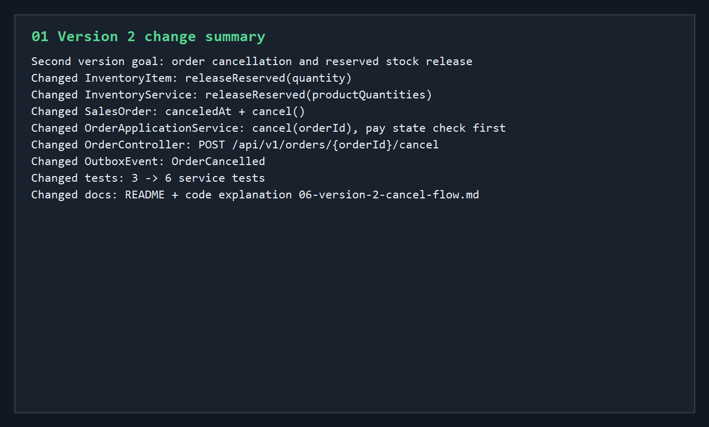
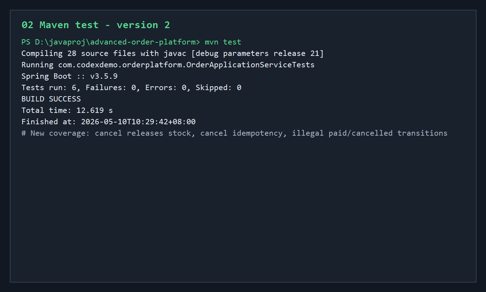
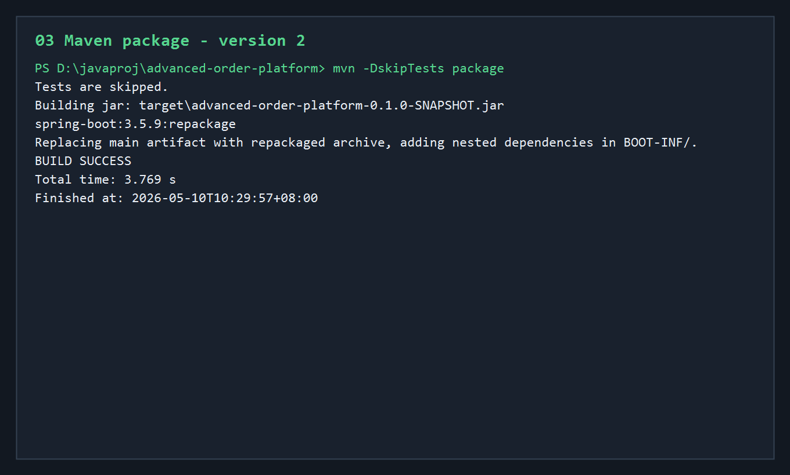
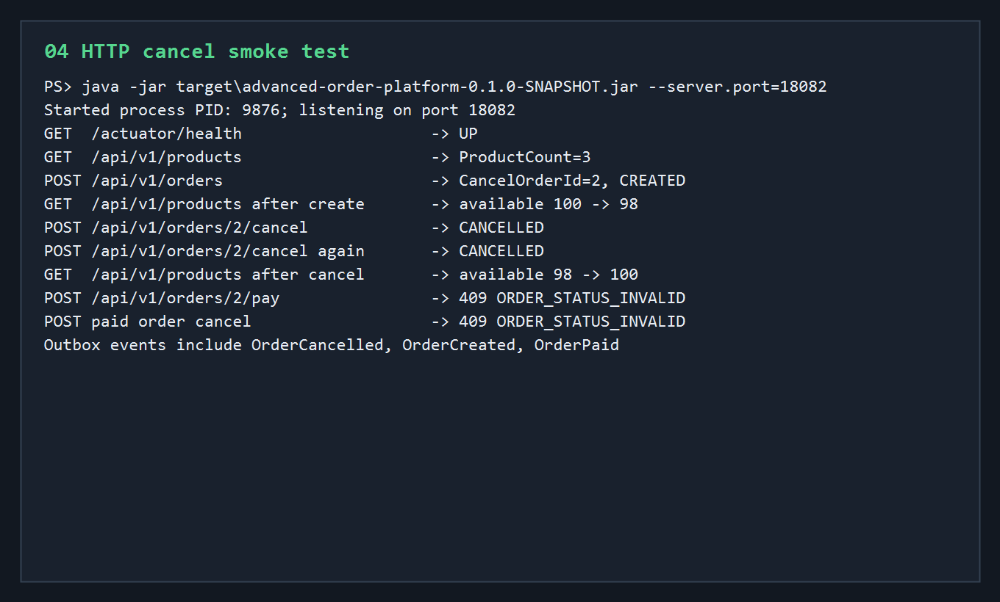
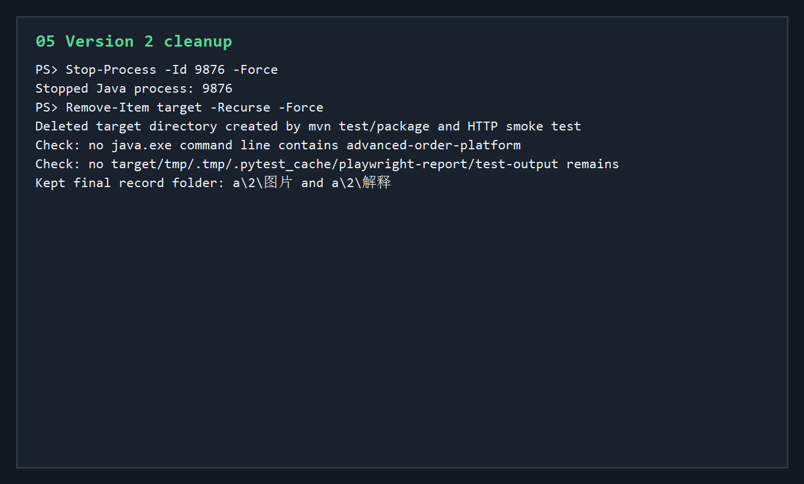

# 第二版开发调试运行归档说明

第二版在第一版“创建订单 + 支付订单 + Outbox 事件”的基础上，补上订单取消能力。

本轮新增范围：

- `InventoryItem` 新增 `releaseReserved(quantity)`。
- `InventoryService` 新增 `releaseReserved(productQuantities)`。
- `SalesOrder` 新增 `canceledAt` 和 `cancel()` 状态流转。
- `OrderApplicationService` 新增 `cancel(orderId)` 用例。
- `OrderController` 新增 `POST /api/v1/orders/{orderId}/cancel`。
- `OutboxEvent` 新增 `OrderCancelled`。
- 服务测试从 3 个增加到 6 个。
- README 和代码讲解记录补充第二版取消链路。

## 核心执行流程

```text
修改订单取消相关代码
 -> mvn test
 -> mvn -DskipTests package
 -> java -jar target/advanced-order-platform-0.1.0-SNAPSHOT.jar --server.port=18082
 -> 调用 Actuator health
 -> 创建一张 CREATED 订单
 -> 检查库存 available 下降
 -> 调用 cancel
 -> 检查订单状态变为 CANCELLED
 -> 重复调用 cancel
 -> 检查库存不重复释放
 -> 尝试支付已取消订单
 -> 创建并支付另一张订单
 -> 尝试取消已支付订单
 -> 查询 Outbox 事件
 -> 停止 Java 进程
 -> 删除 target 构建产物
```

## 01-version-2-change-summary.png



这张图记录第二版代码变更范围。

核心变化是把订单状态机补成：

```text
CREATED
 -> PAID

CREATED
 -> CANCELLED
```

并且让库存有两条后续路径：

```text
支付成功
 -> reserved 减少
 -> available 不变

取消订单
 -> reserved 减少
 -> available 增加
```

意义：第一版只解决“库存预占后支付确认”，第二版补上“库存预占后取消释放”。

## 02-maven-test-v2.png



- 命令：`mvn test`
- 结果：测试全部通过。

关键输出：

```text
Tests run: 6, Failures: 0, Errors: 0, Skipped: 0
BUILD SUCCESS
```

第一版有 3 个测试，第二版增加到 6 个。

新增测试覆盖：

- 取消订单会释放 reserved 库存。
- 重复取消同一订单不会重复释放库存。
- 已支付订单不能取消。
- 已取消订单不能支付。

测试末尾仍有 Mockito / ByteBuddy 动态 agent 警告，这是测试依赖在新版 JDK 上的运行提示，不是失败。

## 03-maven-package-v2.png



- 命令：`mvn -DskipTests package`
- 结果：打包成功。

关键输出：

```text
Building jar: target\advanced-order-platform-0.1.0-SNAPSHOT.jar
spring-boot:3.5.9:repackage
BUILD SUCCESS
```

意义：确认第二版新增的取消接口、实体字段、响应 DTO、Outbox 事件和测试补强不会影响 Spring Boot fat jar 打包。

## 04-http-cancel-smoke.png



- 启动命令：

```powershell
java -jar target\advanced-order-platform-0.1.0-SNAPSHOT.jar --server.port=18082
```

- 本次启动进程：

```text
PID: 9876
Port: 18082
```

HTTP smoke test 结果：

```text
GET  /actuator/health                    -> UP
GET  /api/v1/products                    -> ProductCount=3
POST /api/v1/orders                      -> CancelOrderId=2, CREATED
GET  /api/v1/products after create       -> available 100 -> 98
POST /api/v1/orders/2/cancel             -> CANCELLED
POST /api/v1/orders/2/cancel again       -> CANCELLED
GET  /api/v1/products after cancel       -> available 98 -> 100
POST /api/v1/orders/2/pay                -> 409 ORDER_STATUS_INVALID
POST paid order cancel                   -> 409 ORDER_STATUS_INVALID
Outbox events include OrderCancelled, OrderCreated, OrderPaid
```

这轮 smoke test 证明：

- 应用能正常启动。
- 取消接口可用。
- 创建订单后库存从 `available=100` 下降到 `98`。
- 取消订单后库存从 `98` 回到 `100`。
- 重复取消不会重复释放库存。
- 已取消订单不能支付。
- 已支付订单不能取消。
- Outbox 能记录 `OrderCancelled`。

调试补充：第一次 HTTP smoke 脚本在读取 409 错误响应体时遇到 PowerShell 空值分支，属于验证脚本解析问题，不是应用错误；改成更稳的响应体读取函数后，第二次 smoke 完整通过。

## 05-cleanup-v2.png



验证结束后执行清理：

```text
Stop-Process -Id 9876 -Force
Remove-Item target -Recurse -Force
```

清理结果：

- 本轮 HTTP smoke test 启动的 Java 进程 `9876` 已停止。
- 本轮 `mvn test`、`mvn package`、jar 启动验证生成的 `target` 目录已删除。
- 检查后没有发现 `advanced-order-platform` 相关 Java 进程残留。
- 没有发现 `tmp`、`.tmp`、`.pytest_cache`、`playwright-report`、`test-output` 等临时目录。

## 当前结论

第二版已经达到“订单可取消、库存可释放、非法状态流转可拦截、事件可追踪”的状态。

当前稳定链路是：

```text
创建订单
 -> 预占库存
 -> 支付订单
 -> 订单 PAID，reserved 确认扣减，写 OrderPaid

创建订单
 -> 预占库存
 -> 取消订单
 -> 订单 CANCELLED，reserved 释放回 available，写 OrderCancelled
```

下一轮适合继续做：

- 定时取消超时未支付订单。
- Outbox 后台发布器。
- PostgreSQL profile + Docker Compose 真实数据库验证。
- Redis 缓存、限流和幂等 token。

## 进程与清理

- 本轮启动的 Java 服务进程 `9876` 已停止。
- 本轮构建产生的 `target` 目录已删除。
- 没有保留临时脚本。
- 没有发现残留临时目录。
