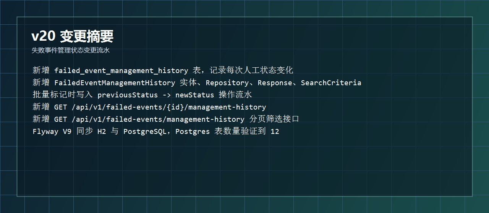
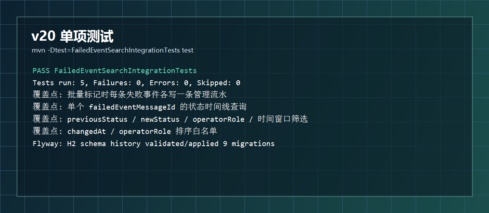
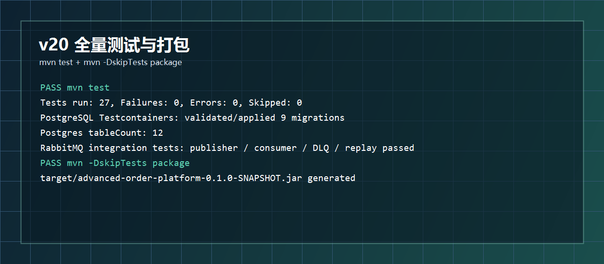
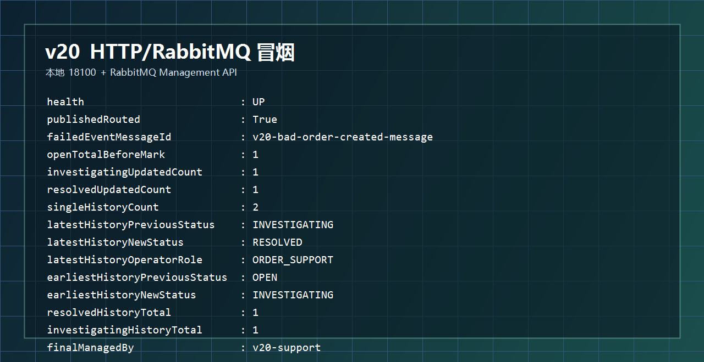
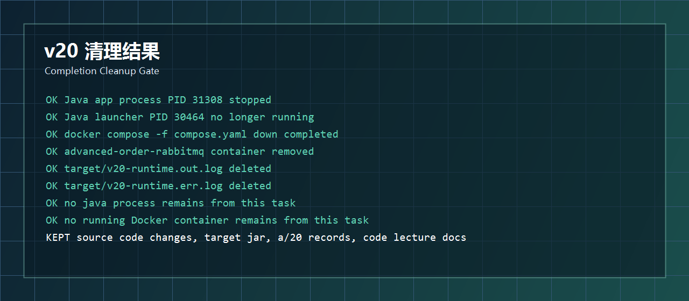

# 开发运行调试 v20：失败事件管理状态变更流水

## 本轮目标

v19 已经能批量标记失败事件管理状态，但只保存“当前状态”。v20 继续补后台系统很关键的审计能力：每一次管理状态变化都写入独立流水表。

```text
OPEN -> INVESTIGATING
 -> 谁开始排查、什么时候排查、备注是什么

INVESTIGATING -> RESOLVED
 -> 谁关闭、什么时候关闭、关闭原因是什么
```



## 代码改动概要

### 1. 新增管理状态变更流水实体

文件：`src/main/java/com/codexdemo/orderplatform/notification/FailedEventManagementHistory.java`

核心字段：

```java
@ManyToOne(fetch = FetchType.LAZY, optional = false)
@JoinColumn(name = "failed_event_message_id", nullable = false)
private FailedEventMessage failedEventMessage;

@Enumerated(EnumType.STRING)
@Column(name = "previous_status", nullable = false, length = 32)
private FailedEventManagementStatus previousStatus;

@Enumerated(EnumType.STRING)
@Column(name = "new_status", nullable = false, length = 32)
private FailedEventManagementStatus newStatus;
```

操作信息：

```java
@Column(name = "operator_id", nullable = false, length = 80)
private String operatorId;

@Column(name = "operator_role", nullable = false, length = 80)
private String operatorRole;

@Column(nullable = false, length = 500)
private String note;

@Column(name = "changed_at", nullable = false)
private Instant changedAt;
```

这张表回答的是：

```text
哪条失败事件
从什么状态
变成什么状态
谁操作的
以什么角色操作的
为什么操作
什么时候操作
```

### 2. 新增 Repository、响应和查询条件

文件：`src/main/java/com/codexdemo/orderplatform/notification/FailedEventManagementHistoryRepository.java`

```java
public interface FailedEventManagementHistoryRepository
        extends JpaRepository<FailedEventManagementHistory, Long>, JpaSpecificationExecutor<FailedEventManagementHistory> {

    List<FailedEventManagementHistory> findByFailedEventMessageIdOrderByChangedAtDescIdDesc(Long failedEventMessageId);
}
```

文件：`src/main/java/com/codexdemo/orderplatform/notification/FailedEventManagementHistoryResponse.java`

```java
public record FailedEventManagementHistoryResponse(
        Long id,
        Long failedEventMessageId,
        FailedEventManagementStatus previousStatus,
        FailedEventManagementStatus newStatus,
        String operatorId,
        String operatorRole,
        String note,
        Instant changedAt
) {
}
```

文件：`src/main/java/com/codexdemo/orderplatform/notification/FailedEventManagementHistorySearchCriteria.java`

```java
public record FailedEventManagementHistorySearchCriteria(
        Long failedEventMessageId,
        FailedEventManagementStatus previousStatus,
        FailedEventManagementStatus newStatus,
        String operatorId,
        String operatorRole,
        Instant changedFrom,
        Instant changedTo,
        Integer page,
        Integer size,
        String sort,
        Integer limit
) {
}
```

### 3. 批量标记时同步写流水

文件：`src/main/java/com/codexdemo/orderplatform/notification/FailedEventMessageService.java`

v20 改造后的关键代码：

```java
failedMessages.forEach(failedMessage -> {
    FailedEventManagementStatus previousStatus = failedMessage.getManagementStatus();
    failedMessage.markManagementStatus(managementStatus, note, normalizedOperatorId, managedAt);
    failedEventManagementHistoryRepository.save(FailedEventManagementHistory.record(
            failedMessage,
            previousStatus,
            managementStatus,
            normalizedOperatorId,
            normalizedOperatorRole,
            note,
            managedAt
    ));
});
```

这段代码把一次人工操作拆成两个持久化结果：

```text
failed_event_messages
 -> 保存当前最新管理状态

failed_event_management_history
 -> 保存这一次状态变化流水
```

因为外层方法仍然是：

```java
@Transactional
public FailedEventManagementBatchResponse markManagementStatus(...)
```

所以当前状态和流水记录会一起提交，出现异常时一起回滚。

### 4. 新增流水查询接口

文件：`src/main/java/com/codexdemo/orderplatform/notification/FailedEventMessageController.java`

单个失败事件的管理状态时间线：

```java
@GetMapping("/{id}/management-history")
public List<FailedEventManagementHistoryResponse> listManagementHistory(@PathVariable Long id) {
    return failedEventMessageService.listManagementHistory(id);
}
```

全局分页筛选：

```java
@GetMapping("/management-history")
public PagedResponse<FailedEventManagementHistoryResponse> searchManagementHistory(
        @RequestParam(required = false) Long failedEventMessageId,
        @RequestParam(required = false) FailedEventManagementStatus previousStatus,
        @RequestParam(required = false) FailedEventManagementStatus newStatus,
        @RequestParam(required = false) String operatorId,
        @RequestParam(required = false) String operatorRole,
        @RequestParam(required = false) @DateTimeFormat(iso = DateTimeFormat.ISO.DATE_TIME) Instant changedFrom,
        @RequestParam(required = false) @DateTimeFormat(iso = DateTimeFormat.ISO.DATE_TIME) Instant changedTo,
        @RequestParam(required = false) Integer page,
        @RequestParam(required = false) Integer size,
        @RequestParam(required = false) String sort,
        @RequestParam(required = false) Integer limit
) {
    return failedEventMessageService.searchManagementHistory(...);
}
```

调用示例：

```powershell
Invoke-RestMethod http://localhost:8080/api/v1/failed-events/1/management-history

Invoke-RestMethod "http://localhost:8080/api/v1/failed-events/management-history?failedEventMessageId=1&newStatus=RESOLVED&operatorRole=ORDER_SUPPORT&page=0&size=20&sort=changedAt,desc"
```

### 5. Flyway V9

文件：

```text
src/main/resources/db/migration/h2/V9__failed_event_management_history.sql
src/main/resources/db/migration/postgresql/V9__failed_event_management_history.sql
```

核心 SQL：

```sql
create table failed_event_management_history (
    id bigint generated by default as identity primary key,
    failed_event_message_id bigint not null,
    previous_status varchar(32) not null,
    new_status varchar(32) not null,
    operator_id varchar(80) not null,
    operator_role varchar(80) not null,
    note varchar(500) not null,
    changed_at timestamp(6) with time zone not null,
    constraint fk_failed_event_management_history_message
        foreign key (failed_event_message_id) references failed_event_messages (id)
);
```

索引：

```sql
create index idx_failed_event_management_history_message
    on failed_event_management_history (failed_event_message_id, changed_at);

create index idx_failed_event_management_history_status
    on failed_event_management_history (new_status, changed_at);

create index idx_failed_event_management_history_operator_role
    on failed_event_management_history (operator_role, changed_at);
```

## 测试结果

单项测试：

```powershell
mvn -Dtest=FailedEventSearchIntegrationTests test
```

结果：

```text
Tests run: 5, Failures: 0, Errors: 0, Skipped: 0
BUILD SUCCESS
```

覆盖内容：

```text
批量标记时写入管理状态变更流水
按 failedEventMessageId 查询单事件时间线
按 previousStatus / newStatus / operatorRole / 时间窗口筛选流水
changedAt / operatorRole 排序白名单
非法时间范围和非法排序字段返回 400
```



全量测试与打包：

```powershell
mvn test
mvn -DskipTests package
```

结果：

```text
mvn test
 -> Tests run: 27, Failures: 0, Errors: 0, Skipped: 0
 -> PostgreSQL Testcontainers validated/applied 9 migrations

mvn -DskipTests package
 -> BUILD SUCCESS
 -> target/advanced-order-platform-0.1.0-SNAPSHOT.jar
```



## 运行调试结果

本轮启动：

```powershell
docker compose -f compose.yaml up -d rabbitmq

java -jar target\advanced-order-platform-0.1.0-SNAPSHOT.jar `
  --spring.profiles.active=rabbitmq `
  --server.port=18100 `
  --outbox.publisher.scan-delay-ms=1000 `
  --order.expiration.enabled=false `
  --notification.rabbitmq.retry.initial-interval-ms=100 `
  --notification.rabbitmq.retry.max-interval-ms=200
```

冒烟链路：

```text
通过 RabbitMQ Management API 投递一条缺少 eventId 的 OrderCreated 消息
 -> 消费者重试失败
 -> 消息进入 DLQ
 -> FailedEventMessageListener 记录 failed_event_messages
 -> 批量标记为 INVESTIGATING
 -> 再批量标记为 RESOLVED
 -> 查询单事件 management-history 得到 2 条流水
 -> 全局按 RESOLVED / ORDER_SUPPORT 查询得到 1 条流水
 -> 全局按 OPEN -> INVESTIGATING / SRE 查询得到 1 条流水
```

冒烟结果：

```text
health                         : UP
publishedRouted                : True
failedEventMessageId           : v20-bad-order-created-message
openTotalBeforeMark            : 1
investigatingUpdatedCount      : 1
resolvedUpdatedCount           : 1
singleHistoryCount             : 2
latestHistoryPreviousStatus    : INVESTIGATING
latestHistoryNewStatus         : RESOLVED
latestHistoryOperatorRole      : ORDER_SUPPORT
earliestHistoryPreviousStatus  : OPEN
earliestHistoryNewStatus       : INVESTIGATING
earliestHistoryOperatorRole    : SRE
resolvedHistoryTotal           : 1
resolvedHistorySort            : changedAt,desc
investigatingHistoryTotal      : 1
investigatingHistorySort       : operatorRole,asc
finalManagedBy                 : v20-support
finalManagementNote            : v20 smoke customer impact cleared
```



## 清理结果

本轮启动过的运行环境已经收掉：

```text
Java 应用进程 PID 31308
 -> 已停止

Java 启动代理 PID 30464
 -> 清理后不再运行

RabbitMQ compose 容器 advanced-order-rabbitmq
 -> docker compose down 后已移除

target/v20-runtime.out.log
target/v20-runtime.err.log
 -> 已删除
```

保留内容：

```text
源码改动
target/advanced-order-platform-0.1.0-SNAPSHOT.jar
a/20 运行调试记录
代码讲解记录/24-version-20-failed-event-management-history.md
```



## 本轮结论

v20 后，失败事件管理不再只是“当前状态字段”，而是有了可追溯的状态变更时间线：

```text
失败事件当前状态
 -> failed_event_messages.management_status

失败事件状态历史
 -> failed_event_management_history

查询方式
 -> 单事件时间线 + 全局分页筛选
```

下一步建议：

```text
v21
 -> 做失败事件管理端导出或简易前端页面
 -> 把列表、批量标记、状态时间线连成一个可操作的小后台
```
