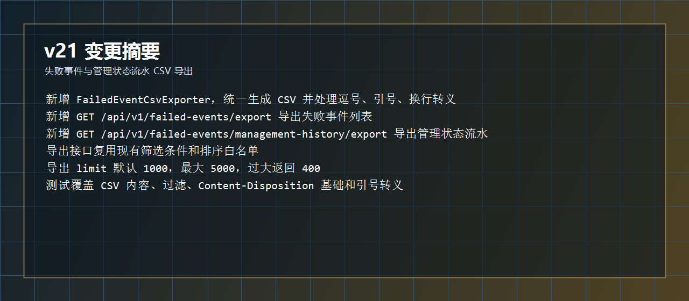
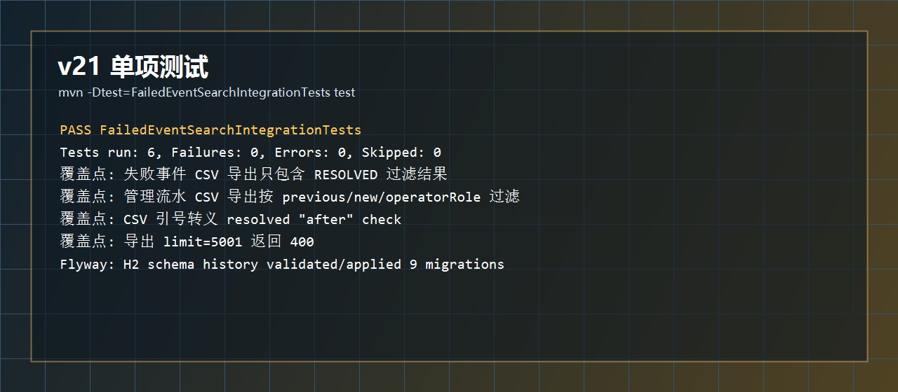
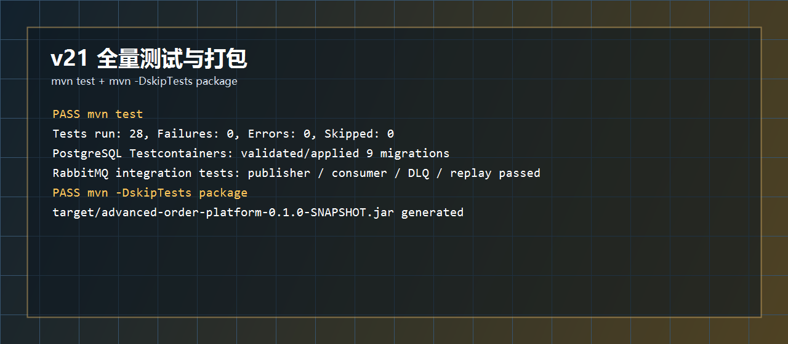
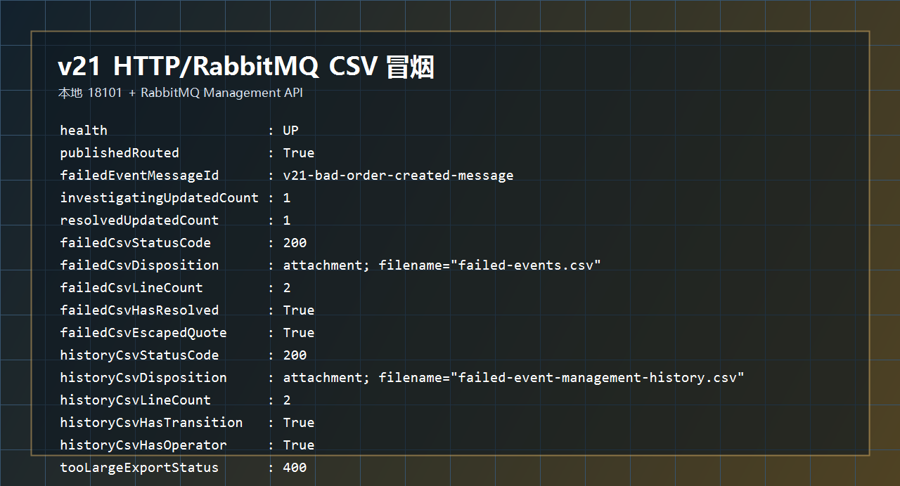
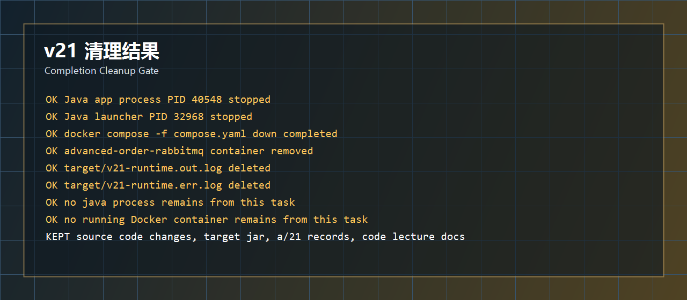

# 开发运行调试 v21：失败事件和管理状态流水 CSV 导出

## 本轮目标

v20 已经让失败事件具备了状态变更时间线。v21 继续补后台排查常用能力：把失败事件列表和管理状态流水导出成 CSV，方便离线查看、交接和复盘。

```text
失败事件列表
 -> 导出当前失败事件、重放状态、管理状态、备注、处理人、payload

管理状态流水
 -> 导出 OPEN -> INVESTIGATING -> RESOLVED 的每次变更
```



## 代码改动概要

### 1. CSV 导出器

文件：`src/main/java/com/codexdemo/orderplatform/notification/FailedEventCsvExporter.java`

导出失败事件字段：

```java
static String failedMessages(List<FailedEventMessageResponse> messages) {
    StringBuilder csv = new StringBuilder();
    appendRow(
            csv,
            List.of(
                    "id",
                    "messageId",
                    "eventId",
                    "eventType",
                    "aggregateType",
                    "aggregateId",
                    "status",
                    "managementStatus",
                    "managementNote",
                    "managedBy",
                    "managedAt",
                    "failedAt",
                    "replayCount",
                    "lastReplayedAt",
                    "lastReplayEventId",
                    "lastReplayError",
                    "sourceQueue",
                    "deadLetterQueue",
                    "failureReason",
                    "payload"
            )
    );
}
```

导出管理状态流水字段：

```java
static String managementHistory(List<FailedEventManagementHistoryResponse> history) {
    StringBuilder csv = new StringBuilder();
    appendRow(
            csv,
            List.of(
                    "id",
                    "failedEventMessageId",
                    "previousStatus",
                    "newStatus",
                    "operatorId",
                    "operatorRole",
                    "note",
                    "changedAt"
            )
    );
}
```

CSV 转义：

```java
private static String escape(String value) {
    if (value == null || value.isEmpty()) {
        return "";
    }
    boolean requiresQuoting = value.contains(",")
            || value.contains("\"")
            || value.contains("\n")
            || value.contains("\r");
    if (!requiresQuoting) {
        return value;
    }
    return "\"" + value.replace("\"", "\"\"") + "\"";
}
```

例如：

```text
v21 "csv" export closed
 -> "v21 ""csv"" export closed"
```

### 2. Service 导出失败事件

文件：`src/main/java/com/codexdemo/orderplatform/notification/FailedEventMessageService.java`

导出上限：

```java
private static final int DEFAULT_EXPORT_LIMIT = 1000;

private static final int MAX_EXPORT_LIMIT = 5000;
```

失败事件导出：

```java
@Transactional(readOnly = true)
public String exportFailedMessagesCsv(FailedEventMessageSearchCriteria criteria) {
    FailedEventMessageSearchCriteria normalizedCriteria = criteria == null
            ? new FailedEventMessageSearchCriteria(null, null, null, null, null, null, null)
            : criteria;
    validateTimeRange(normalizedCriteria.failedFrom(), normalizedCriteria.failedTo(), "failedFrom", "failedTo");
    PageRequest pageRequest = normalizeExportPageRequest(
            normalizedCriteria.limit(),
            normalizedCriteria.sort(),
            FAILED_MESSAGE_SORT_FIELDS,
            "failedAt,desc"
    );
    List<FailedEventMessageResponse> messages = failedEventMessageRepository.findAll(
                    failedMessagesMatching(normalizedCriteria),
                    pageRequest
            )
            .stream()
            .map(FailedEventMessageResponse::from)
            .toList();
    return FailedEventCsvExporter.failedMessages(messages);
}
```

### 3. Service 导出管理流水

文件：`src/main/java/com/codexdemo/orderplatform/notification/FailedEventMessageService.java`

```java
@Transactional(readOnly = true)
public String exportManagementHistoryCsv(FailedEventManagementHistorySearchCriteria criteria) {
    FailedEventManagementHistorySearchCriteria normalizedCriteria = criteria == null
            ? new FailedEventManagementHistorySearchCriteria(null, null, null, null, null, null, null, null)
            : criteria;
    validateSearchId(normalizedCriteria.failedEventMessageId(), "failedEventMessageId");
    validateTimeRange(
            normalizedCriteria.changedFrom(),
            normalizedCriteria.changedTo(),
            "changedFrom",
            "changedTo"
    );
    PageRequest pageRequest = normalizeExportPageRequest(
            normalizedCriteria.limit(),
            normalizedCriteria.sort(),
            MANAGEMENT_HISTORY_SORT_FIELDS,
            "changedAt,desc"
    );
    List<FailedEventManagementHistoryResponse> history = failedEventManagementHistoryRepository.findAll(
                    managementHistoryMatching(normalizedCriteria),
                    pageRequest
            )
            .stream()
            .map(FailedEventManagementHistoryResponse::from)
            .toList();
    return FailedEventCsvExporter.managementHistory(history);
}
```

导出复用了现有能力：

```text
failedMessagesMatching / managementHistoryMatching
 -> 复用动态筛选

FAILED_MESSAGE_SORT_FIELDS / MANAGEMENT_HISTORY_SORT_FIELDS
 -> 复用排序白名单

limit
 -> 默认 1000，最大 5000
```

### 4. Controller 下载接口

文件：`src/main/java/com/codexdemo/orderplatform/notification/FailedEventMessageController.java`

CSV 媒体类型：

```java
private static final MediaType TEXT_CSV = MediaType.parseMediaType("text/csv; charset=UTF-8");
```

失败事件导出：

```java
@GetMapping(value = "/export", produces = "text/csv")
public ResponseEntity<String> exportFailedMessages(...) {
    String csv = failedEventMessageService.exportFailedMessagesCsv(...);
    return csvResponse("failed-events.csv", csv);
}
```

管理流水导出：

```java
@GetMapping(value = "/management-history/export", produces = "text/csv")
public ResponseEntity<String> exportManagementHistory(...) {
    String csv = failedEventMessageService.exportManagementHistoryCsv(...);
    return csvResponse("failed-event-management-history.csv", csv);
}
```

统一下载响应：

```java
private ResponseEntity<String> csvResponse(String filename, String csv) {
    return ResponseEntity.ok()
            .contentType(TEXT_CSV)
            .header(HttpHeaders.CONTENT_DISPOSITION, "attachment; filename=\"" + filename + "\"")
            .body(csv);
}
```

## 测试结果

单项测试：

```powershell
mvn -Dtest=FailedEventSearchIntegrationTests test
```

结果：

```text
Tests run: 6, Failures: 0, Errors: 0, Skipped: 0
BUILD SUCCESS
```

覆盖内容：

```text
失败事件 CSV 只导出 RESOLVED 过滤结果
管理流水 CSV 按 previousStatus / newStatus / operatorRole 过滤
CSV 双引号转义
导出 limit=5001 返回 400
导出排序字段不在白名单返回 400
```



全量测试与打包：

```powershell
mvn test
mvn -DskipTests package
```

结果：

```text
mvn test
 -> Tests run: 28, Failures: 0, Errors: 0, Skipped: 0
 -> PostgreSQL Testcontainers validated/applied 9 migrations

mvn -DskipTests package
 -> BUILD SUCCESS
 -> target/advanced-order-platform-0.1.0-SNAPSHOT.jar
```



## 运行调试结果

本轮启动：

```powershell
docker compose -f compose.yaml up -d rabbitmq

java -jar target\advanced-order-platform-0.1.0-SNAPSHOT.jar `
  --spring.profiles.active=rabbitmq `
  --server.port=18101 `
  --outbox.publisher.scan-delay-ms=1000 `
  --order.expiration.enabled=false `
  --notification.rabbitmq.retry.initial-interval-ms=100 `
  --notification.rabbitmq.retry.max-interval-ms=200
```

冒烟链路：

```text
投递缺少 eventId 的 OrderCreated 坏消息
 -> 消费失败后进入 DLQ
 -> failed_event_messages 记录失败事件
 -> 标记 INVESTIGATING
 -> 标记 RESOLVED，备注包含双引号
 -> 下载失败事件 CSV
 -> 下载管理状态流水 CSV
 -> 验证超大 limit 返回 400
```

冒烟结果：

```text
health                    : UP
publishedRouted           : True
failedEventMessageId      : v21-bad-order-created-message
investigatingUpdatedCount : 1
resolvedUpdatedCount      : 1
failedCsvStatusCode       : 200
failedCsvContentType      : text/csv;charset=UTF-8
failedCsvDisposition      : attachment; filename="failed-events.csv"
failedCsvLineCount        : 2
failedCsvHasResolved      : True
failedCsvEscapedQuote     : True
historyCsvStatusCode      : 200
historyCsvContentType     : text/csv;charset=UTF-8
historyCsvDisposition     : attachment; filename="failed-event-management-history.csv"
historyCsvLineCount       : 2
historyCsvHasTransition   : True
historyCsvHasOperator     : True
tooLargeExportStatus      : 400
```



## 清理结果

本轮启动过的运行环境已经收掉：

```text
Java 应用进程 PID 40548
 -> 已停止

Java 启动代理 PID 32968
 -> 已停止

RabbitMQ compose 容器 advanced-order-rabbitmq
 -> docker compose down 后已移除

target/v21-runtime.out.log
target/v21-runtime.err.log
 -> 已删除
```

保留内容：

```text
源码改动
target/advanced-order-platform-0.1.0-SNAPSHOT.jar
a/21 运行调试记录
代码讲解记录/25-version-21-failed-event-csv-export.md
```



## 本轮结论

v21 后，失败事件管理已经具备：

```text
在线列表查询
在线管理状态标记
状态变更流水追踪
CSV 下载导出
```

下一步建议：

```text
v22
 -> 做一个极简失败事件管理页面
 -> 把查询、批量标记、流水查看、CSV 下载串成可操作 UI
```
