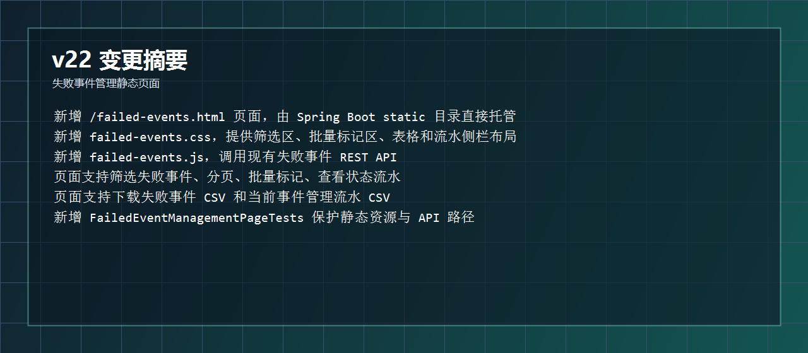
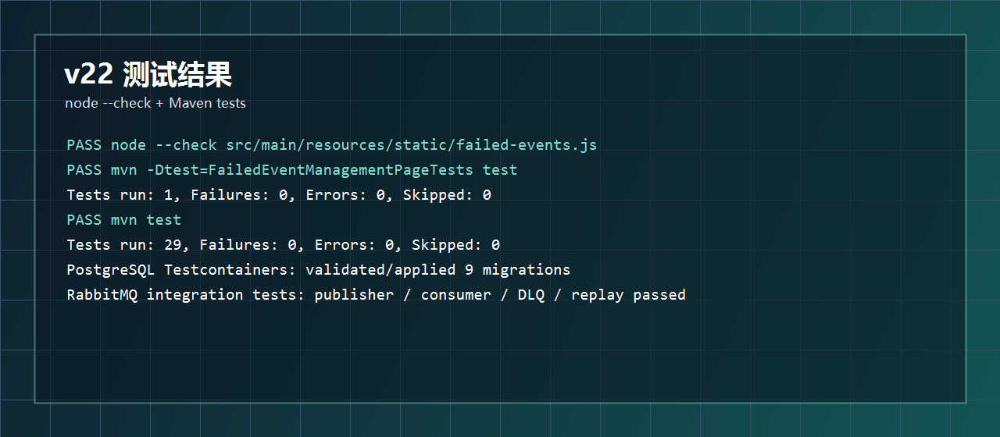
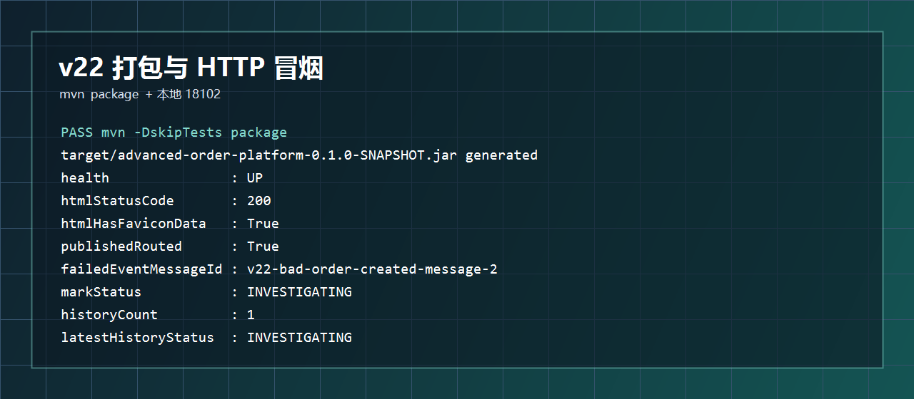
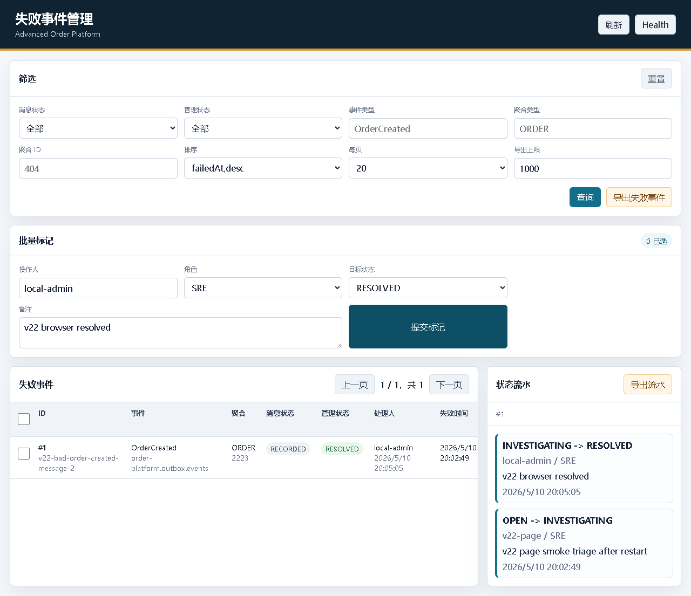
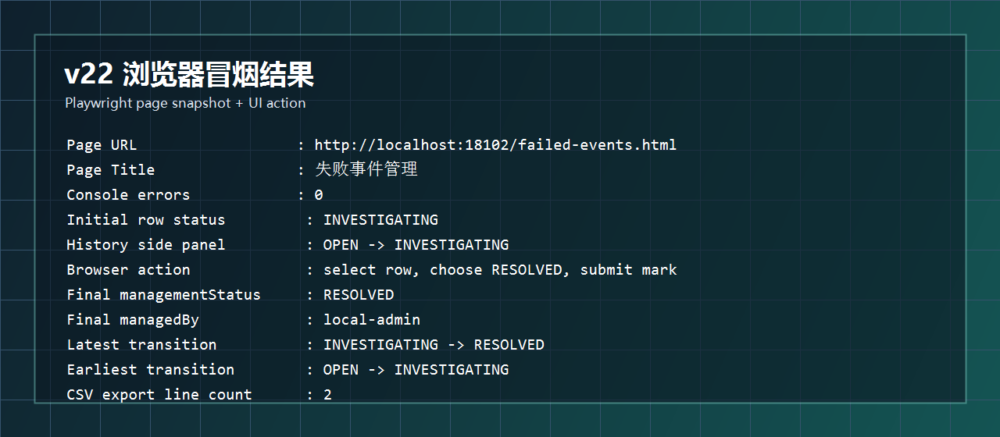
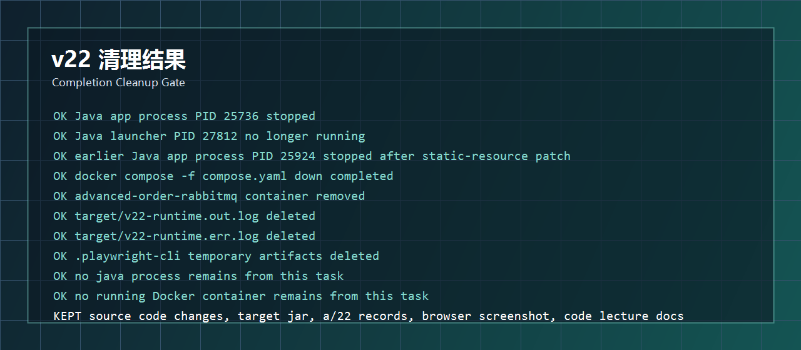

# 开发运行调试 v22：失败事件管理静态页面

## 本轮目标

v21 已经有失败事件查询、批量标记、状态流水和 CSV 导出接口。v22 把这些能力串成一个浏览器页面：

```text
http://localhost:8080/failed-events.html
```

页面提供：

```text
筛选失败事件
批量标记管理状态
查看单条失败事件状态流水
导出失败事件 CSV
导出当前失败事件管理流水 CSV
```



## 代码改动概要

### 1. 页面入口

文件：`src/main/resources/static/failed-events.html`

```html
<!doctype html>
<html lang="zh-CN">
<head>
    <meta charset="utf-8">
    <meta name="viewport" content="width=device-width, initial-scale=1">
    <title>失败事件管理</title>
    <link rel="icon" href="data:image/svg+xml,...">
    <link rel="stylesheet" href="/failed-events.css">
    <script defer src="/failed-events.js"></script>
</head>
```

因为文件放在 Spring Boot 默认静态资源目录：

```text
src/main/resources/static
```

所以不需要新增 Controller，就能访问：

```text
/failed-events.html
```

### 2. 筛选、批量标记和表格

文件：`src/main/resources/static/failed-events.html`

筛选区包含：

```text
status
managementStatus
eventType
aggregateType
aggregateId
sort
size
exportLimit
```

批量标记区包含：

```text
operatorId
operatorRole
targetManagementStatus
managementNote
```

表格列：

```html
<th>ID</th>
<th>事件</th>
<th>聚合</th>
<th>消息状态</th>
<th>管理状态</th>
<th>处理人</th>
<th>失败时间</th>
<th>操作</th>
```

每行提供一个“流水”按钮，用来加载右侧状态流水侧栏。

### 3. 页面样式

文件：`src/main/resources/static/failed-events.css`

主布局：

```css
.layout {
    display: grid;
    gap: 16px;
    padding: 18px;
}

.content-grid {
    display: grid;
    grid-template-columns: minmax(0, 1fr) 360px;
    gap: 16px;
}
```

表格滚动：

```css
.table-wrap {
    overflow: auto;
    max-height: 560px;
}

table {
    width: 100%;
    border-collapse: collapse;
    min-width: 980px;
}
```

移动端降为单列：

```css
@media (max-width: 640px) {
    .filter-grid,
    .batch-grid {
        grid-template-columns: 1fr;
    }

    .content-grid {
        grid-template-columns: 1fr;
    }
}
```

### 4. 浏览器脚本

文件：`src/main/resources/static/failed-events.js`

API 基础路径：

```javascript
const apiBase = "/api/v1/failed-events";
```

页面状态：

```javascript
const state = {
    page: 0,
    totalPages: 0,
    selectedIds: new Set(),
    activeEventId: null
};
```

构建查询参数：

```javascript
function failedEventQueryParams(includePage) {
    const params = new URLSearchParams();
    addParam(params, "status", elements.statusFilter.value);
    addParam(params, "managementStatus", elements.managementStatusFilter.value);
    addParam(params, "eventType", elements.eventTypeFilter.value);
    addParam(params, "aggregateType", elements.aggregateTypeFilter.value);
    addParam(params, "aggregateId", elements.aggregateIdFilter.value);
    addParam(params, "sort", elements.sortFilter.value);
    if (includePage) {
        params.set("page", state.page);
        params.set("size", elements.sizeFilter.value);
    } else {
        params.set("limit", exportLimit());
    }
    return params;
}
```

批量标记：

```javascript
const response = await fetch(apiBase + "/management-status", {
    method: "POST",
    headers: {
        "Content-Type": "application/json",
        "X-Operator-Id": elements.operatorIdInput.value,
        "X-Operator-Role": elements.operatorRoleInput.value
    },
    body: JSON.stringify(body)
});
```

加载状态流水：

```javascript
const history = await fetchJson(`${apiBase}/${id}/management-history`);
```

下载 CSV：

```javascript
downloadCsv(`${apiBase}/export?${failedEventQueryParams(false)}`, "failed-events.csv");
downloadCsv(`${apiBase}/management-history/export?${params}`, "failed-event-management-history.csv");
```

动态 HTML 输出前统一转义：

```javascript
function escapeHtml(value) {
    return String(value)
        .replaceAll("&", "&amp;")
        .replaceAll("<", "&lt;")
        .replaceAll(">", "&gt;")
        .replaceAll("\"", "&quot;")
        .replaceAll("'", "&#39;");
}
```

## 测试结果

JS 语法检查：

```powershell
node --check src\main\resources\static\failed-events.js
```

静态页面测试：

```powershell
mvn -Dtest=FailedEventManagementPageTests test
```

结果：

```text
Tests run: 1, Failures: 0, Errors: 0, Skipped: 0
BUILD SUCCESS
```

全量测试：

```powershell
mvn test
```

结果：

```text
Tests run: 29, Failures: 0, Errors: 0, Skipped: 0
BUILD SUCCESS
```



## 打包和 HTTP 冒烟

打包：

```powershell
mvn -DskipTests package
```

结果：

```text
BUILD SUCCESS
target/advanced-order-platform-0.1.0-SNAPSHOT.jar
```

HTTP 冒烟：

```text
health               : UP
htmlStatusCode       : 200
htmlHasFaviconData   : True
publishedRouted      : True
failedEventMessageId : v22-bad-order-created-message-2
markStatus           : INVESTIGATING
historyCount         : 1
latestHistoryStatus  : INVESTIGATING
```



## 浏览器冒烟

本轮使用 Playwright 打开真实页面：

```text
http://localhost:18102/failed-events.html
```

浏览器快照确认：

```text
Page Title
 -> 失败事件管理

Console errors
 -> 0

页面可见区域
 -> 筛选、批量标记、失败事件表格、状态流水侧栏
```

保留的页面截图：



浏览器操作链路：

```text
点击表格行“流水”
 -> 右侧显示 OPEN -> INVESTIGATING

勾选失败事件
 -> 目标状态选 RESOLVED
 -> 填写备注 v22 browser resolved
 -> 点击提交标记
 -> 表格刷新为 RESOLVED
 -> 右侧状态流水显示两条记录
```

最终结果：

```text
Final managementStatus : RESOLVED
Final managedBy        : local-admin
Final managementNote   : v22 browser resolved
historyCount           : 2
latestTransition       : INVESTIGATING -> RESOLVED
latestOperator         : local-admin / SRE
earliestTransition     : OPEN -> INVESTIGATING
earliestOperator       : v22-page / SRE
csvLineCount           : 2
csvHasResolved         : True
```



## 清理结果

本轮启动过的运行环境已经收掉：

```text
Java 应用进程 PID 25736
 -> 已停止

Java 启动代理 PID 27812
 -> 清理后不再运行

中途静态资源补丁前启动的 Java 应用进程 PID 25924
 -> 已停止

RabbitMQ compose 容器 advanced-order-rabbitmq
 -> docker compose down 后已移除

target/v22-runtime.out.log
target/v22-runtime.err.log
 -> 已删除

.playwright-cli
 -> 已删除
```

保留内容：

```text
源码改动
target/advanced-order-platform-0.1.0-SNAPSHOT.jar
a/22 运行调试记录
a/22/图片/04-browser-management-page-v22.png
代码讲解记录/26-version-22-failed-event-management-page.md
```



## 本轮结论

v22 后，失败事件管理已经从后端接口升级为一个可操作页面：

```text
查询
 -> 筛选、分页、排序

处理
 -> 勾选后批量标记状态

追踪
 -> 右侧查看状态流水

交付
 -> CSV 下载
```

下一步建议：

```text
v23
 -> 给页面补失败事件重放入口和基础审批提示
 -> 让页面从“处理状态管理”扩展到“修复重放工作台”
```
