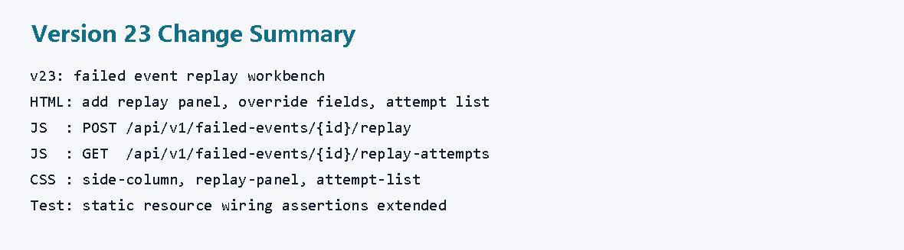
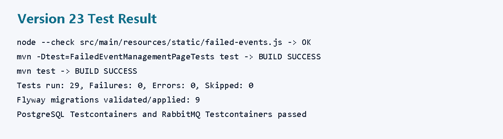
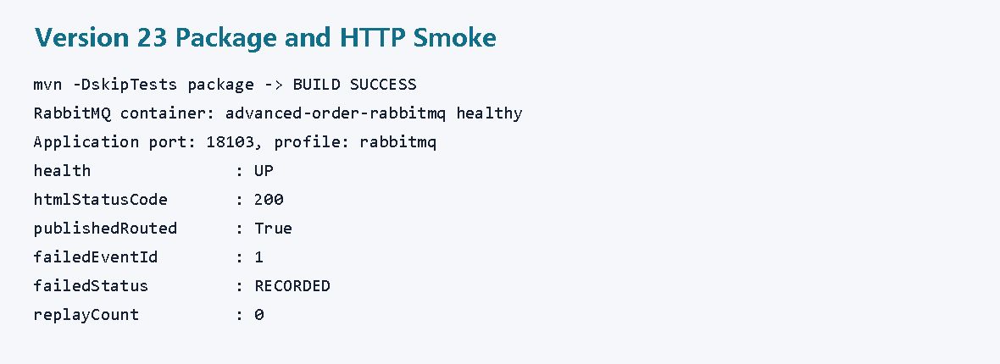
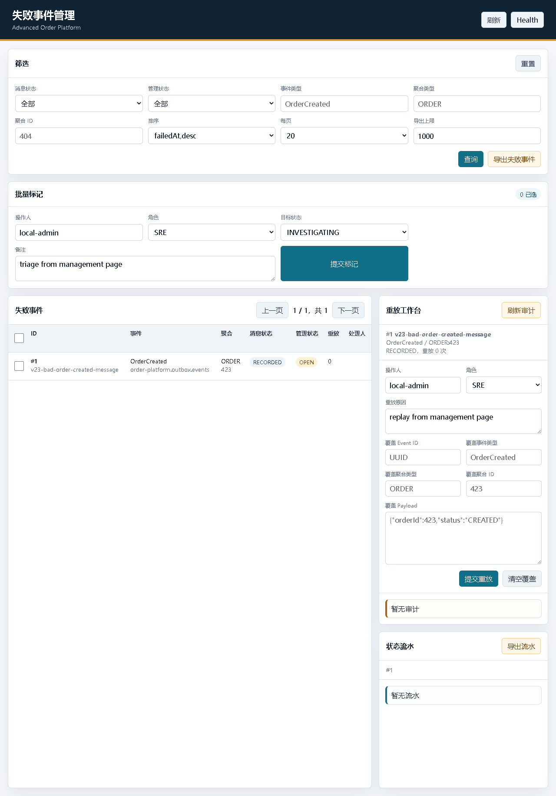
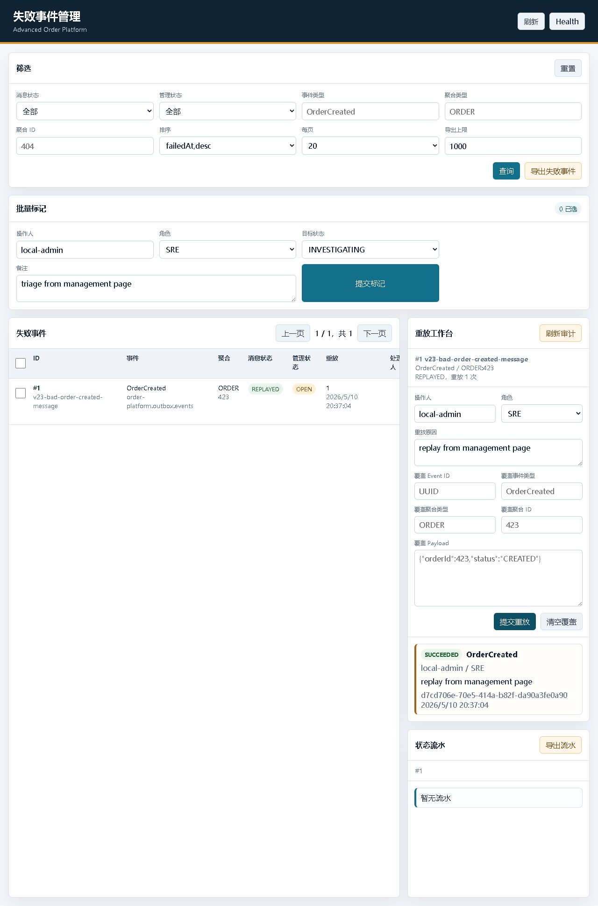
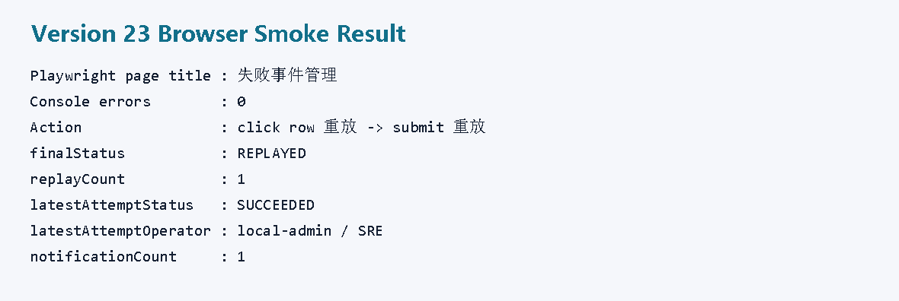
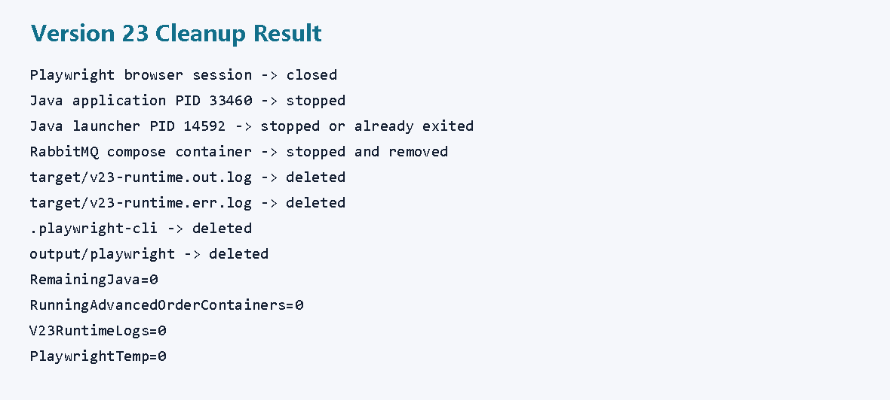

# v23 开发运行调试记录：失败事件重放工作台

## 本轮目标

v22 已经完成失败事件管理静态页面：

```text
筛选失败事件
批量标记管理状态
查看管理状态流水
下载 CSV
```

v23 继续推进页面能力，把后端已有的失败事件重放接口接到页面里，形成一个可演示、可操作的“重放工作台”。

目标链路：

```text
失败事件表格
 -> 点击单条“重放”
 -> 右侧工作台绑定失败事件
 -> 填写操作者、角色、重放原因和可选覆盖字段
 -> POST /api/v1/failed-events/{id}/replay
 -> 查看重放审计
```



## 代码改动

### 1. 页面增加重放工作台

文件：

```text
src/main/resources/static/failed-events.html
```

新增了右侧重放面板：

```html
<section class="panel replay-panel" aria-labelledby="replayTitle">
    <div class="panel-heading">
        <h2 id="replayTitle">重放工作台</h2>
        <button id="refreshAttemptsButton" class="secondary-button" type="button">刷新审计</button>
    </div>
    <div id="replayMeta" class="history-meta">未选择</div>
    ...
</section>
```

新增的重放输入字段：

```html
<input id="replayOperatorIdInput" type="text" value="local-admin">
<select id="replayOperatorRoleInput">
    <option value="SRE">SRE</option>
    <option value="ORDER_SUPPORT">ORDER_SUPPORT</option>
    <option value="SYSTEM">SYSTEM</option>
</select>
<textarea id="replayReasonInput" rows="2">replay from management page</textarea>
```

可选覆盖字段：

```html
<input id="replayEventIdInput" type="text" placeholder="UUID">
<input id="replayEventTypeInput" type="text" placeholder="OrderCreated">
<input id="replayAggregateTypeInput" type="text" placeholder="ORDER">
<input id="replayAggregateIdInput" type="text" placeholder="404">
<textarea id="replayPayloadInput" rows="5" spellcheck="false"></textarea>
```

### 2. 表格增加重放状态列和重放按钮

文件：

```text
src/main/resources/static/failed-events.html
src/main/resources/static/failed-events.js
```

表格新增列：

```html
<th>重放</th>
```

JS 渲染重放信息：

```javascript
<td>
    <div>${escapeHtml(item.replayCount)}</div>
    <div class="muted">${formatDate(item.lastReplayedAt)}</div>
    <div class="muted">${escapeHtml(item.lastReplayError || "")}</div>
</td>
```

行操作新增：

```javascript
<button class="ghost-button" type="button" data-history-id="${item.id}">流水</button>
<button class="secondary-button" type="button" data-replay-id="${item.id}">重放</button>
```

### 3. JS 串联重放接口和审计接口

文件：

```text
src/main/resources/static/failed-events.js
```

基础 API：

```javascript
const apiBase = "/api/v1/failed-events";
```

点击行内“重放”后：

```javascript
async function prepareReplay(id) {
    setActiveEvent(id);
    await Promise.all([
        loadHistory(id),
        loadReplayAttempts(id)
    ]);
}
```

发起重放：

```javascript
const response = await fetch(`${apiBase}/${id}/replay`, {
    method: "POST",
    headers: {
        "Content-Type": "application/json",
        "X-Operator-Id": elements.replayOperatorIdInput.value,
        "X-Operator-Role": elements.replayOperatorRoleInput.value
    },
    body: JSON.stringify(body)
});
```

查询审计：

```javascript
const attempts = await fetchJson(`${apiBase}/${id}/replay-attempts`);
```

### 4. CSS 增加右侧工作区

文件：

```text
src/main/resources/static/failed-events.css
```

右侧从一个历史侧栏升级为两个面板：

```css
.side-column {
    display: grid;
    align-content: start;
    gap: 16px;
}
```

重放工作台：

```css
.replay-grid {
    display: grid;
    grid-template-columns: repeat(2, minmax(0, 1fr));
    gap: 12px;
    padding: 14px;
}
```

审计列表：

```css
.attempt-list {
    display: grid;
    gap: 10px;
    max-height: 360px;
    overflow: auto;
    padding: 14px;
    border-top: 1px solid var(--line);
}
```

### 5. 静态资源测试补充

文件：

```text
src/test/java/com/codexdemo/orderplatform/FailedEventManagementPageTests.java
```

新增检查页面 ID：

```java
"replayButton",
"refreshAttemptsButton",
"attemptList",
"replayReasonInput"
```

新增检查 JS 接口接线：

```java
"/replay-attempts",
"/replay",
"replayActiveEvent",
"loadReplayAttempts",
"X-Operator-Id",
"reason"
```

新增检查 CSS 结构：

```java
".side-column",
".replay-panel",
".attempt-list"
```

## 测试结果

JS 语法检查：

```powershell
node --check src\main\resources\static\failed-events.js
```

结果：

```text
exit code 0
```

页面资源测试：

```powershell
mvn -Dtest=FailedEventManagementPageTests test
```

结果：

```text
Tests run: 1, Failures: 0, Errors: 0, Skipped: 0
BUILD SUCCESS
```

全量测试：

```powershell
mvn test
```

结果：

```text
Tests run: 29, Failures: 0, Errors: 0, Skipped: 0
BUILD SUCCESS
```

覆盖点：

```text
H2 + Flyway 9 个迁移
PostgreSQL Testcontainers
RabbitMQ Testcontainers
失败事件查询、管理状态、CSV、重放审计
v23 静态页面接线
```



## 打包和 HTTP 冒烟

打包：

```powershell
mvn -DskipTests package
```

结果：

```text
BUILD SUCCESS
target/advanced-order-platform-0.1.0-SNAPSHOT.jar
```

启动 RabbitMQ：

```powershell
docker compose -f compose.yaml up -d rabbitmq
```

启动应用：

```powershell
java -jar target\advanced-order-platform-0.1.0-SNAPSHOT.jar `
  --spring.profiles.active=rabbitmq `
  --server.port=18103
```

本轮应用进程：

```text
Java 应用 PID 33460
Java 启动代理 PID 14592
```

HTTP 冒烟结果：

```text
health               : UP
htmlStatusCode       : 200
publishedRouted      : True
failedEventId        : 1
failedEventMessageId : v23-bad-order-created-message
failedStatus         : RECORDED
replayCount          : 0
eventType            : OrderCreated
aggregateId          : 423
```



## 浏览器冒烟

使用 Playwright 打开：

```text
http://localhost:18103/failed-events.html
```

页面快照确认：

```text
Page Title -> 失败事件管理
Console errors -> 0
```

点击表格行内“重放”后：

```text
右侧重放工作台显示：
 -> #1 v23-bad-order-created-message
 -> OrderCreated / ORDER:423
 -> RECORDED，重放 0 次
 -> 审计列表暂无审计
```



点击“提交重放”后：

```text
表格状态刷新为 REPLAYED
replayCount 从 0 变为 1
重放审计列表出现 SUCCEEDED
操作者为 local-admin / SRE
原因 replay from management page
```



最终 API 验证：

```text
finalStatus              : REPLAYED
replayCount              : 1
lastReplayEventId        : d7cd706e-70e5-414a-b82f-da90a3fe0a90
attemptCount             : 1
latestAttemptStatus      : SUCCEEDED
latestAttemptOperator    : local-admin / SRE
latestAttemptReason      : replay from management page
notificationCount        : 1
firstNotificationEventId : d7cd706e-70e5-414a-b82f-da90a3fe0a90
```



## 清理结果

本轮结束前执行清理：

```text
Playwright 浏览器会话
 -> 已关闭

Java 应用 PID 33460
 -> 已停止

Java 启动代理 PID 14592
 -> 已停止或已随应用退出

RabbitMQ compose 容器 advanced-order-rabbitmq
 -> 已停止并移除

临时运行日志
 -> target/v23-runtime.out.log 已删除
 -> target/v23-runtime.err.log 已删除

Playwright 临时目录
 -> .playwright-cli 已删除
 -> output/playwright 已删除
```



## v23 结论

v23 把失败事件页面从“查得到、标得到”推进到了“能在页面里发起修复重放”。

当前失败事件治理能力已经形成闭环：

```text
DLQ 失败落库
 -> 分页筛选
 -> 管理状态标记
 -> 管理状态流水
 -> CSV 导出
 -> 管理页面
 -> 页面内重放
 -> 重放审计
 -> 通知消息重新落库
```

后续更值得做的是重放审批、二次确认、真实登录态和权限隔离。
