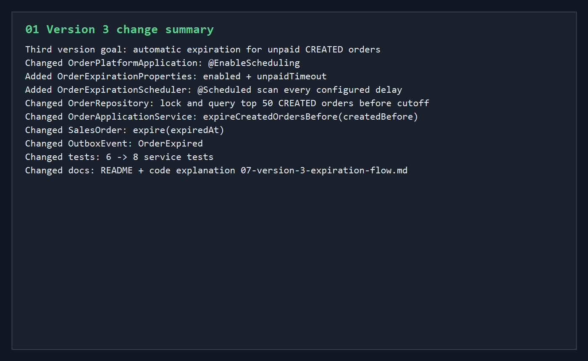
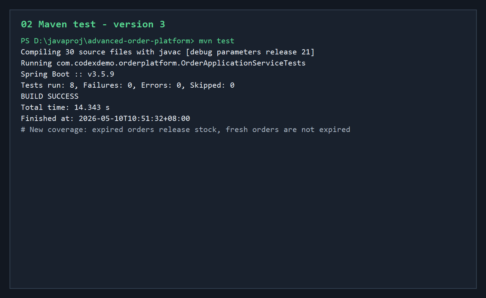
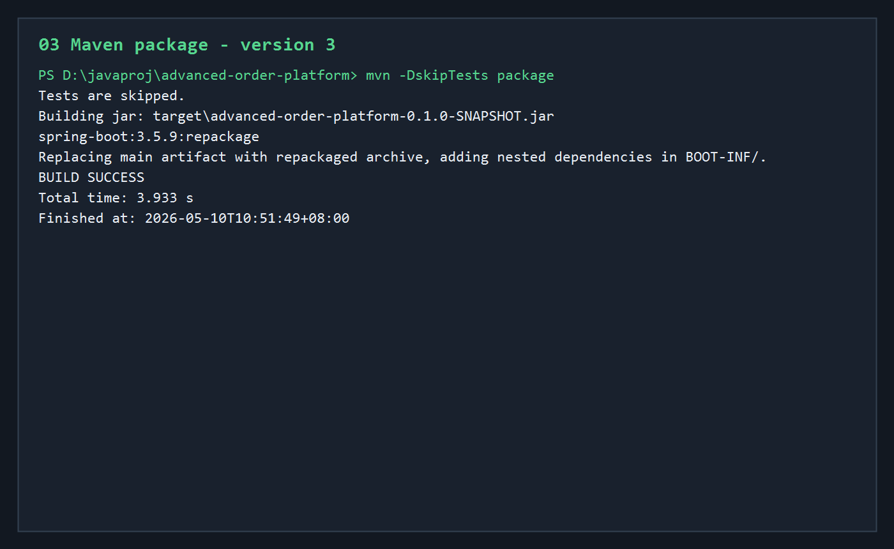
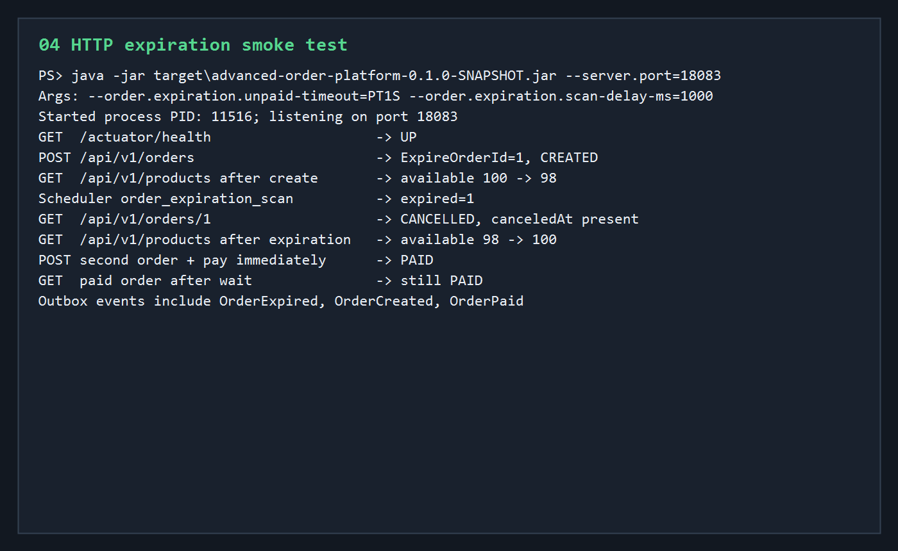
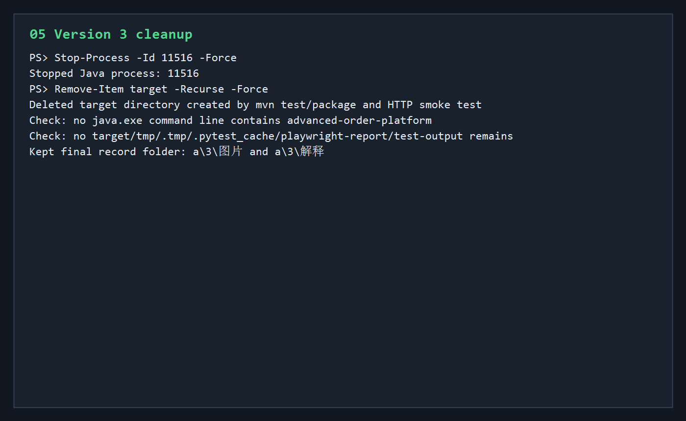

# 第三版开发调试运行归档说明

第三版在第二版“手动取消订单 + 释放库存”的基础上，补上“超时未支付订单自动过期取消”。

本轮新增范围：

- `OrderPlatformApplication` 新增 `@EnableScheduling`。
- 新增 `OrderExpirationProperties`，用于绑定过期配置。
- 新增 `OrderExpirationScheduler`，按固定间隔扫描超时订单。
- `OrderRepository` 新增带悲观锁的过期订单查询。
- `OrderApplicationService` 新增 `expireCreatedOrdersBefore(createdBefore)`。
- `SalesOrder` 新增 `expire(expiredAt)`。
- `OutboxEvent` 新增 `OrderExpired`。
- 服务测试从 6 个增加到 8 个。
- README 和代码讲解记录补充第三版过期取消链路。

## 核心执行流程

```text
修改自动过期相关代码
 -> mvn test
 -> mvn -DskipTests package
 -> java -jar target/advanced-order-platform-0.1.0-SNAPSHOT.jar --server.port=18083 --order.expiration.unpaid-timeout=PT1S --order.expiration.scan-delay-ms=1000
 -> 调用 Actuator health
 -> 创建一张 CREATED 订单
 -> 检查库存 available 下降
 -> 等待调度器扫描
 -> 查询订单变为 CANCELLED
 -> 检查库存 available 恢复
 -> 创建另一张订单并立刻支付
 -> 等待后确认已支付订单仍为 PAID
 -> 查询 Outbox 事件
 -> 停止 Java 进程
 -> 删除 target 构建产物
```

## 01-version-3-change-summary.png



这张图记录第三版代码变更范围。

第三版新增的核心链路是：

```text
OrderExpirationScheduler
 -> OrderApplicationService.expireCreatedOrdersBefore
 -> OrderRepository 查询超时 CREATED 订单
 -> SalesOrder.expire
 -> InventoryService.releaseReserved
 -> OutboxEvent.orderExpired
```

和第二版手动取消相比，第三版不是用户调用 `/cancel`，而是系统按时间自动扫描。

最终效果仍然是：

```text
订单 CANCELLED
reserved 释放回 available
```

但事件类型是：

```text
OrderExpired
```

意义：系统现在可以自动释放长时间未支付订单占住的库存。

## 02-maven-test-v3.png



- 命令：`mvn test`
- 结果：测试全部通过。

关键输出：

```text
Compiling 30 source files with javac [debug parameters release 21]
Tests run: 8, Failures: 0, Errors: 0, Skipped: 0
BUILD SUCCESS
```

第三版新增测试覆盖：

- 过期扫描会把超时 `CREATED` 订单改成 `CANCELLED`。
- 过期扫描会释放订单预占的 `reserved` 库存。
- 未到期的 `CREATED` 订单不会被误取消。

测试末尾仍有 Mockito / ByteBuddy 动态 agent 警告，这是测试依赖在新版 JDK 上的运行提示，不是失败。

## 03-maven-package-v3.png



- 命令：`mvn -DskipTests package`
- 结果：打包成功。

关键输出：

```text
Building jar: target\advanced-order-platform-0.1.0-SNAPSHOT.jar
spring-boot:3.5.9:repackage
BUILD SUCCESS
```

意义：确认第三版新增的调度器、配置属性、过期查询、过期事件和测试补强不会影响 Spring Boot fat jar 打包。

## 04-http-expiration-smoke.png



- 启动命令：

```powershell
java -jar target\advanced-order-platform-0.1.0-SNAPSHOT.jar `
  --server.port=18083 `
  --order.expiration.unpaid-timeout=PT1S `
  --order.expiration.scan-delay-ms=1000
```

- 本次启动进程：

```text
PID: 11516
Port: 18083
```

为了让 smoke test 不用等 15 分钟，本轮把未支付超时时间临时调成 1 秒，扫描间隔调成 1 秒。

HTTP smoke test 结果：

```text
GET  /actuator/health                    -> UP
POST /api/v1/orders                      -> ExpireOrderId=1, CREATED
GET  /api/v1/products after create       -> available 100 -> 98
Scheduler order_expiration_scan          -> expired=1
GET  /api/v1/orders/1                    -> CANCELLED, canceledAt present
GET  /api/v1/products after expiration   -> available 98 -> 100
POST second order + pay immediately      -> PAID
GET  paid order after wait               -> still PAID
Outbox events include OrderExpired, OrderCreated, OrderPaid
```

调度器日志里也出现：

```text
event=order_expiration_scan expired=1
```

这轮 smoke test 证明：

- 应用能正常启动。
- 自动过期调度器可运行。
- 超时未支付订单会自动变成 `CANCELLED`。
- 自动过期会释放库存。
- 自动过期会写入 `OrderExpired` 事件。
- 已支付订单不会被过期任务误取消。

## 05-cleanup-v3.png



验证结束后执行清理：

```text
Stop-Process -Id 11516 -Force
Remove-Item target -Recurse -Force
```

清理结果：

- 本轮 HTTP smoke test 启动的 Java 进程 `11516` 已停止。
- 本轮 `mvn test`、`mvn package`、jar 启动验证生成的 `target` 目录已删除。
- 检查后没有发现 `advanced-order-platform` 相关 Java 进程残留。
- 没有发现 `tmp`、`.tmp`、`.pytest_cache`、`playwright-report`、`test-output` 等临时目录。

## 当前结论

第三版已经达到“订单超时可自动关闭、库存可自动释放、过期事件可追踪”的状态。

当前稳定链路是：

```text
创建订单
 -> 预占库存
 -> 用户支付
 -> 订单 PAID，reserved 确认扣减，写 OrderPaid

创建订单
 -> 预占库存
 -> 用户手动取消
 -> 订单 CANCELLED，reserved 释放回 available，写 OrderCancelled

创建订单
 -> 预占库存
 -> 超时未支付
 -> 调度器自动过期
 -> 订单 CANCELLED，reserved 释放回 available，写 OrderExpired
```

下一轮适合继续做：

- Outbox 后台发布器。
- PostgreSQL profile + Docker Compose 真实数据库验证。
- Redis 缓存、限流和幂等 token。
- Testcontainers 集成测试。
- 支付单和支付回调幂等。

## 进程与清理

- 本轮启动的 Java 服务进程 `11516` 已停止。
- 本轮构建产生的 `target` 目录已删除。
- 没有保留临时脚本。
- 没有发现残留临时目录。
