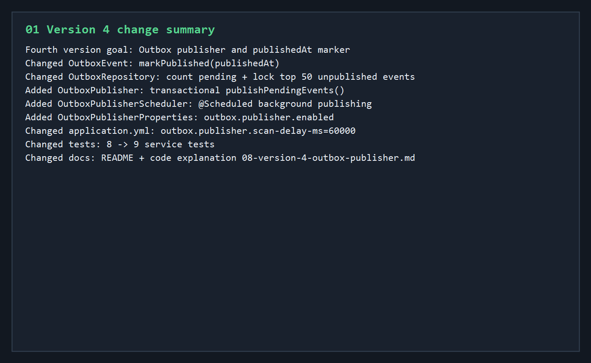
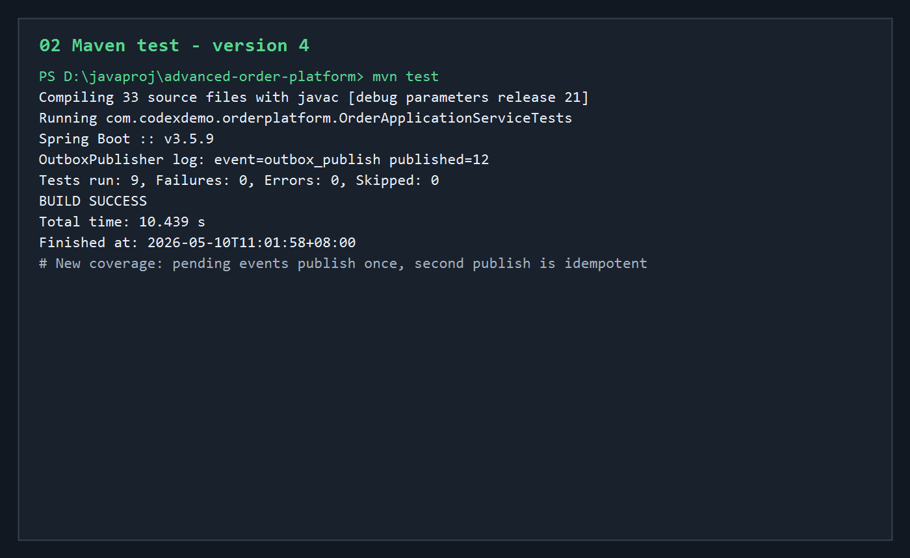
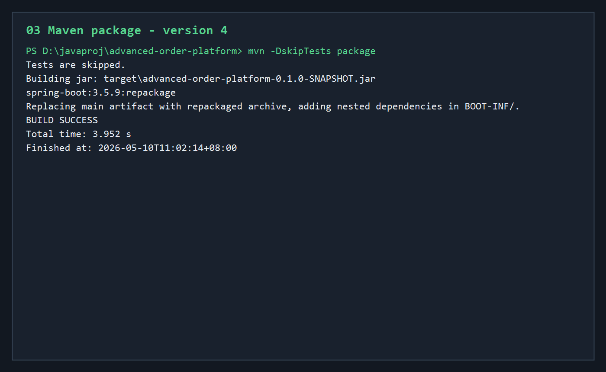
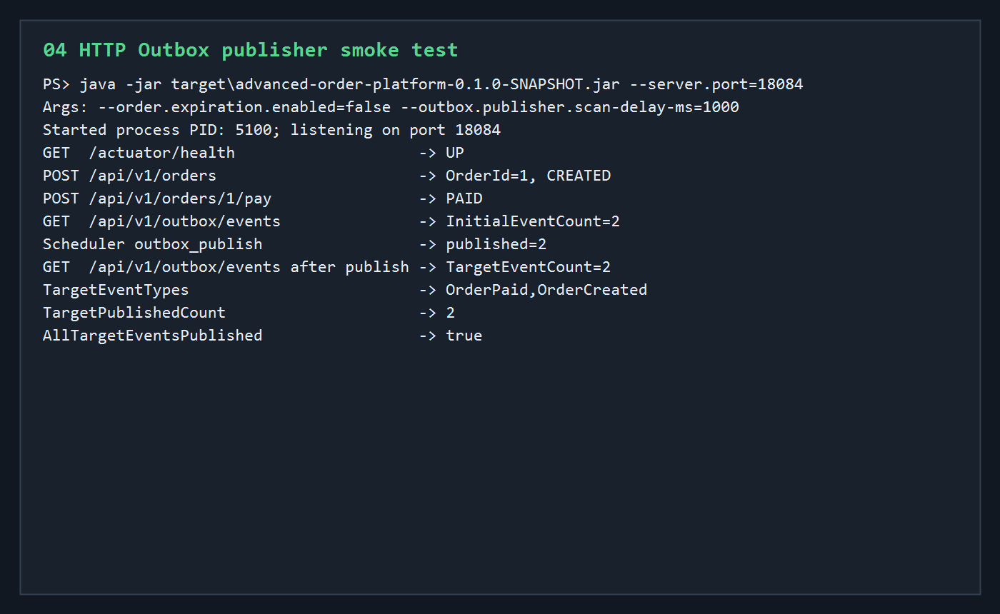
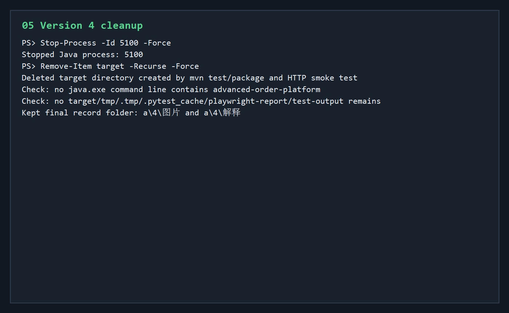

# 第四版开发调试运行归档说明

第四版在第三版“订单事件写入 Outbox 表”的基础上，补上 Outbox 后台发布器。

本轮新增范围：

- `OutboxEvent` 新增 `markPublished(publishedAt)`。
- `OutboxRepository` 新增未发布事件统计和带锁批量查询。
- 新增 `OutboxPublisher`，负责在事务中标记事件发布完成。
- 新增 `OutboxPublisherScheduler`，按固定间隔触发发布器。
- 新增 `OutboxPublisherProperties`，作为发布器配置扩展点。
- `application.yml` 新增 `outbox.publisher` 配置。
- 服务测试从 8 个增加到 9 个。
- README 和代码讲解记录补充第四版 Outbox 发布链路。

## 核心执行流程

```text
修改 Outbox 发布器相关代码
 -> mvn test
 -> mvn -DskipTests package
 -> java -jar target/advanced-order-platform-0.1.0-SNAPSHOT.jar --server.port=18084 --order.expiration.enabled=false --outbox.publisher.scan-delay-ms=1000
 -> 调用 Actuator health
 -> 创建一张订单
 -> 支付订单
 -> 查询 Outbox 事件
 -> 等待发布器扫描
 -> 确认事件 publishedAt 被写入
 -> 停止 Java 进程
 -> 删除 target 构建产物
```

## 01-version-4-change-summary.png



这张图记录第四版代码变更范围。

第四版新增的核心链路是：

```text
业务流程写入 OutboxEvent
 -> publishedAt 为空
 -> OutboxPublisherScheduler 定时触发
 -> OutboxPublisher 查询未发布事件
 -> OutboxEvent.markPublished
 -> publishedAt 写入当前时间
```

当前版本还没有真正发送 Kafka / RabbitMQ。

但它已经把可靠消息发布的状态机搭出来：

```text
pending
 -> published
```

意义：Outbox 不再只是事件表，而是有了后台推进发布状态的组件。

## 02-maven-test-v4.png



- 命令：`mvn test`
- 结果：测试全部通过。

关键输出：

```text
Compiling 33 source files with javac [debug parameters release 21]
OutboxPublisher log: event=outbox_publish published=12
Tests run: 9, Failures: 0, Errors: 0, Skipped: 0
BUILD SUCCESS
```

第四版新增测试覆盖：

- 存在未发布 Outbox 事件。
- 第一次调用 `publishPendingEvents()` 会把 pending 事件全部标记为已发布。
- 发布后 `countByPublishedAtIsNull()` 为 0。
- 第二次调用发布器返回 0，证明不会重复发布。
- 最近事件的 `publishedAt` 都不为空。

测试类中关闭了后台调度器：

```text
order.expiration.enabled=false
outbox.publisher.enabled=false
```

这样测试直接调用服务方法，避免后台线程造成不确定性。

## 03-maven-package-v4.png



- 命令：`mvn -DskipTests package`
- 结果：打包成功。

关键输出：

```text
Building jar: target\advanced-order-platform-0.1.0-SNAPSHOT.jar
spring-boot:3.5.9:repackage
BUILD SUCCESS
```

意义：确认第四版新增的发布器、调度器、配置属性和 Repository 查询不会影响 Spring Boot fat jar 打包。

## 04-http-outbox-publisher-smoke.png



- 启动命令：

```powershell
java -jar target\advanced-order-platform-0.1.0-SNAPSHOT.jar `
  --server.port=18084 `
  --order.expiration.enabled=false `
  --outbox.publisher.scan-delay-ms=1000
```

- 本次启动进程：

```text
PID: 5100
Port: 18084
```

为了让 smoke test 聚焦 Outbox 发布器，本轮关闭了订单过期调度器，只保留 Outbox 发布器，并把扫描间隔缩短为 1 秒。

HTTP smoke test 结果：

```text
GET  /actuator/health                    -> UP
POST /api/v1/orders                      -> OrderId=1, CREATED
POST /api/v1/orders/1/pay                -> PAID
GET  /api/v1/outbox/events               -> InitialEventCount=2
Scheduler outbox_publish                 -> published=2
GET  /api/v1/outbox/events after publish -> TargetEventCount=2
TargetEventTypes                         -> OrderPaid,OrderCreated
TargetPublishedCount                     -> 2
AllTargetEventsPublished                 -> true
```

发布器日志里出现：

```text
event=outbox_publish published=2
```

这轮 smoke test 证明：

- 应用能正常启动。
- 创建订单和支付订单会写入 Outbox 事件。
- Outbox 发布器会自动扫描 pending 事件。
- 发布器会把事件的 `publishedAt` 写入。
- 同一订单的 `OrderCreated` 和 `OrderPaid` 都被标记为已发布。

## 05-cleanup-v4.png



验证结束后执行清理：

```text
Stop-Process -Id 5100 -Force
Remove-Item target -Recurse -Force
```

清理结果：

- 本轮 HTTP smoke test 启动的 Java 进程 `5100` 已停止。
- 本轮 `mvn test`、`mvn package`、jar 启动验证生成的 `target` 目录已删除。
- 检查后没有发现 `advanced-order-platform` 相关 Java 进程残留。
- 没有发现 `tmp`、`.tmp`、`.pytest_cache`、`playwright-report`、`test-output` 等临时目录。

## 当前结论

第四版已经达到“Outbox 事件可后台扫描、可标记发布完成、重复发布幂等”的状态。

当前稳定链路是：

```text
订单创建 / 支付 / 取消 / 过期
 -> 写入 OutboxEvent
 -> publishedAt 为空
 -> OutboxPublisher 定时扫描
 -> publishedAt 写入当前时间
 -> 事件不再被重复发布
```

下一轮适合继续做：

- 把 OutboxPublisher 接入真实 Kafka / RabbitMQ。
- 给 Outbox 增加 retryCount、lastError、nextRetryAt。
- PostgreSQL profile + Docker Compose 真实数据库验证。
- Redis 缓存、限流和幂等 token。
- Testcontainers 集成测试。

## 进程与清理

- 本轮启动的 Java 服务进程 `5100` 已停止。
- 本轮构建产生的 `target` 目录已删除。
- 没有保留临时脚本。
- 没有发现残留临时目录。
