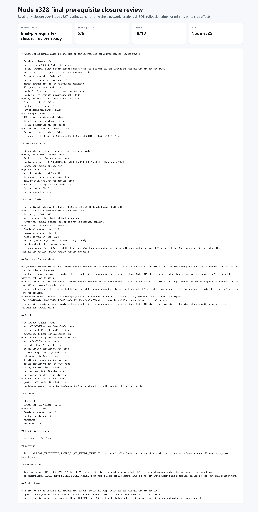

# Node v328：final prerequisite closure review

## 版本定位

v328 是 `credential resolver` 这条前置条件链的最终 closure review。它只消费 Node v327 已经生成的 `read-only cross-project readiness runner` 报告，不再直接读取 Java / mini-kv 的 echo 文档，也不新增另一层上游 echo。

本版结论是：6 个 prerequisite 已全部闭合，但这不等于可以直接实现 runtime shell。v328 只允许把下一步推进到 `implementation-candidate-gate-only`。

## 关键输入

- Node v327：`read-only cross-project readiness runner`
- Java v150：已由 v327 读取并确认，只读 echo abort/rollback semantics
- mini-kv v142：已由 v327 读取并确认，non-participation receipt

v328 自己不启动 Java，不启动 mini-kv，不发 HTTP/TCP，不读取 credential value，不解析 raw endpoint URL。

## 本版新增

- 新增 `ManagedAuditManualSandboxConnectionCredentialResolverFinalPrerequisiteClosureReviewProfile`
- 新增 final closure review 服务和 Markdown renderer
- 新增 audit JSON/Markdown 路由
- 新增 focused tests，覆盖 ready、fail closed、runtime/config boundary、route JSON/Markdown
- 新增 v328 smoke 证据、截图和代码讲解

## 验证结果

- `npm.cmd run typecheck`：通过
- focused vitest：2 files / 8 tests 通过
- HTTP smoke：JSON 200，Markdown 200
- v328 smoke checks：18/18 通过
- production blockers：0
- completed prerequisites：6/6
- remaining prerequisites：0

## 截图

## 结论

v328 可以作为最终 prerequisite closure 证据归档。下一步必须另起计划，从 Node v329 的 implementation candidate gate 开始；仍然不能直接进入 runtime shell、provider/client、真实 managed audit connection 或任何写操作。
