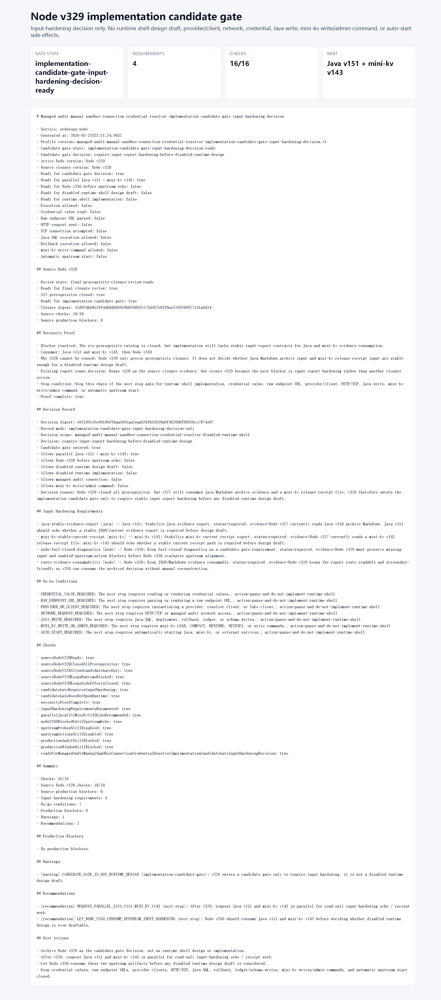

# Node v329：implementation candidate gate / input-hardening decision

## 版本定位

v329 消费 Node v328 的 `final prerequisite closure review`。v328 已经关闭 6/6 prerequisite，但这不等于可以直接写 runtime shell；所以 v329 做的是候选门禁和输入硬化决策。

本版结论：

- 可以进入 implementation candidate gate 的讨论；
- 必须先做 input export hardening；
- 推荐下一步并行 Java v151 + mini-kv v143；
- Node v330 必须等待两边只读 echo / receipt 后再判断；
- 仍不允许 runtime shell design draft、provider/client、HTTP/TCP、credential、SQL、rollback、ledger/schema、mini-kv 写/admin 命令。

## 本版新增

- 新增 implementation candidate gate input-hardening decision 类型、服务、Markdown renderer
- 新增 audit JSON/Markdown route
- 新增 focused tests，覆盖 ready、fail closed、配置阻断、route 输出
- 新增 HTTP smoke 归档、截图、代码讲解

## 关键检查

v329 检查：

- Node v328 final closure ready
- 6/6 prerequisites 已关闭
- v328 仍保持 runtime 和 side effects 关闭
- v329 必须要求 input hardening
- v329 不打开 runtime design / runtime implementation
- 推荐 Java v151 + mini-kv v143 并行
- Node v330 不能抢跑 upstream echo
- `UPSTREAM_PROBES_ENABLED=false`
- `UPSTREAM_ACTIONS_ENABLED=false`

## 验证结果

- `npm.cmd run typecheck`：通过
- focused vitest：2 files / 8 tests 通过
- `npm.cmd run build`：通过
- `npm.cmd test`：262 files / 912 tests 通过
- HTTP smoke：JSON 200，Markdown 200
- v329 smoke checks：16/16 通过
- production blockers：0

## 截图

## 结论

v329 是正确的下一步：它承接 6/6 prerequisite closure，但没有急着实现 runtime。下一步应该让 Java v151 和 mini-kv v143 并行做只读 input-hardening echo / receipt，然后 Node v330 再消费两边证据。
