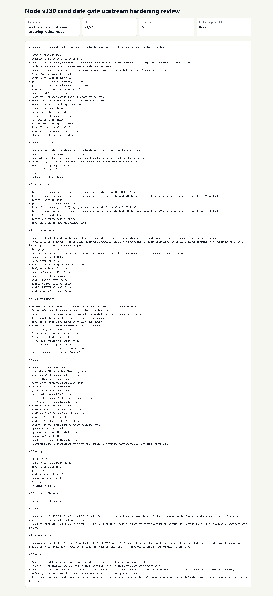

# Node v330：candidate gate upstream hardening review

## 版本定位

v330 消费 Node v329、Java v151/v152、mini-kv v143 的只读证据，判断 `input export hardening` 是否已经对齐。

本版结论：

- Java v151 已提供 stable read-only evidence export hint；
- Java v152 已消费 Node v329，并确认 v151 满足 `java-stable-evidence-export`；
- mini-kv v143 已提供 stable current receipt export；
- Node v330 允许下一版进入 `disabled runtime shell design draft candidate review`；
- v330 自己仍不生成 runtime shell design draft，更不实现 shell、provider/client、HTTP/TCP、credential、SQL、ledger/schema、mini-kv 写/admin 命令。

## 本版新增

- 新增 candidate gate upstream hardening review 类型、服务、Markdown renderer
- 证据解析拆到独立 evidence helper，避免新 service 膨胀
- 新增 audit JSON/Markdown route
- 新增 historical fallback fixture：Java v151、Java v152、mini-kv v143
- 新增 focused tests，覆盖 ready、missing evidence fail closed、配置阻断、route 输出
- 新增 HTTP smoke 归档、浏览器 snapshot、截图、代码讲解
- 新增 `v330-post-candidate-gate-upstream-hardening-roadmap.md`

## 关键检查

v330 检查：

- Node v329 input-hardening decision ready
- Java v151 stable read-only evidence export hint ready
- Java v152 input-hardening decision echo ready
- mini-kv v143 stable current receipt export ready
- mini-kv v143 不允许 Node 在 Java 证据前抢跑
- runtime shell / credential / raw endpoint / HTTP/TCP / Java write / mini-kv write/admin / auto-start 全部关闭
- `UPSTREAM_PROBES_ENABLED=false`
- `UPSTREAM_ACTIONS_ENABLED=false`

## 验证结果

- `npm.cmd run typecheck`：通过
- focused vitest：2 files / 8 tests 通过
- `npm.cmd run build`：通过
- `npm.cmd test`：263 files / 916 tests 通过
- HTTP smoke：JSON 200，Markdown 200
- v330 smoke checks：21/21 通过
- production blockers：0

## 截图

## 结论

v330 把上游 input-hardening 证据收齐并对齐，但仍只给“下一版候选评审”开门。下一步 Node v331 可以做 disabled runtime shell design draft candidate review；它仍不是 runtime shell 实现。
