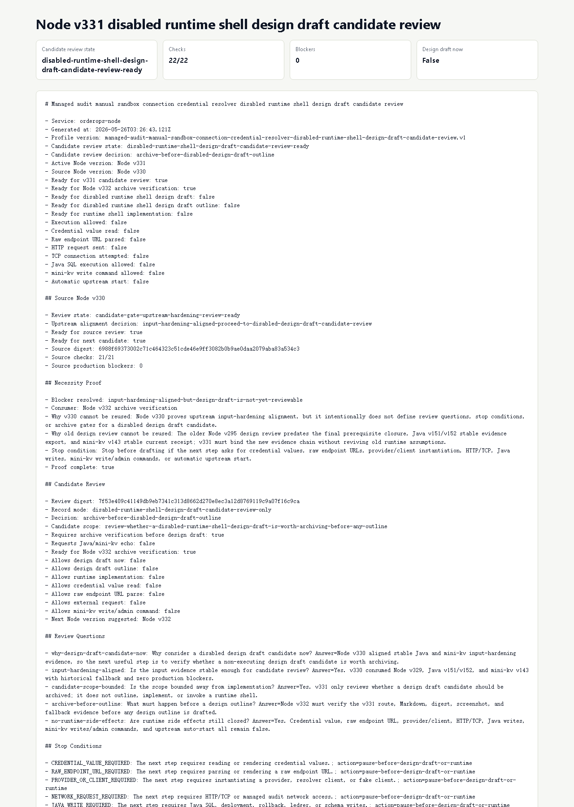

# Node v331：disabled runtime shell design draft candidate review

## 版本定位

v331 消费 Node v330 的 `candidate gate upstream hardening review`，但只做一件事：

```text
判断是否值得进入 disabled runtime shell design draft 的候选评审归档。
```

本版结论：

- 可以进入 Node v332 archive verification；
- v331 自己不写 design draft outline；
- 不实现 runtime shell；
- 不实例化 provider/client；
- 不读取 credential value；
- 不解析 raw endpoint URL；
- 不发 HTTP/TCP；
- 不请求 Java / mini-kv 新 echo。

## 本版新增

- 新增 disabled runtime shell design draft candidate review 类型、服务、Markdown renderer
- 新增 audit JSON/Markdown route
- 新增 focused tests，覆盖 ready、source blocked、配置阻断、route 输出
- 新增 HTTP smoke 归档、浏览器 snapshot、截图、代码讲解

## 关键检查

v331 检查：

- Node v330 hardening review ready
- Node v330 只允许 candidate review，不允许 design draft
- v331 有 necessity proof
- 5 个 review question 全部回答
- 必须先做 Node v332 archive verification
- 不请求 Java / mini-kv echo
- runtime design draft / implementation / invocation 全部关闭
- credential / raw endpoint / provider-client / HTTP-TCP 全部关闭
- Java write / mini-kv write-admin / auto-start 全部关闭

## 验证结果

- `npm.cmd run typecheck`：通过
- focused vitest：2 files / 8 tests 通过
- `npm.cmd run build`：通过
- `npm.cmd test` 默认并发：22 个旧 JSON/Markdown route 测试超时，无断言失败；聚焦复跑通过，判定为全量并发预算问题
- `npm.cmd exec -- vitest run --testTimeout=180000 --maxWorkers=2`：264 files / 920 tests 通过
- HTTP smoke：JSON 200，Markdown 200
- v331 smoke checks：22/22 通过
- production blockers：0

## 截图

Playwright MCP 仍阻止 `file://` 归档页；Chrome DevTools snapshot 可用，但截图调用超时。本版截图最终用本机 Chrome headless 对本地 HTML 归档页生成。



## 结论

v331 是“设计稿之前的候选评审”，不是设计稿本身。下一步 Node v332 应只验证 v331 的 route、Markdown、digest、截图和 historical fallback，再决定是否进入真正的 disabled design draft outline。
