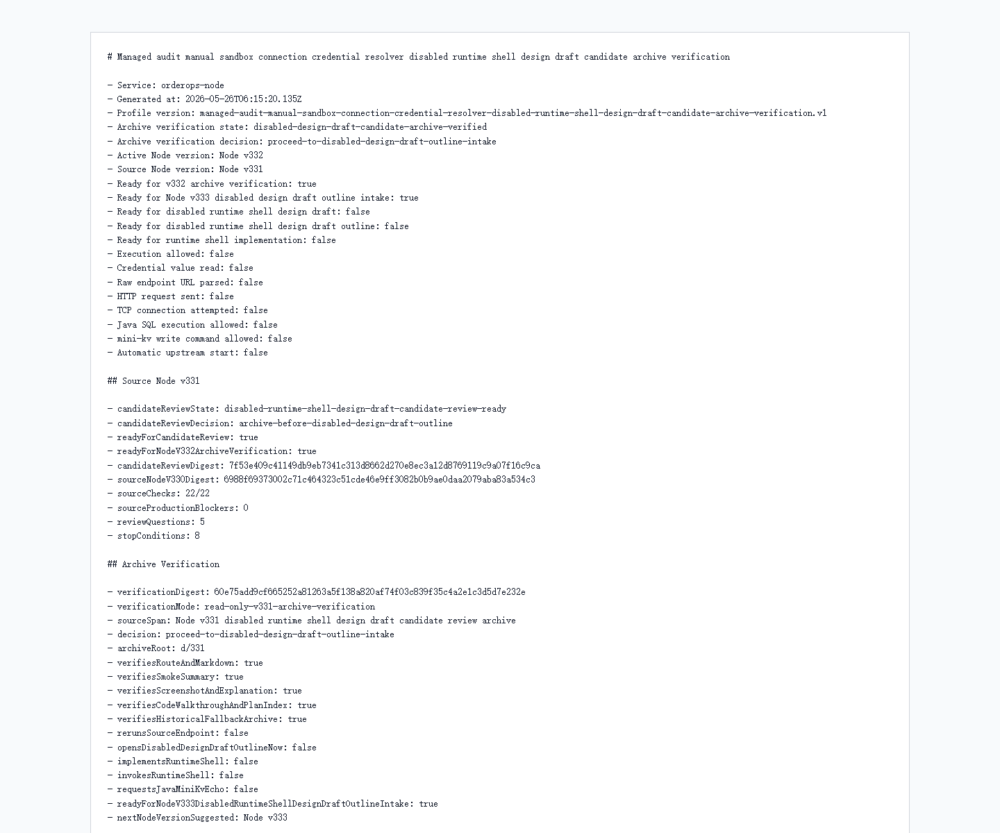

# Node v332：disabled design draft candidate archive verification

## 版本定位

v332 消费 Node v331 的 `disabled runtime shell design draft candidate review`，只做归档验证：

```text
确认 v331 的 route / Markdown / JSON evidence / smoke summary / screenshot / 讲解 / plan index 都可归档复核。
```

本版结论：

- v331 archive verification 通过；
- 可以进入 Node v333 disabled design draft outline intake；
- v332 自己不写 design draft outline；
- 不实现 runtime shell；
- 不实例化 provider/client；
- 不读取 credential value；
- 不解析 raw endpoint URL；
- 不发 HTTP/TCP；
- 不请求 Java / mini-kv 新 echo。

## 本版新增

- 新增 v332 archive verification 类型、服务、Markdown renderer
- 新增 audit JSON/Markdown route
- 新增 focused tests，覆盖 ready、archive missing、配置阻断、route 输出
- 新增 v332 HTTP smoke 归档、HTML、截图、代码讲解
- 新建下一阶段计划 `docs/plans2/v332-post-disabled-design-draft-candidate-archive-verification-roadmap.md`

## 关键检查

v332 检查：

- Node v331 candidate review ready
- v331 必须先要求 archive verification
- v331 仍未打开 design draft / outline / runtime
- `d/331` 的 11 个归档文件都存在
- v331 archived JSON digest 与 live v331 digest 一致
- v331 archived Markdown 记录 candidate 边界
- v331 smoke summary 记录 JSON/Markdown 200 和 forced fallback
- v331 screenshot、HTML、解释、代码讲解、计划索引都存在
- v332 自己不 rerun source endpoint、不写 outline、不请求 Java/mini-kv echo
- upstream probes/actions 仍关闭

## 验证结果

- `npm.cmd run typecheck`：通过
- focused vitest：2 files / 8 tests 通过
- full vitest stable mode：265 files / 924 tests 通过（`--maxWorkers=2`）
- `npm.cmd run build`：通过
- HTTP smoke：JSON 200，Markdown 200
- v332 smoke checks：29/29 通过
- v331 archive files：11/11
- production blockers：0

## 截图

Playwright MCP 仍阻止 `file://` 归档页；本版截图用本机 Chrome headless 对本地 HTML 归档页生成。



## 结论

v332 是“候选评审归档验证”，不是设计稿本身。下一步 Node v333 只允许做 disabled design draft outline intake，而且仍不能实现 runtime shell、不能打开 provider/client、credential、raw endpoint、HTTP/TCP、Java 写、mini-kv 写或自动启动。
