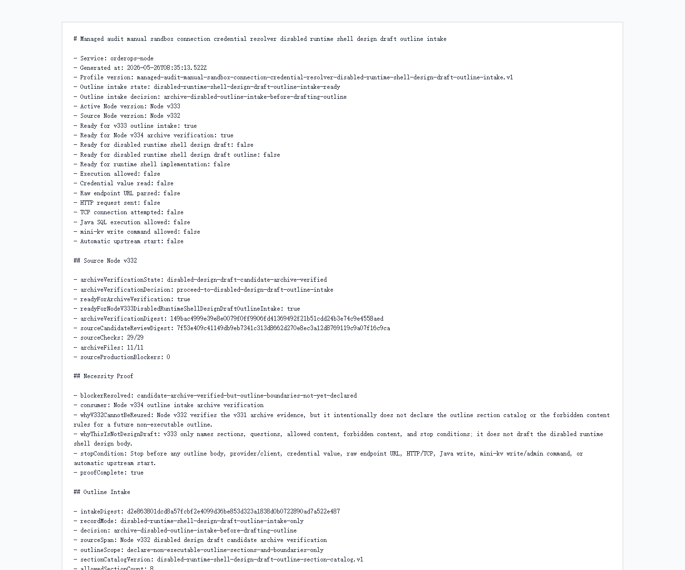

# Node v333：disabled runtime shell design draft outline intake

## 版本定位

v333 消费 Node v332 的 `disabled design draft candidate archive verification`，但只做 outline intake：

```text
定义未来 outline 可以有哪些章节、每章允许写什么、禁止写什么，以及何时必须暂停。
```

本版结论：

- 可以进入 Node v334 archive verification；
- v333 自己不写 outline body；
- 不实现 runtime shell；
- 不实例化 provider/client；
- 不读取 credential value；
- 不解析 raw endpoint URL；
- 不发 HTTP/TCP；
- 不请求 Java / mini-kv 新 echo。

## 本版新增

- 新增 v333 outline intake 类型、服务、Markdown renderer
- 新增集中式 outline section catalog，共 8 个章节
- 新增 audit JSON/Markdown route
- 新增 focused tests，覆盖 ready、source blocked、配置阻断、route 输出
- 新增 v333 HTTP smoke 归档、HTML、截图、代码讲解

## 关键检查

v333 检查：

- Node v332 archive verification ready
- Node v332 只允许 outline intake，不允许直接写 design draft
- v333 有 necessity proof
- 8 个 outline section 都只定义 allowed / forbidden content
- 所有 section 都要求 future archive verification
- v333 必须先让 Node v334 验证归档
- runtime design draft / implementation / invocation 全部关闭
- credential / raw endpoint / provider-client / HTTP-TCP 全部关闭
- Java write / mini-kv write-admin / auto-start 全部关闭

## 验证结果

- `npm.cmd run typecheck`：通过
- focused vitest：2 files / 8 tests 通过
- full vitest stable mode：266 files / 928 tests 通过（`--maxWorkers=2`）
- `npm.cmd run build`：通过
- HTTP smoke：JSON 200，Markdown 200
- v333 smoke checks：23/23 通过
- outline sections：8
- stop conditions：8
- production blockers：0

## 截图

Playwright MCP 仍阻止 `file://` 归档页；本版截图用本机 Chrome headless 对本地 HTML 归档页生成。



## 结论

v333 是“设计稿大纲入口”，不是设计稿正文，也不是 runtime shell 实现。下一步 Node v334 只能验证 v333 的 route、Markdown、digest、截图、讲解和 historical fallback，然后再决定是否进入真正的 outline draft。
