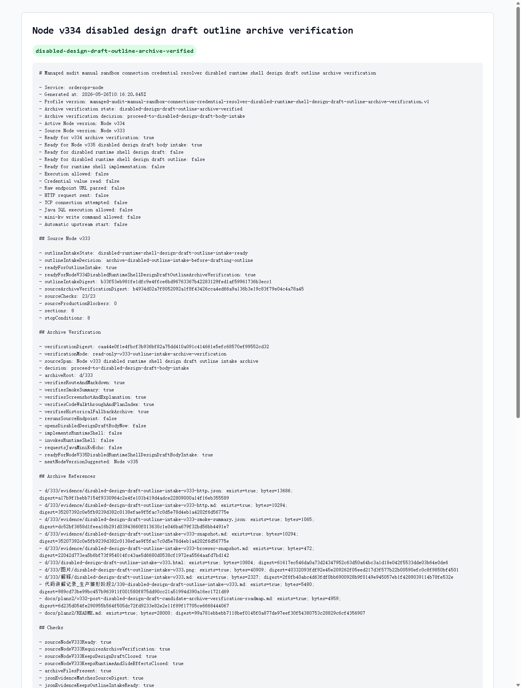

# Node v334：disabled design draft outline archive verification

## 版本定位

v334 消费 Node v333 的 `disabled runtime shell design draft outline intake` 归档，只做只读验收：

```text
确认 v333 的 route、Markdown、JSON digest、HTTP smoke、截图、代码讲解和计划索引都完整。
```

本版结论：

- v333 归档验收通过；
- 可以进入 Node v335 的 disabled design draft body intake / readiness step；
- v334 自己不写 design draft body；
- 不实现 runtime shell；
- 不实例化 provider/client；
- 不读取 credential value；
- 不解析 raw endpoint URL；
- 不发 HTTP/TCP；
- 不请求 Java / mini-kv 新 echo。

## 本版新增

- 新增 v334 archive verification 类型、服务、Markdown renderer
- 新增 audit JSON/Markdown route
- 新增 focused tests，覆盖 ready、archive missing、配置阻断、route 输出
- 新增 v334 HTTP smoke 归档、HTML、截图、代码讲解
- 续写 `docs/plans2/`，v334 完成后另起后续计划

## 关键检查

v334 检查：

- Node v333 outline intake ready
- Node v333 要求先做 archive verification
- v333 仍没有打开 design draft / outline body
- runtime implementation / invocation 全部关闭
- credential / raw endpoint / provider-client / HTTP-TCP 全部关闭
- Java write / mini-kv write-admin / auto-start 全部关闭
- v333 JSON evidence digest 与 live source digest 一致
- v333 Markdown 记录 Node v334 gate 和 runtime 边界
- v333 smoke summary 记录 forced historical fallback 与 route 200
- v333 HTML、截图、解释、代码讲解、计划索引都存在

## 验证结果

- `npm.cmd run typecheck`：通过
- focused vitest：2 files / 8 tests 通过
- `npm.cmd run build`：通过
- full vitest stable mode：267 files / 932 tests 通过（`--maxWorkers=2`）
- HTTP smoke：JSON 200，Markdown 200
- v334 smoke checks：29/29 通过
- archive files：11/11
- production blockers：0

## 截图

Playwright MCP 先尝试打开本地 HTML，但仍阻止 `file://` 协议；本版截图改用本机 Chrome headless 对本地 HTML 归档页生成。



## 结论

v334 是“v333 大纲入口归档验收”，不是设计稿正文。下一步 Node v335 只能做 body intake / readiness step，继续保持非执行、无 secret、无 raw endpoint、无 provider/client、无网络、无 Java/mini-kv 写操作。
