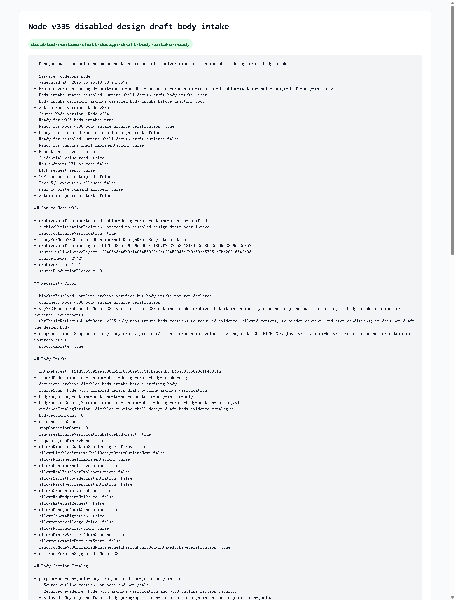

# Node v335：disabled design draft body intake

## 版本定位

v335 消费 Node v334 的 `disabled design draft outline archive verification`，但只做 body intake / readiness：

```text
把 v333 的 outline section catalog 映射成未来 body draft 可用的章节入口、证据清单和停止条件。
```

本版结论：

- 可以进入 Node v336 body intake archive verification；
- v335 自己不写 design draft body；
- 不实现 runtime shell；
- 不实例化 provider/client；
- 不读取 credential value；
- 不解析 raw endpoint URL；
- 不发 HTTP/TCP；
- 不请求 Java / mini-kv 新 echo。

## 本版新增

- 新增 v335 body intake 类型、服务、Markdown renderer
- 新增 8 个 body section catalog，逐一映射 v333 outline section
- 新增 6 个 evidence catalog，用来说明未来 body draft 必须消费哪些只读证据
- 新增 audit JSON/Markdown route
- 新增 focused tests，覆盖 ready、source blocked、配置阻断、route 输出
- 新增 v335 HTTP smoke 归档、HTML、截图、代码讲解

## 关键检查

v335 检查：

- Node v334 archive verification ready
- Node v334 只允许 body intake，不允许直接写 design body
- v335 有 necessity proof
- 8 个 body section 都映射到 8 个 outline section
- 6 个 evidence item 都是 required 且不允许 runtime behavior
- v335 必须先让 Node v336 验证归档
- runtime design draft / implementation / invocation 全部关闭
- credential / raw endpoint / provider-client / HTTP-TCP 全部关闭
- Java write / mini-kv write-admin / auto-start 全部关闭

## 验证结果

- `npm.cmd run typecheck`：通过
- focused vitest：2 files / 8 tests 通过
- `npm.cmd run build`：通过
- full vitest stable mode：268 files / 936 tests 通过（`--maxWorkers=2`）
- HTTP smoke：JSON 200，Markdown 200
- v335 smoke checks：25/25 通过
- body sections：8
- evidence items：6
- stop conditions：8
- production blockers：0

## 截图

Playwright MCP 先尝试打开本地 HTML，但仍阻止 `file://` 协议；本版截图改用本机 Chrome headless 对本地 HTML 归档页生成。



## 结论

v335 是“设计稿正文入口准备”，不是设计稿正文，也不是 runtime shell 实现。下一步 Node v336 只能验证 v335 的 route、Markdown、digest、截图、讲解和 historical fallback，然后再决定是否继续靠近真正 body draft。
