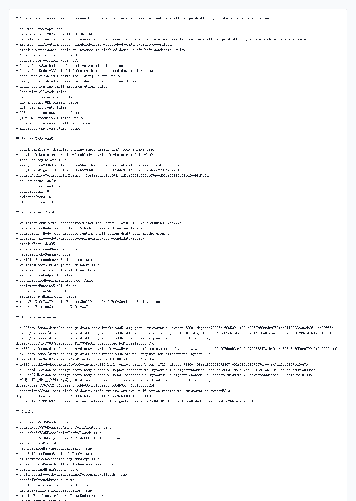

# Node v336：disabled design draft body intake archive verification

## 版本定位

v336 消费 Node v335 的 `disabled design draft body intake`，只做归档验证：

```text
确认 v335 的 route、Markdown、digest、smoke、截图、代码讲解和计划索引都已经可追溯。
```

本版结论：

- 可以进入 Node v337 body candidate review；
- v336 自己不写 design draft body；
- 不实现 runtime shell；
- 不实例化 provider/client；
- 不读取 credential value；
- 不解析 raw endpoint URL；
- 不发 HTTP/TCP 到上游；
- 不请求 Java / mini-kv 新 echo。

## 本版新增

- 新增 v336 body intake archive verification 类型、服务、Markdown renderer
- 新增 audit JSON/Markdown route
- 新增 focused tests，覆盖 ready、archive missing、配置阻断、route 输出
- 新增 v336 HTTP smoke 归档、HTML、截图、代码讲解
- 新开 `docs/plans2/v336-post-disabled-design-draft-body-intake-archive-verification-roadmap.md`

## 关键检查

v336 检查：

- Node v335 body intake ready
- Node v335 要求先做 archive verification
- v335 仍未打开 design draft body / outline
- v335 仍未打开 runtime / credential / raw endpoint / HTTP-TCP
- `d/335` 的 JSON / Markdown / smoke / HTML / 截图 / 解释 / 代码讲解 / 计划索引均存在
- JSON intake digest 与 live source 或 archived payload 自洽
- smoke summary 记录 forced historical fallback
- 计划索引同时记录 Node v335 和 Node v336
- upstream probes / actions 仍为 false

## 验证结果

- `npm.cmd run typecheck`：通过
- focused vitest：2 files / 8 tests 通过
- `npm.cmd run build`：通过
- HTTP smoke：JSON 200，Markdown 200
- v336 smoke checks：29/29 通过
- archive files：11/11
- production blockers：0
- full vitest stable mode：269 files / 940 tests 通过（按分组完整覆盖全部测试文件，`--maxWorkers=2`）

说明：单个 full vitest 命令在外层工具 10 分钟预算内会超时，但没有断言失败；本轮按 50/25 文件分组完整跑完 269 个测试文件。第 50-99 文件段本身耗时较高，因此拆成两个 25 文件组。

## 截图

Playwright MCP 已按规则优先尝试，但本地 HTML 的 `file://` 仍被阻止；本版截图改用本机 Chrome headless 对本地 HTML 归档页生成。



## 结论

v336 是“v335 body intake 的归档验证”，不是 body draft，也不是 runtime shell 实现。下一步 Node v337 只能做 body candidate review；如果没有新增非 secret handoff 字段，仍不需要 Java / mini-kv 参与。
