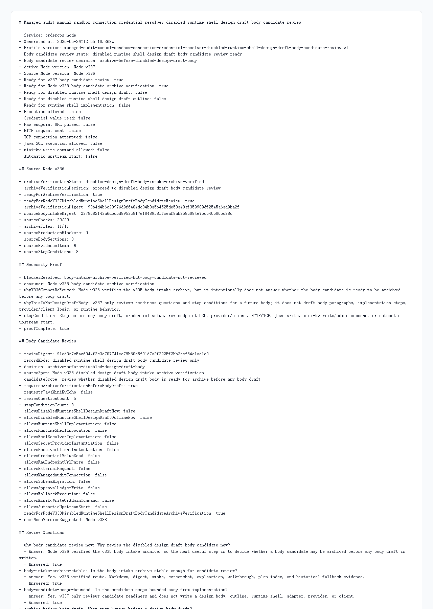

# Node v337：disabled design draft body candidate review

## 版本定位

v337 消费 Node v336 的 `disabled design draft body intake archive verification`，但只做 body candidate review：

```text
判断未来是否可以把 body candidate 归档，再由 v338 先验证归档，之后才可能写正式 body draft。
```

本版结论：

- 可以进入 Node v338 body candidate archive verification；
- v337 自己不写 design draft body；
- 不实现 runtime shell；
- 不实例化 provider/client；
- 不读取 credential value；
- 不解析 raw endpoint URL；
- 不发 HTTP/TCP；
- 不请求 Java / mini-kv 新 echo。

## 本版新增

- 新增 v337 body candidate review 类型、服务、Markdown renderer
- 新增 5 个 review questions，说明为什么现在只做 candidate review
- 新增 8 个 stop conditions，继续阻断 body draft / credential / raw URL / provider-client / network / Java write / mini-kv write-admin / auto-start
- 新增 audit JSON/Markdown route
- 新增 focused tests，覆盖 ready、source blocked、配置阻断、route 输出
- 新增 v337 HTTP smoke 归档、HTML、截图、代码讲解

## 关键检查

v337 检查：

- Node v336 archive verification ready
- Node v336 只允许 body candidate review，不允许直接写 body draft
- v337 有 necessity proof
- 5 个 review questions 都已回答
- v337 必须先让 Node v338 验证归档
- body draft / runtime implementation / runtime invocation 全部关闭
- credential / raw endpoint / provider-client / HTTP-TCP 全部关闭
- Java write / mini-kv write-admin / auto-start 全部关闭

## 验证结果

- `npm.cmd run typecheck`：通过
- focused vitest：2 files / 8 tests 通过
- `npm.cmd run build`：通过
- HTTP smoke：JSON 200，Markdown 200
- v337 smoke checks：22/22 通过
- full vitest stable mode：270 files / 944 tests 通过（按分组完整覆盖全部测试文件，`--maxWorkers=2`）
- source Node v336 checks：29/29
- source archive files：11/11
- review questions：5/5
- stop conditions：8
- production blockers：0

说明：单个 full vitest 命令会超过外层工具预算；本轮按 50/25 文件分组完整跑完 270 个测试文件，没有断言失败。

## 截图

Playwright MCP 已按规则优先尝试，但本地 HTML 的 `file://` 仍被阻止；本版截图改用本机 Chrome headless 对本地 HTML 归档页生成。



## 结论

v337 是“body candidate review”，不是 body draft，也不是 runtime shell 实现。下一步 Node v338 只能验证 v337 的 route、Markdown、digest、截图、讲解和 historical fallback；如果没有新增非 secret handoff 字段，仍不需要 Java / mini-kv 参与。
