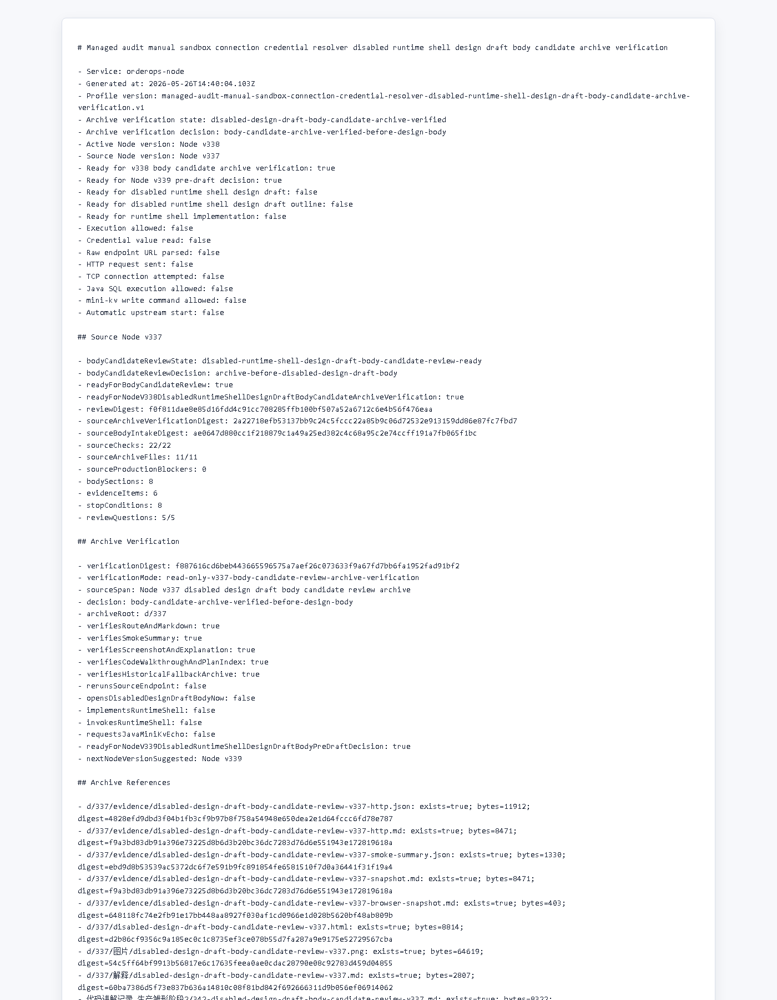

# Node v338：disabled design draft body candidate archive verification

## 版本定位

v338 消费 Node v337 的 `disabled design draft body candidate review`，但只做归档验证：

```text
确认 v337 的 route、Markdown、digest、截图、讲解、计划索引和 historical fallback 都稳定。
```

本版结论：

- v337 archive verification 通过；
- 可以进入 Node v339 pre-draft decision；
- v338 自己不写 design draft body；
- 不实现 runtime shell；
- 不实例化 provider/client；
- 不读取 credential value；
- 不解析 raw endpoint URL；
- 不发 HTTP/TCP；
- 不请求 Java / mini-kv 新 echo。

## 本版新增

- 新增 v338 archive verification 类型、服务、Markdown renderer
- 新增 audit JSON/Markdown route
- 新增 focused tests，覆盖 ready、archive missing、配置阻断、route 输出
- 新增 v338 HTTP smoke 归档、HTML、截图、代码讲解
- 新增 v338 衍生计划，下一步仅允许 Node v339 pre-draft decision

## 关键检查

v338 检查：

- Node v337 body candidate review ready
- v337 要求 v338 先做 archive verification
- v337 没有打开 body draft / outline / runtime
- v337 的 review digest 与归档 JSON 一致
- v337 Markdown 记录 body boundary
- smoke summary 记录 JSON/Markdown 200 与 fallback
- screenshot / HTML / explanation / walkthrough / plan index 均存在
- credential / raw endpoint / provider-client / HTTP-TCP 全部关闭
- Java write / mini-kv write-admin / auto-start 全部关闭

## 验证结果

- `npm.cmd run typecheck`：通过
- focused vitest：2 files / 8 tests 通过
- `npm.cmd run build`：通过
- HTTP smoke：JSON 200，Markdown 200
- v338 smoke checks：29/29 通过
- full vitest stable mode：271 files / 948 tests 通过（按分组完整覆盖全部测试文件）
- source Node v337 checks：22/22
- source archive files：11/11
- v338 archive files：11/11
- review questions：5/5
- production blockers：0

说明：第一次 smoke 脚本把启动、轮询、请求、写档和 finally 收尾放在一个 90 秒外层命令里，命令预算先到，但路由本身随后确认可 200 返回；已停止残留 Node 进程并用分步 smoke 重新写入证据。

## 截图

Playwright MCP 已按规则优先尝试，但本地 HTML 的 `file://` 仍被阻止；本版截图改用本机 Chrome headless 对本地 HTML 归档页生成。



## 结论

v338 是“body candidate archive verification”，不是 body draft，也不是 runtime shell 实现。下一步 Node v339 只能做 pre-draft decision；如果没有新增非 secret handoff 字段，仍不需要 Java / mini-kv 参与。
