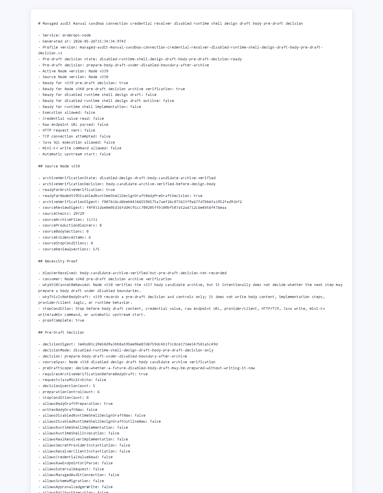

# Node v339：disabled design draft body pre-draft decision

## 版本定位

v339 消费 Node v338 的 `disabled design draft body candidate archive verification`，但只做 pre-draft decision：

```text
判断未来是否可以准备受限 body draft，但本版不写正文。
```

本版结论：

- 可以进入 Node v340 pre-draft decision archive verification；
- v339 自己不写 design draft body；
- 不实现 runtime shell；
- 不实例化 provider/client；
- 不读取 credential value；
- 不解析 raw endpoint URL；
- 不发 HTTP/TCP；
- 不请求 Java / mini-kv 新 echo。

## 本版新增

- 新增 v339 pre-draft decision 类型、服务、Markdown renderer
- 新增 5 个 decision questions
- 新增 6 个 preparation controls，约束后续 draft 只能在归档验证之后开始
- 新增 8 个 stop conditions
- 新增 audit JSON/Markdown route
- 新增 focused tests，覆盖 ready、source blocked、配置阻断、route 输出
- 新增 v339 HTTP smoke 归档、HTML、截图、代码讲解

## 关键检查

v339 检查：

- Node v338 archive verification ready
- Node v338 只允许 pre-draft decision，不允许直接写 body draft
- v339 有 necessity proof
- 5 个 decision questions 都已回答
- 6 个 preparation controls 都已强制
- v339 必须先让 Node v340 验证归档
- body draft / runtime implementation / runtime invocation 全部关闭
- credential / raw endpoint / provider-client / HTTP-TCP 全部关闭
- Java write / mini-kv write-admin / auto-start 全部关闭

## 验证结果

- `npm.cmd run typecheck`：通过
- focused vitest：2 files / 8 tests 通过
- `npm.cmd run build`：通过
- full vitest stable mode：272 files / 952 tests 通过
- HTTP smoke：JSON 200，Markdown 200
- v339 smoke checks：23/23 通过
- source Node v338 checks：29/29
- decision questions：5/5
- preparation controls：6/6
- stop conditions：8
- production blockers：0

## 截图

Playwright MCP 已按规则优先尝试，但本地 HTML 的 `file://` 仍被阻止；本版截图改用本机 Chrome headless 对本地 HTML 归档页生成。



## 结论

v339 是“pre-draft decision”，不是 body draft，也不是 runtime shell 实现。下一步 Node v340 只能验证 v339 的 route、Markdown、digest、截图、讲解和 historical fallback；如果没有新增非 secret handoff 字段，仍不需要 Java / mini-kv 参与。
