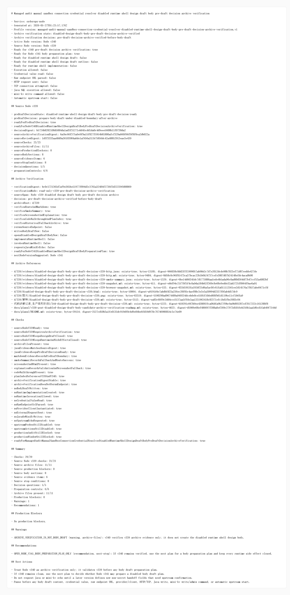

# Node v340：disabled design draft body pre-draft decision archive verification

## 版本定位

v340 消费 Node v339 的 `disabled design draft body pre-draft decision` 归档，只做 archive verification：

```text
验证 v339 的 route、Markdown、digest、smoke、截图、讲解和计划索引。
```

本版结论：

- v339 pre-draft decision 归档完整；
- 可以进入 Node v341 body preparation plan；
- v340 自己不写 body draft；
- 不实现 runtime shell；
- 不实例化 provider/client；
- 不读取 credential value；
- 不解析 raw endpoint URL；
- 不发 HTTP/TCP；
- 不请求 Java / mini-kv 新 echo。

## 本版新增

- 新增 v340 archive verification 类型、服务、Markdown renderer
- 新增 audit JSON/Markdown route
- 新增 focused tests，覆盖 ready、archive missing、配置阻断、route 输出
- 新增 v340 HTTP smoke 归档、HTML、截图、代码讲解
- 新增 v340 衍生计划，用来承接 v341 之后的 body preparation plan

## 关键检查

v340 检查：

- Node v339 pre-draft decision ready
- Node v339 要求 v340 先做 archive verification
- `d/339` 的 JSON、Markdown、smoke summary、snapshot、HTML、截图、解释、代码讲解、plan index 都存在
- JSON digest 与 live source digest 对齐
- Markdown 记录 `requestsJavaMiniKvEcho: false`
- smoke summary 记录 JSON 200 / Markdown 200 / fallback enabled
- body draft / runtime implementation / runtime invocation 全部关闭
- credential / raw endpoint / provider-client / HTTP-TCP 全部关闭
- Java write / mini-kv write-admin / auto-start 全部关闭

## 验证结果

- `npm.cmd run typecheck`：通过
- focused vitest：2 files / 8 tests 通过
- `npm.cmd run build`：通过
- full vitest stable mode：273 files / 956 tests 通过
- HTTP smoke：JSON 200，Markdown 200
- v340 smoke checks：29/29 通过
- source Node v339 checks：23/23
- archive files：11/11
- production blockers：0

## 截图

Playwright MCP 已按规则优先尝试，但本地 HTML 的 `file://` 仍被阻止；本版改用 Chrome DevTools MCP 打开本地 HTML 并生成截图。



## 结论

v340 是“pre-draft decision archive verification”，不是 body draft，也不是 runtime shell 实现。下一步 Node v341 只能做 body preparation plan，仍不打开 runtime、provider/client、credential、raw endpoint、HTTP/TCP、Java 写入或 mini-kv write/admin。
