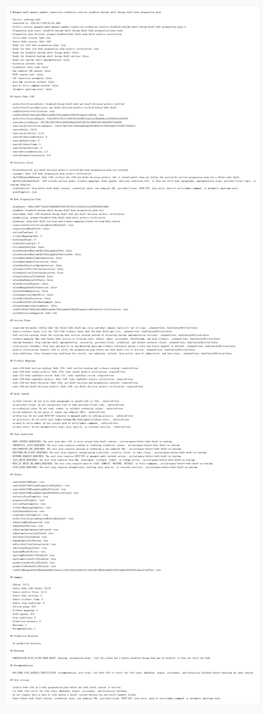

# Node v341：disabled design draft body preparation plan

## 版本定位

v341 消费 Node v340 的 `pre-draft decision archive verification`，但只做 body preparation plan：

```text
规划未来 body draft 的章节、证据映射和保护边界，不写正式 body draft 正文。
```

本版结论：

- 可以进入 Node v342 body preparation plan archive verification；
- v341 自己不写 design draft body；
- 不实现 runtime shell；
- 不实例化 provider/client；
- 不读取 credential value；
- 不解析 raw endpoint URL；
- 不发 HTTP/TCP；
- 不请求 Java / mini-kv 新 echo。

## 本版新增

- 新增 v341 preparation plan 类型、服务、Markdown renderer
- 新增 8 个 section plans
- 新增 6 个 evidence mappings，串起 Node v335-v340 证据链
- 新增 8 个 draft guards
- 新增 8 个 stop conditions
- 新增 audit JSON/Markdown route
- 新增 focused tests，覆盖 ready、source blocked、配置阻断、route 输出
- 新增 v341 HTTP smoke 归档、HTML、截图、代码讲解

## 关键检查

v341 检查：

- Node v340 archive verification ready
- Node v340 只允许 preparation plan，不允许直接写 body draft
- v341 有 necessity proof
- 8 个 section plans 都已规划且未写正文
- 6 个 evidence mappings 都指向既有版本证据
- 8 个 draft guards 都已强制
- v341 必须先让 Node v342 验证归档
- body draft / runtime implementation / runtime invocation 全部关闭
- credential / raw endpoint / provider-client / HTTP-TCP 全部关闭
- Java write / mini-kv write-admin / auto-start 全部关闭

## 验证结果

- `npm.cmd run typecheck`：通过
- focused vitest：2 files / 8 tests 通过
- full vitest stable mode：274 files / 960 tests 通过
- `npm.cmd run build`：通过
- HTTP smoke：JSON 200，Markdown 200
- v341 smoke checks：25/25 通过
- source Node v340 checks：29/29
- section plans：8/8
- evidence mappings：6
- draft guards：8/8
- stop conditions：8
- production blockers：0

## 截图

Playwright MCP 已按规则优先尝试，但本地 HTML 的 `file://` 仍被阻止；本版改用 Chrome DevTools MCP 打开本地 HTML 并生成截图。



## 结论

v341 是“body preparation plan”，不是 body draft，也不是 runtime shell 实现。下一步 Node v342 只能验证 v341 的 route、Markdown、digest、截图、讲解和 historical fallback；如果没有新增非 secret handoff 字段，仍不需要 Java / mini-kv 参与。
