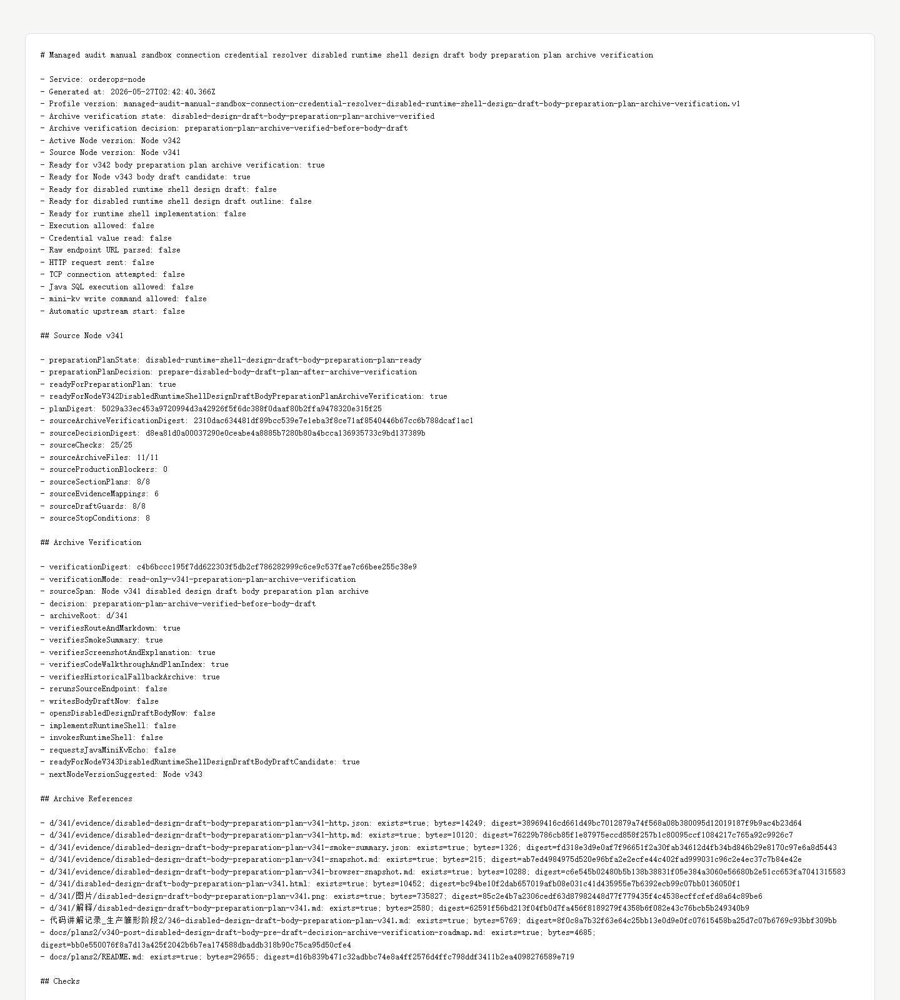

# Node v342：disabled design draft body preparation plan archive verification

## 版本定位

v342 消费 Node v341 的 `body preparation plan`，只做归档验证：

```text
验证 v341 route、Markdown、digest、截图、讲解、计划索引和 historical fallback；不写 body draft，不实现 runtime shell。
```

本版结论：

- v341 preparation plan 归档完整；
- 允许下一步进入 Node v343 的受限 body draft candidate 判断；
- 不请求 Java / mini-kv 新 echo；
- 不读取 credential value；
- 不解析 raw endpoint URL；
- 不实例化 provider/client；
- 不发 HTTP/TCP；
- 不写 Java ledger/schema/SQL；
- 不执行 mini-kv write/admin；
- 不自动启动上游。

## 本版新增

- 新增 v342 archive verification 类型、服务、Markdown renderer
- 新增 v342 audit JSON/Markdown route
- 新增 v342 focused tests，覆盖 ready、归档缺失、配置阻断、route 输出
- 新增 v342 HTTP smoke 归档、HTML、截图、代码讲解
- 新增 v342 衍生计划，下一步只允许 Node v343 做受限 body draft candidate

## 关键检查

v342 检查：

- Node v341 preparation plan ready
- Node v341 要求先做 v342 archive verification
- v341 仍保持 design draft / runtime / provider-client / credential / raw endpoint / network 全关闭
- v341 的 11 个归档文件存在
- archived JSON 的 `bodyPreparationPlan.planDigest` 与 live source 一致
- Markdown 记录 v342 gate 和 runtime boundary
- smoke summary 记录 JSON/Markdown 200
- screenshot、HTML、解释、代码讲解、计划索引齐全
- 本版不写 body draft，不请求 Java / mini-kv，不打开生产窗口

## 验证结果

- `npm.cmd run typecheck`：通过
- focused vitest：2 files / 8 tests 通过
- full vitest stable mode：275 files / 964 tests 通过
- `npm.cmd run build`：通过
- HTTP smoke：JSON 200，Markdown 200
- v342 smoke checks：29/29 通过
- source Node v341 checks：25/25
- archive files：11/11
- production blockers：0

## 截图

Playwright MCP 已按规则优先尝试，但本地 HTML 的 `file://` 仍被阻止；本版改用本机 Chrome headless 生成截图。



## 结论

v342 是“preparation plan archive verification”，不是 body draft，也不是 runtime shell 实现。下一步 Node v343 只能做受限 body draft candidate，并继续保持 credential、raw endpoint、provider/client、HTTP/TCP、Java 写操作和 mini-kv write/admin 全关闭。
