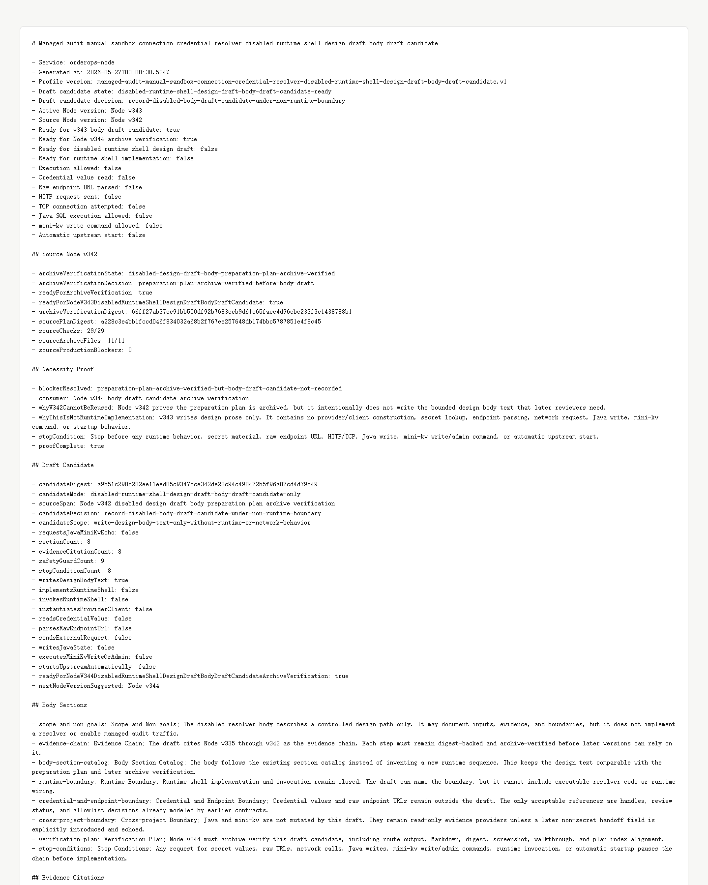

# Node v343：disabled design draft body draft candidate

## 版本定位

v343 消费 Node v342 的 `preparation plan archive verification`，第一次写入受限的 body draft candidate：

```text
只写设计正文草案，不实现 runtime shell，不连接 managed audit，不请求 Java / mini-kv。
```

本版结论：

- body draft candidate 已形成；
- 可以进入 Node v344 archive verification；
- candidate 是设计文本，不是可执行实现；
- credential value、raw endpoint URL、provider/client、HTTP/TCP 全关闭；
- Java ledger/schema/SQL 和 mini-kv write/admin 全关闭；
- 不自动启动上游。

## 本版新增

- 新增 v343 draft candidate 类型、服务、Markdown renderer
- 新增 8 个 body sections
- 新增 8 个 evidence citations
- 新增 9 个 safety guards
- 新增 8 个 stop conditions
- 新增 audit JSON/Markdown route
- 新增 focused tests，覆盖 ready、source blocked、配置阻断、route 输出
- 新增 v343 HTTP smoke 归档、HTML、截图、代码讲解

## 关键检查

v343 检查：

- Node v342 archive verification ready
- Node v342 只允许 v343 body draft candidate
- candidate mode 是 text-only
- 8 个正文 section 都是设计文本
- 8 个 evidence citation 指向 v335-v342 链路
- 9 个 safety guard 全部 enforced
- 8 个 stop condition 齐全
- 不请求 Java / mini-kv echo
- 不实现 runtime，不调用 runtime
- 不读取 credential，不解析 raw endpoint，不发 HTTP/TCP
- 不写 Java，不执行 mini-kv write/admin

## 验证结果

- `npm.cmd run typecheck`：通过
- focused vitest：2 files / 8 tests 通过
- `npm.cmd run build`：通过
- HTTP smoke：JSON 200，Markdown 200
- `npm.cmd test`：276 files / 968 tests 通过
- 旧 route 慢测试单独重跑：6 files / 24 tests 通过；此前大块分组超时归类为验证负载问题，不是 v343 回归
- v343 smoke checks：22/22 通过
- source Node v342 checks：29/29
- body sections：8
- evidence citations：8
- safety guards：9
- stop conditions：8
- production blockers：0

## 截图

Playwright MCP 已按规则优先尝试，但本地 HTML 的 `file://` 仍被阻止；本版改用本机 Chrome headless 生成截图。



## 结论

v343 是“受限设计正文草案”，不是 runtime shell 实现。下一步 Node v344 只能验证 v343 route、Markdown、digest、截图、讲解和计划索引；在 v344 之前不能把该 draft candidate 当作稳定证据。
