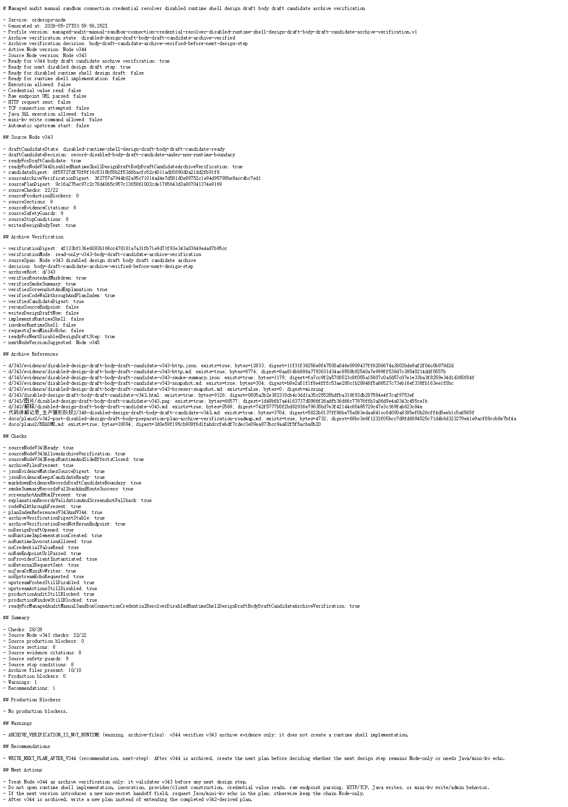

# Node v344：disabled design draft body draft candidate archive verification

## 版本进度

v344 是 v343 的归档验证版。它只验证 v343 的 route、Markdown、candidate digest、HTTP smoke、截图、代码讲解和计划索引，确认 v343 可以作为稳定证据进入下一阶段。

本版没有打开 runtime shell，也没有请求 Java / mini-kv 新 echo。

## 本版新增

- 新增 v344 archive verification 类型、服务、Markdown renderer
- 新增 audit JSON/Markdown route
- 新增 focused tests，覆盖 ready、缺归档 fail-closed、配置阻断、route 输出
- 新增 v344 HTTP smoke 归档、HTML、Playwright MCP 浏览器快照、截图、说明和代码讲解
- 续写计划：v344 后不再无限增加 disabled design draft 层，下一阶段转向最小只读真实联调窗口

## 关键检查

- Node v343 draft candidate ready
- v343 candidate digest 与归档 JSON 对齐
- v343 route / Markdown / smoke / screenshot / walkthrough / plan index 都存在
- v343 只写设计正文，没有 runtime、secret、endpoint、HTTP/TCP、Java write、mini-kv write/admin
- v344 不重跑上游、不请求 Java/mini-kv echo
- production audit/window 仍关闭

## 验证结果

- `npm.cmd run typecheck`：通过
- focused vitest：2 files / 8 tests 通过
- `npm.cmd run build`：通过
- HTTP smoke：JSON 200，Markdown 200
- v344 smoke checks：28/28 通过
- v343 必需归档：10/10 通过
- Playwright MCP：HTTP 页面访问 200，已生成 browser snapshot 和截图
- 分块广域 vitest：277 files / 972 tests 通过
- 旧 route 慢测试单独重跑：8 files / 32 tests 通过；一次性全量中的超时归类为测试负载问题，不是 v344 行为回归
- CI 路径兼容修复：`CandidateGateUpstreamHardeningReview` 历史 fixture 路径断言改为先 normalize，再匹配 `fixtures/historical/sibling-workspaces`

## 截图

## 结论

v344 完成了 v343 的归档稳定化，但它不是 runtime 实现。下一阶段计划要收束治理链：继续保持 fail-closed、不读真密钥、不连真实 endpoint，同时开始推进 Node 到 Java / mini-kv 的最小只读真实联调窗口。
