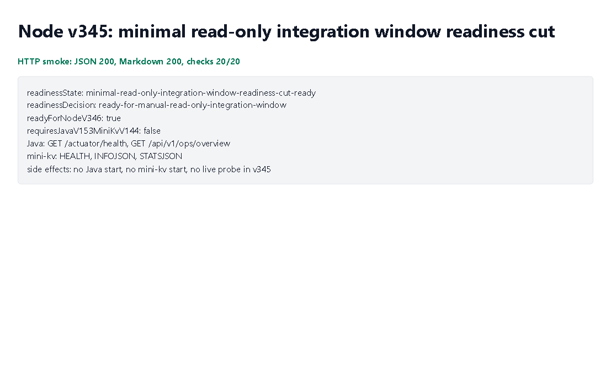

# Node v345：minimal read-only integration window readiness cut

## 版本进度

v345 把 v344 的稳定归档证据推进到“最小只读真实联调窗口”的 readiness cut。

这版不是 live smoke，也不是 runtime shell。它只回答一个问题：

```text
Node 现在是否已经具备进入 Java / mini-kv 最小只读联调窗口的前置条件？
```

本版结论是：现有 Node client 已经覆盖 Java `GET /actuator/health`、`GET /api/v1/ops/overview`，以及 mini-kv `HEALTH`、`INFOJSON`、`STATSJSON`，所以无需额外插入 Java v153 + mini-kv v144。

## 本版新增

- 新增 v345 readiness cut 类型、服务、Markdown renderer。
- 新增 audit JSON/Markdown route。
- 新增 focused tests，覆盖 ready、配置打开时 blocked、route 输出。
- 续写计划到 `docs/plans2/v345-post-minimal-read-only-integration-window-readiness-cut-roadmap.md`。
- 明确下一步 Node v346 才能做只读 smoke rehearsal，而且必须由用户或外部窗口先启动 Java / mini-kv。

## 关键边界

- 不启动 Java。
- 不启动 mini-kv。
- 不发 Java HTTP 请求。
- 不打开 mini-kv TCP socket。
- 不读取 managed audit credential value。
- 不解析 raw endpoint URL。
- 不实现或调用 runtime shell。
- 不允许 Java 写 ledger/schema/SQL。
- 不允许 mini-kv write/admin。

## 允许的最小只读窗口

Java 只允许：

```text
GET /actuator/health
GET /api/v1/ops/overview
```

mini-kv 只允许：

```text
HEALTH
INFOJSON
STATSJSON
```

## 验证结果

- `npm.cmd run typecheck`：通过
- focused vitest：v345 1 file / 3 tests 通过
- v344/v345 小组 vitest：2 files / 7 tests 通过
- `npm.cmd run build`：通过
- HTTP smoke：JSON 200，Markdown 200
- v345 smoke checks：20/20 通过
- Playwright MCP：可用；本轮 route 需要 access-guard headers，MCP 当前工具未暴露 header 注入，所以真实 route 由 HTTP smoke 验证，MCP 截图展示同轮 smoke summary
- 浏览器截图：已生成

## 截图



## 结论

v345 结束了继续堆 disabled design draft 的惯性，把链路推进到真实只读联调之前的最后准备状态。下一步 Node v346 可以做只读 smoke rehearsal，但 Node 不能自动启动 Java / mini-kv；如果服务不可达，只能归档 connection refused / timeout 并 fail closed。
