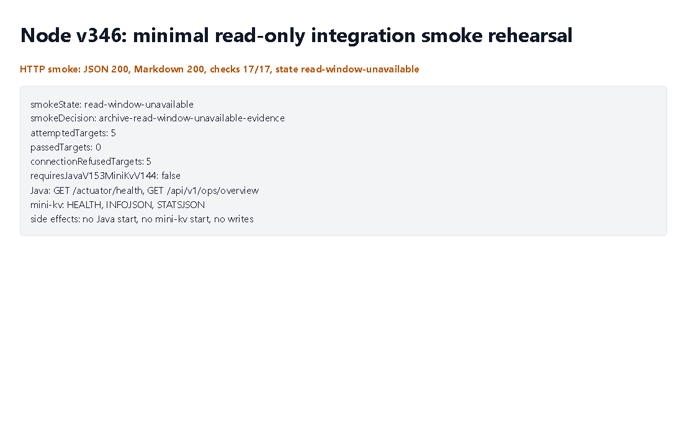

# Node v346：minimal read-only integration smoke rehearsal

## 版本进度

v346 是 v345 之后的第一轮最小只读真实联调 smoke rehearsal。

它真正调用现有 Node client，但调用范围被限制在：

```text
Java: GET /actuator/health
Java: GET /api/v1/ops/overview
mini-kv: HEALTH
mini-kv: INFOJSON
mini-kv: STATSJSON
```

这版不会启动 Java 或 mini-kv；如果它们没有由用户或外部窗口启动，v346 会记录 connection-refused / timeout，并 fail closed。

## 本版新增

- 新增 v346 smoke rehearsal 类型、服务、Markdown renderer。
- 新增 audit JSON/Markdown route。
- 新增 focused tests，覆盖 all-read-passed、read-window-unavailable、invalid-read-contract、route 输出。
- 续写计划到 `docs/plans2/v346-post-minimal-read-only-integration-smoke-rehearsal-roadmap.md`。

## 关键边界

- 不启动 Java。
- 不启动 mini-kv。
- 不构建、不测试、不修改 Java / mini-kv。
- 不读取 managed audit credential value。
- 不解析 raw endpoint URL。
- 不连接 managed audit endpoint。
- 不实现或调用 runtime shell。
- 不允许 Java 写 ledger/schema/SQL。
- 不允许 mini-kv write/admin。

## 错误分类

```text
read-passed
connection-refused
timeout
invalid-json
unexpected-status
```

如果只是 connection-refused / timeout，不要求 Java 或 mini-kv 改代码；如果是 invalid-json / unexpected-status，才建议后续 Java v153 或 mini-kv v144 补只读字段。

## 验证结果

- `npm.cmd run typecheck`：通过
- focused vitest：v346 1 file / 4 tests 通过
- v345/v346 小组 vitest：2 files / 7 tests 通过
- `npm.cmd run build`：通过
- HTTP smoke：JSON 200，Markdown 200
- v346 smoke checks：17/17 通过
- 本机只读联调结果：`read-window-unavailable`，5 个只读目标均为 connection-refused
- Java / mini-kv 是否需要改代码：否；这是服务未由外部窗口启动的环境状态，不是 read contract 字段缺失
- Playwright MCP：可用；本轮 route 需要 access-guard headers，真实 route 由 HTTP smoke 验证，MCP 截图展示同轮 smoke summary
- 浏览器截图：已生成

## 截图



## 结论

v346 开始把前期治理链落到真实只读联调上。它不是生产通过证据，也不是 managed audit runtime；它只是最小只读窗口的第一轮现实探测，并把不可达、超时或字段不匹配清楚归档给 v347 消费。
