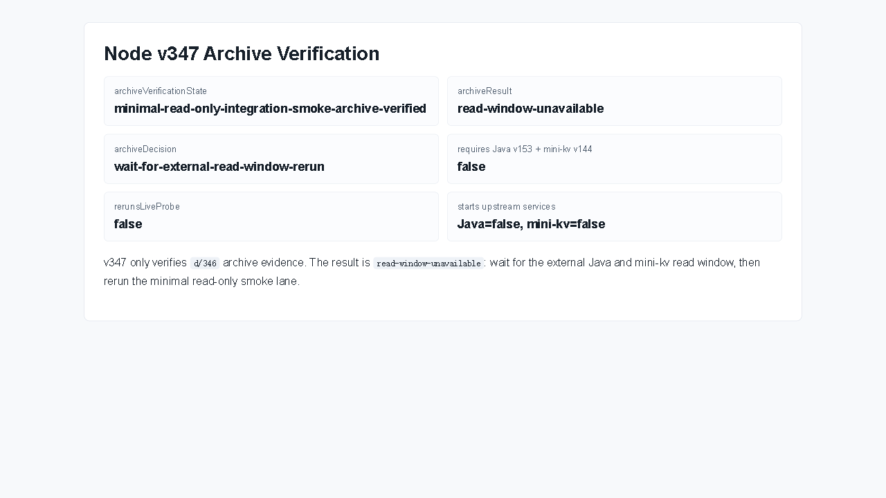

# Node v347：minimal read-only integration smoke archive verification

## 版本进度

v347 消费 v346 的 JSON、Markdown、smoke summary、截图、说明、代码讲解和计划索引，只做归档验证。

这版不会重新探测 Java / mini-kv，不启动上游，也不把 `read-window-unavailable` 误判成字段缺失。

## 本版新增

- 新增 v347 archive verification 类型、服务、Markdown renderer。
- 新增 audit JSON/Markdown route。
- 新增 focused tests，覆盖 read-window-unavailable 归档验证、缺归档 fail-closed、route 输出。
- 续写计划到 `docs/plans2/v347-post-minimal-read-only-integration-smoke-archive-verification-roadmap.md`。

## 归档结论

```text
archiveResult: read-window-unavailable
archiveDecision: wait-for-external-read-window-rerun
requiresParallelJavaV153MiniKvV144ReadOnlyEcho: false
```

原因：v346 的五个只读目标都是 connection-refused。这说明当前外部窗口没有启动 Java / mini-kv，不说明 Java / mini-kv 只读字段缺失。

## 关键边界

- 不重新 live probe。
- 不启动 Java。
- 不启动 mini-kv。
- 不读取 managed audit credential value。
- 不解析 raw endpoint URL。
- 不连接 managed audit endpoint。
- 不实现或调用 runtime shell。
- 不要求 Java v153 / mini-kv v144。

## 验证结果

- `npm.cmd run typecheck`：通过
- focused vitest：v347 1 file / 3 tests 通过
- 小组 vitest：v346 + v347 2 files / 7 tests 通过
- `npm.cmd run build`：通过
- HTTP smoke：200 JSON / 200 Markdown，`archiveResult=read-window-unavailable`
- 浏览器截图：Playwright MCP data-page summary 截图已保存；route 真值以 HTTP evidence 为准

## 截图



## 结论

v347 把 v346 的真实只读探测结果收成稳定证据：当前不是 read contract 问题，而是需要用户或外部窗口启动 Java / mini-kv 后再重跑只读 smoke lane。下一步 v348 应该做 rerun decision，而不是让 Java / mini-kv 无意义改代码。
