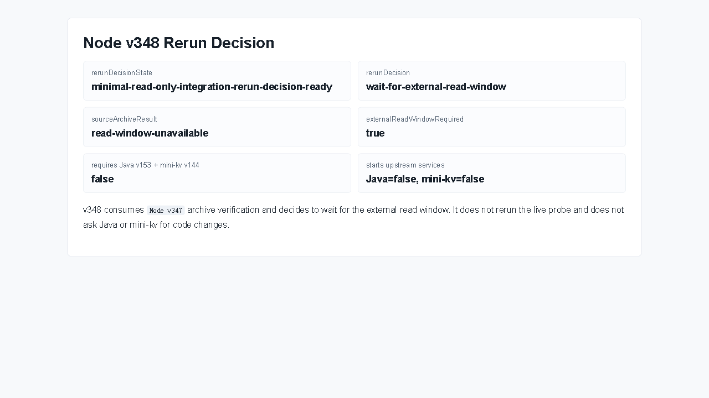

# Node v348：minimal read-only integration rerun decision

## 版本进度

v348 消费 v347 的 archive verification，不重新探测 Java / mini-kv，只生成下一步是否重跑的 decision record。

本轮结论：

```text
rerunDecision: wait-for-external-read-window
externalReadWindowRequired: true
requiresParallelJavaV153MiniKvV144ReadOnlyEcho: false
```

也就是说，v346/v347 已经证明当前不是 Java / mini-kv 字段合同问题，而是本机只读联调窗口没有启动。

## 本版新增

- 新增 v348 rerun decision 类型、服务、Markdown renderer。
- 新增 audit JSON/Markdown route。
- 新增 focused tests，覆盖正常 decision、缺 v347 archive fail-closed、route 输出。
- 续写计划到 `docs/plans2/v348-post-minimal-read-only-integration-rerun-decision-roadmap.md`。

## 关键边界

- 不重新 live probe。
- 不启动 Java。
- 不启动 mini-kv。
- 不读取 managed audit credential value。
- 不解析 raw endpoint URL。
- 不连接 managed audit endpoint。
- 不实现或调用 runtime shell。
- 不要求 Java v153 / mini-kv v144。

## 验证结果

- `npm.cmd run typecheck`：通过
- focused vitest：v348 1 file / 3 tests 通过
- 小组 vitest：v346 + v347 + v348 3 files / 10 tests 通过
- `npm.cmd run build`：通过
- HTTP smoke：200 JSON / 200 Markdown，`rerunDecision=wait-for-external-read-window`
- 浏览器截图：Playwright MCP data-page summary 截图已保存；route 真值以 HTTP evidence 为准

## 截图



## 结论

v348 把最小只读联调推进到更清晰的执行边界：下一步不是让 Java / mini-kv 改代码，而是等待用户确认两个上游服务已启动；只有那时 Node v349 才适合重跑现有只读 smoke lane。
