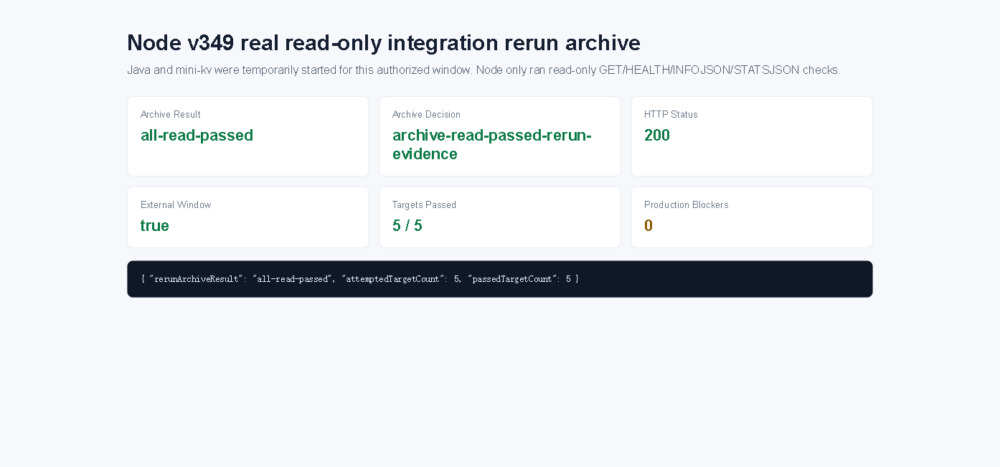

# Node v349：minimal read-only integration smoke rerun archive

## 版本进度

v349 消费 v348 的 `wait-for-external-read-window` 决策。在用户授权本轮由 Node 临时启动 Java / mini-kv 后，Node 只执行现有最小只读 smoke lane 的重跑，并把结果归档。

本轮真实联调结果：

```text
rerunArchiveResult: all-read-passed
rerunArchiveDecision: archive-read-passed-rerun-evidence
attemptedTargetCount: 5
passedTargetCount: 5
productionBlockerCount: 0
```

## 本版新增

- 新增 v349 smoke rerun archive 类型、服务、Markdown renderer。
- 新增 audit JSON/Markdown route。
- 新增 focused tests，覆盖外部窗口确认后重跑、窗口未确认 pending 且不调用上游、route 输出。
- 真实启动 Java / mini-kv / Node 做一次授权只读联调，并保存 JSON、Markdown、summary、HTML、浏览器截图和 snapshot。

## 关键边界

- 本版 route 不启动 Java / mini-kv；本轮进程启动是用户授权的外部联调窗口。
- 只执行 Java `GET /actuator/health`、`GET /api/v1/ops/overview`。
- 只执行 mini-kv `HEALTH`、`INFOJSON`、`STATSJSON`。
- 不读取 managed audit credential value。
- 不解析 raw endpoint URL。
- 不连接真实 managed audit endpoint。
- 不实现或调用 runtime shell。
- 不执行 Java ledger/schema/SQL/deployment/rollback。
- 不执行 mini-kv write/admin 命令。

## 验证结果

- `npm.cmd run typecheck`：通过
- focused vitest：v349 1 file / 3 tests 通过
- 小组 vitest：v346 + v347 + v348 + v349 4 files / 13 tests 通过
- `npm.cmd run build`：通过
- HTTP smoke：200 JSON / 200 Markdown，`rerunArchiveResult=all-read-passed`
- 浏览器截图：Playwright MCP data-page summary 截图已保存；route 真值以 HTTP evidence 为准

## 证据文件

- `d/349/evidence/minimal-read-only-integration-smoke-rerun-archive-v349-http.json`
- `d/349/evidence/minimal-read-only-integration-smoke-rerun-archive-v349-http.md`
- `d/349/evidence/minimal-read-only-integration-smoke-rerun-archive-v349-summary.json`
- `d/349/evidence/minimal-read-only-integration-smoke-rerun-archive-v349-browser-snapshot.md`
- `d/349/minimal-read-only-integration-smoke-rerun-archive-v349.html`

## 截图



## 结论

v349 是第一版真正跑通的三项目最小只读联调窗口。它证明 Node 可以在显式外部窗口下消费 Java / mini-kv 的只读能力，同时仍保持 managed audit、credential、runtime shell、写入和执行边界关闭。
